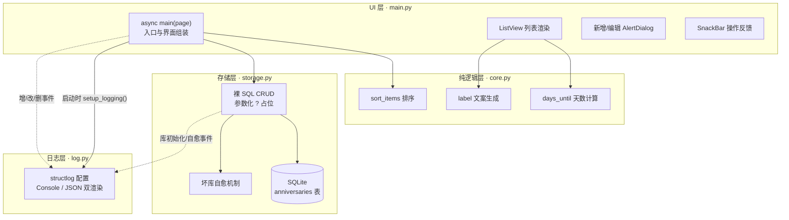
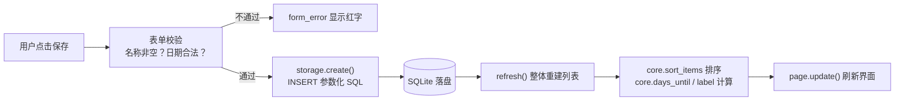

这是本 wiki 的第一页，也是你进入这个项目的起点。本页回答三个问题：**这个项目是什么、它由哪些部分组成、你应该按什么顺序继续阅读**。读完本页你不需要看懂任何一行代码——只需要建立起对整体结构的"地图感"，后续深入解析的每一页都会是这张地图上的一块拼图。

## 项目定位：不写一行 Dart/JS，也能做出 Android 应用

`flet-android-lab` 是一个技术实验项目，验证的命题是**技术路线 A——Python 原生方案（Flet）**：用纯 Python 编写界面与逻辑，底层由 Flutter 渲染引擎负责绘制，最终能打包出可安装到 Android 手机的 APK。传统跨平台开发通常要求你学习 Dart（Flutter 原生）或 JavaScript/TypeScript（React Native 等），而 Flet 让 Python 开发者用熟悉的语言直接上手，声明式 UI、无需学习新语言。

项目的载体是一个**纪念日 App**：记录一个日期，自动展示"已过多少天"或"倒计时还剩多少天"。选择这样一个功能完整但规模克制的 App 作为实验样本，意味着每一层技术决策（UI 框架、存储、日志、打包）都能在一个真实可用的产品里被验证。当前使用的 Flet 版本为 0.86.x，入口写法是 `ft.run(main)`，对话框走 `page.show_dialog / pop_dialog`。

Sources: [README.md](README.md#L1-L8)

## 纪念日 App 功能速览

App 的功能刻意保持精炼，三类核心能力覆盖了一个数据型应用的完整闭环：

| 功能 | 行为说明 |
|---|---|
| 添加 / 编辑 / 删除 | 录入"名称 + 一次性日期"，支持随时修改和删除 |
| 天数计算 | 未来日期显示 `还有 N 天`（当天显示 `就是今天`），过去日期显示 `已 N 天` |
| 智能排序 | 倒计时临近的排在最前；已过去的按新→旧排在后面 |

这三个功能背后分别对应纯函数计算（`days_until` / `label`）、排序键设计（`sort_items`）和 UI 交互（对话框与列表），是后续深入解析的主线索。App 的完整界面元素与操作流程（列表、空态提示、表单校验反馈等）在[认识纪念日 App：功能、界面与交互流程](4-ren-shi-ji-nian-ri-app-gong-neng-jie-mian-yu-jiao-hu-liu-cheng)中逐一拆解。

Sources: [README.md](README.md#L10-L14)

## 技术栈全景：全项目只有两个第三方依赖

这个项目有一个鲜明的工程取向——**依赖极简主义**。`pyproject.toml` 中声明的第三方依赖只有两个：`flet` 和 `structlog`，其余全部使用 Python 标准库（`sqlite3`、`datetime`、`uuid`、`pathlib`、`os`、`logging`）。

| 层面 | 选型 | 一句话说明 |
|---|---|---|
| 语言版本 | Python ≥ 3.12 | `.python-version` 锁定 3.12 |
| UI 框架 | Flet 0.86.x | 基于 Flutter 渲染引擎的声明式 UI，Python 编写 |
| 依赖管理 | uv | `.venv` + `uv.lock` 精确锁定版本，一条命令同步 |
| 结构化日志 | structlog | 默认 Console 彩色格式，可切换 JSON |
| 数据库 | sqlite3（标准库） | 裸 SQL + 参数化查询，不用 ORM |
| 业务逻辑 | 纯函数 | `datetime` 标准库完成日期运算，无任何 IO |
| 打包 | flet build apk | flet-cli 已内置 Flutter 工具链，无需单独安装 Flutter SDK |

"零第三方依赖"不是偶然，而是一个刻意的设计哲学——依赖越少，升级成本越低、供应链风险越小、可测试性越好。这一取舍的完整论证见[uv 依赖管理与零第三方依赖哲学](24-uv-yi-lai-guan-li-yu-ling-di-san-fang-yi-lai-zhe-xue)。

Sources: [pyproject.toml](pyproject.toml#L9-L13)

## 四层架构总览

整个项目由四个 Python 文件组成，每个文件负责一层职责，**层与层之间通过明确的函数调用边界衔接**。下面这张图展示模块间的依赖关系，阅读前先说明图例：实线箭头表示直接的函数调用（数据流经的方向），虚线箭头表示日志事件的输出。



四层的职责边界一句话概括：**main.py 负责"看见"，core.py 负责"算对"，storage.py 负责"存住"，log.py 负责"说清"**。`main.py` 只包含 Flet UI 组装与事件处理，不直接写 SQL；`core.py` 是无 IO 的纯函数集合，日期算术与排序逻辑不碰数据库也不碰界面，因而可以独立做边界测试；`storage.py` 封装全部 SQLite 读写，每次操作独立开关连接；`log.py` 在应用启动时完成一次性配置。这种分层的完整职责论证与设计动机，在[四层分层架构：UI、纯逻辑、存储、日志的职责划分](5-si-ceng-fen-ceng-jia-gou-ui-chun-luo-ji-cun-chu-ri-zhi-de-zhi-ze-hua-fen)中展开。

Sources: [main.py](main.py#L7-L31), [core.py](core.py#L4-L23), [storage.py](storage.py#L25-L55), [log.py](log.py#L8-L24)

## 一次"保存"操作背后的数据流

为了把上面的静态架构变成动态直觉，追踪一个最典型的用户动作——在对话框中点击"保存"。数据在四层之间的完整旅程如下：



这条链路体现了架构的两个关键模式：其一，**校验前置**——非法输入（如名称为空、2 月 30 日）在 UI 层就被 `date.fromisoformat` 拦截，永远不会污染数据库；其二，**整体刷新**——保存成功后不是局部修改某个控件，而是由 `refresh()` 从数据库重读全部数据、重新排序、重建整份列表。这种"闭包式状态管理"简单直接，代价与适用边界的讨论见[闭包式状态管理：refresh 驱动的整体刷新模式](11-bi-bao-shi-zhuang-tai-guan-li-refresh-qu-dong-de-zheng-ti-shua-xin-mo-shi)。

Sources: [main.py](main.py#L117-L138), [main.py](main.py#L97-L101)

## 项目文件地图

整个仓库的文件数量少到可以用一张图看完，这正是分层清晰的收益之一：

```
flet-android-lab/
├── main.py            # UI 层：列表、对话框、事件处理（约 175 行）
├── core.py            # 纯函数：days_until / label / sort_items（约 24 行）
├── storage.py         # SQLite CRUD + 建表 + 坏库自愈（约 116 行）
├── log.py             # structlog 配置：环境变量可调（约 25 行）
├── pyproject.toml     # 项目元数据：仅 flet + structlog 两个依赖
├── uv.lock            # uv 锁定的精确依赖版本
├── .python-version    # Python 3.12
├── .flet/             # flet run 自动生成的开发态目录（可安全删除）
│   └── storage/       # data / cache / temp 三类存储位置
└── data/              # 数据库本地回退目录（已 gitignore，运行时生成）
```

值得注意的细节：`.flet/` 是 `flet run` 监视器创建的本地开发状态目录，删除后下次运行会自动重建；`data/` 则是当系统应用数据目录不可用时数据库文件的回退落点，被 `.gitignore` 排除在版本控制之外。数据库文件的实际落盘位置遵循"系统目录 → 本地回退 → 环境变量指定"的三级策略，具体判定逻辑见[数据库路径三级策略：系统目录、本地回退与 ANNIVERSARY_DB 环境变量](16-shu-ju-ku-lu-jing-san-ji-ce-lue-xi-tong-mu-lu-ben-di-hui-tui-yu-anniversary_db-huan-jing-bian-liang)。

Sources: [main.py](main.py#L24-L30), [.flet/README.md](.flet/README.md), [.gitignore](.gitignore)

## 桌面开发 vs 真机部署：两条路径的能力边界

这个项目在开发体验上做了一个务实的选择：**日常开发完全在桌面窗口完成，真机只在最终验证时介入**。桌面端零额外安装，UI 逻辑、增删改查、SQLite 读写全部可验证；真机阶段则覆盖桌面无法模拟的部分——小屏与触摸适配、虚拟键盘遮挡、App 沙箱存储、切后台的生命周期行为。

| 维度 | 桌面窗口调试 | 真机 / APK 打包 |
|---|---|---|
| 适用场景 | 日常开发的绝大部分 | 想把 App 装进手机日常使用时 |
| 额外安装 | 零 | JDK 17+、Android SDK、手机开启 USB 调试 |
| 可验证范围 | UI 逻辑、增删改查、SQLite 读写 | 小屏触摸、键盘遮挡、沙箱存储、生命周期、安装包本身 |
| 启动方式 | `uv run flet run main.py` | `flet build apk` + `adb install` |

两条路径的取舍逻辑、以及"桌面覆盖不了什么"的完整清单，在[桌面调试与真机验证的能力边界划分](23-zhuo-mian-diao-shi-yu-zhen-ji-yan-zheng-de-neng-li-bian-jie-hua-fen)中详细分析。

Sources: [README.md](README.md#L77-L99)

## 阅读路线建议

本 wiki 的目录本身就设计了一条由浅入深的路径，建议按下面的顺序推进：

| 阶段 | 阅读页面 | 阶段目标 |
|---|---|---|
| ① 上手运行 | [快速开始：安装 uv 并运行纪念日 App](2-kuai-su-kai-shi-an-zhuang-uv-bing-yun-xing-ji-nian-ri-app) → [热重载开发工作流：flet run 与直接运行的区别](3-re-zhong-zai-kai-fa-gong-zuo-liu-flet-run-yu-zhi-jie-yun-xing-de-qu-bie) | 让 App 在自己电脑上跑起来 |
| ② 认识产品 | [认识纪念日 App：功能、界面与交互流程](4-ren-shi-ji-nian-ri-app-gong-neng-jie-mian-yu-jiao-hu-liu-cheng) | 熟悉每个界面元素与操作 |
| ③ 理解骨架 | [四层分层架构：UI、纯逻辑、存储、日志的职责划分](5-si-ceng-fen-ceng-jia-gou-ui-chun-luo-ji-cun-chu-ri-zhi-de-zhi-ze-hua-fen) → [Flet 0.86 声明式 UI 模型：async main 与 ft.run 入口](6-flet-0-86-sheng-ming-shi-ui-mo-xing-async-main-yu-ft-run-ru-kou) | 建立全局架构认知 |
| ④ 按兴趣深入 | UI 实现（列表渲染 → 对话框 → 状态管理）／核心纯函数／数据持久化／日志体系 任选 | 深入任意一层 |
| ⑤ 走向真机 | [APK 打包前置条件：JDK 17+、Android SDK 与 USB 调试](21-apk-da-bao-qian-zhi-tiao-jian-jdk-17-android-sdk-yu-usb-tiao-shi) → [flet build apk 打包流程与 adb 真机安装](22-flet-build-apk-da-bao-liu-cheng-yu-adb-zhen-ji-an-zhuang) | 打出 APK 装进手机 |

如果只想最快看到成果，直接从[快速开始：安装 uv 并运行纪念日 App](2-kuai-su-kai-shi-an-zhuang-uv-bing-yun-xing-ji-nian-ri-app)开始——两条命令之后，桌面窗口里就会出现你的第一个纯 Python 桌面应用，而它离一部 Android 手机，只差一次 `flet build apk`。