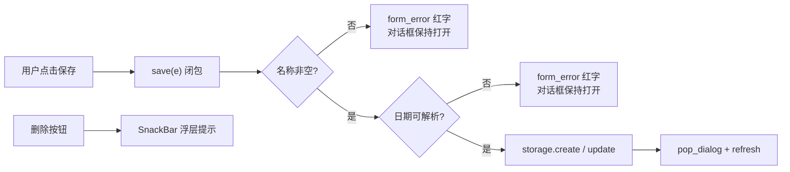
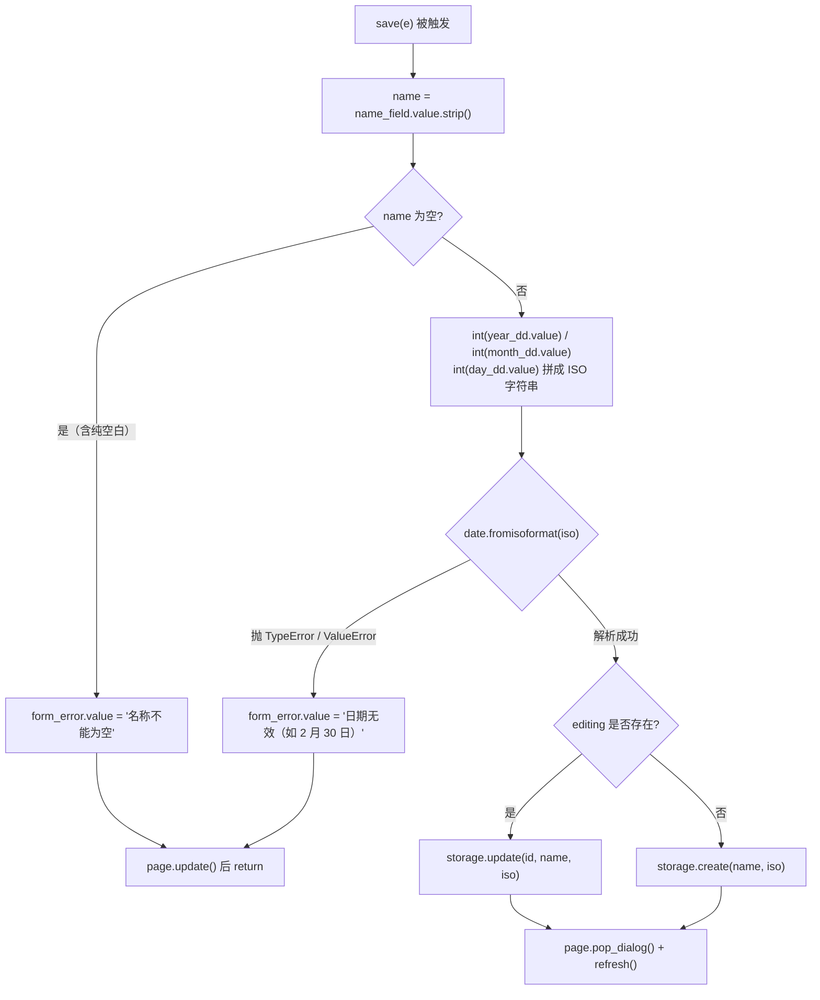

本文聚焦"添加/编辑纪念日"对话框的**保存前校验链**与**用户反馈的双通道设计**：名称非空检查、由三个下拉框组合出的日期合法性检查，以及校验失败（对话框内红字）与操作确认（SnackBar 浮层）这两条反馈路径的分工。对话框的打开/关闭生命周期与下拉选日期的取舍不属于本文范围，将在延伸阅读中给出对应页面链接。

## 校验的职责归属：UI 层是唯一的守门员

先明确一个架构事实：这个项目里**所有表单校验都发生在 UI 层**，存储层对调用方完全信任。`storage.create()` 和 `storage.update()` 接收 `name` 与 `date_iso` 后直接组装 SQL 写入，没有一行参数检查——它们假设"走到这里的数据已经是合法的"。这意味着 `main.py` 中 `save()` 回调是数据进入数据库前的**唯一防线**：任何绕过对话框的调用路径（比如未来加入的批量导入功能）都需要自行承担校验责任，或者把校验下沉为独立函数。当前设计把校验写成 `open_form` 闭包内的内联逻辑，换来的是实现简单、与表单控件零距离，代价是校验逻辑无法复用、也不可直接单测（详见[纯函数可测试性：无 IO 设计与边界断言策略](25-chun-han-shu-ke-ce-shi-xing-wu-io-she-ji-yu-bian-jie-duan-yan-ce-lue)中的对比讨论）。

上图是本文的全景：**校验失败走对话框内反馈并早退（early return），校验通过才触达存储层，SnackBar 则留给对话框之外的操作确认**。三类路径互不混用，这是下文展开的核心模式。

Sources: [main.py](main.py#L117-L138)、[storage.py](storage.py#L69-L102)

## save() 校验链：两道守门与一个出口

`save` 是"保存"按钮的 `on_click` 回调，定义在 `open_form` 内部，直接闭包引用 `name_field`、三个日期下拉框和 `form_error` 控件。它的执行顺序是固定的三段式：**先校验名称，再校验日期，两者都通过才写库**。每道守门失败时执行"设置错误文案 → `page.update()` → `return`"三步，对话框不关闭，用户已填的内容原样保留——这是 guard clause（守卫子句）模式在 UI 校验中的典型应用：失败即退出，不进入后续流程。

第一道守门处理名称：注意它校验的不是原始值而是 `strip()` 之后的结果——用户只输入空格或换行时，`name_field.value` 是非空字符串，但剥离空白后为空，同样被拦截。这比直接判断 `if not name_field.value` 更严谨，同时保证了最终入库的 `name` 不带首尾空白。

Sources: [main.py](main.py#L117-L138)

## 为什么用 date.fromisoformat 当校验器

第二道守门的设计取舍值得细看。由于"日"下拉框固定提供 1~31 全部选项（这是为了 UI 简单、避免月切换联动），用户完全可能选出 **2 月 30 日、4 月 31 日或平年 2 月 29 日**这类不存在的日期组合。项目没有手写大小月与闰年规则，而是把三个下拉框的值格式化成 `YYYY-MM-DD` 字符串，交给标准库的 `date.fromisoformat()` 做权威判定——**能用解析器验证的格式，就不要自己写校验逻辑**。闰年、大小月这些日历知识由 stdlib 维护，业务代码只负责"拼字符串、看是否抛异常"。

`except (TypeError, ValueError)` 一行捕获的是**两类不同的失败场景**，这是初读时最容易忽略的细节：

| 异常类型 | 触发场景 | 抛出位置 | 用户感知 |
|---|---|---|---|
| `TypeError` | 某个下拉框未选择，`value` 为 `None`，`int(None)` 抛出 | f-string 格式化阶段（还没到 fromisoformat） | 看到同样的红字提示 |
| `ValueError` | 三项都已选择，但组合非法（如 2 月 30 日、月份超界） | `date.fromisoformat()` 解析阶段 | 看到同样的红字提示 |
| 无异常 | 组合合法 | — | 进入写库分支 |

两类异常被合并为同一条用户文案，因为对用户而言"没选全"和"选了不存在的日子"都归入"日期无效"，没必要区分技术成因。另外注意拼接时的格式化说明符：`{int(year_dd.value):04d}`、`{int(month_dd.value):02d}` 把 `5` 归一化为 `05`，保证产出的字符串严格符合 ISO 格式，`fromisoformat` 才能正确解析——校验的可靠性建立在**先归一化、再验证**的顺序上。

Sources: [main.py](main.py#L123-L132)、[main.py](main.py#L52-L56)

## 双通道反馈：form_error 与 SnackBar 的分工

这个 App 存在两条独立的用户反馈通道，各自负责一类信息，边界清晰：

| 维度 | `form_error`（对话框内红字） | SnackBar（页面浮层） |
|---|---|---|
| 控件形态 | `ft.Text`，红色 `RED_400`、13 号小字，嵌在对话框 `content` 底部 | `ft.SnackBar(ft.Text(msg))`，覆盖在页面底部 |
| 触发时机 | 校验失败（名称空 / 日期非法） | 删除操作成功后（"已删除「××」"） |
| 生命周期 | **持久**：一直显示，直到下次校验通过或表单重开时被清空 | **瞬时**：展示一段时间后自动消失 |
| 对话框状态 | 对话框保持打开，输入不丢失 | 不涉及对话框（删除从列表直接发起） |
| 实现位置 | 对话框 `content` 的 Column 末位 | `snackbar()` 辅助函数，经 `page.show_dialog()` 展示 |

这个分工背后的逻辑是**反馈必须出现在用户注意力的焦点处**：校验错误发生时，用户正在对话框里操作，红字紧贴输入框下方，视线无需移动即可定位问题；而删除确认发生时对话框并不存在，SnackBar 作为页面级浮层承担确认职责。还有一个容易被忽略的设计决策：**保存成功路径不用任何提示**——`pop_dialog()` 关闭对话框、`refresh()` 让新条目出现在列表中，列表的可见变化本身就是最强的成功反馈，再弹 SnackBar 反而是噪音。

Flet 0.86 的写法上有个值得注意的细节：SnackBar 也是通过 `page.show_dialog()` 展示的。在这个版本的声明式 API 中，SnackBar 与 AlertDialog 共用同一套 overlay 管理机制，所以 9 行的 `snackbar(msg)` 辅助函数本质上和打开对话框是同一类调用，只是传入的控件类型不同。关于 `show_dialog`/`pop_dialog` 的完整生命周期语义，见[新增/编辑对话框：show_dialog 与 pop_dialog 的生命周期](8-xin-zeng-bian-ji-dui-hua-kuang-show_dialog-yu-pop_dialog-de-sheng-ming-zhou-qi)。

Sources: [main.py](main.py#L57-L60)、[main.py](main.py#L103-L106)、[main.py](main.py#L140-L157)

## 状态卫生：form_error 的重置时机

`form_error` 是一个跨多次对话框打开而**长期存活的控件实例**（定义在 `main()` 顶层，不在 `open_form` 内部），这带来一个必须处理的问题：上一次校验失败的错误文案会残留在控件里，下次打开对话框时若无清理，用户会看到一条"陈年旧错"。项目在 `open_form` 的初始化序列中用一行 `form_error.value = ""` 解决：每次打开表单（无论新增还是编辑），先把错误清空、再回填名称与三个日期下拉框的值。这是有状态控件复用的通用卫生规则——**重置必须在展示之前完成**，与 `name_field`、下拉框的回填属于同一个初始化批次。

与之配套的是命令式刷新的必要性：对已挂载控件属性的赋值（`form_error.value = ...`）**不会自动触发界面更新**，必须显式调用 `page.update()`。校验失败分支里"赋值 → `page.update()` → `return`"的三连击中，`page.update()` 缺一不可，否则红字永远不会出现。这里的 `page.update()` 是**局部刷新**（只同步被修改的控件属性），与 `refresh()` 函数重建整个列表的**整体刷新**是两个不同粒度的操作，后者的完整机制见[闭包式状态管理：refresh 驱动的整体刷新模式](11-bi-bao-shi-zhuang-tai-guan-li-refresh-qu-dong-de-zheng-ti-shua-xin-mo-shi)。

Sources: [main.py](main.py#L108-L115)、[main.py](main.py#L119-L132)

## 错误文案的用户体验细节

两条校验文案本身也体现了实用的 UX 判断。"名称不能为空"直述规则；"日期无效（如 2 月 30 日）"则更进一步——**用一个具体反例告诉用户"无效"是什么意思**。用户看到 2 月 30 日这个例子，能立刻理解问题出在日期组合上，而不是猜测格式、范围或其他技术含义。视觉上，红字用 `RED_400`（偏柔和的红）配 13 号小字，在对话框中醒目但克制，符合"错误提示应醒目于正文、从属于表单"的层级感。中间开发者迁移这套模式时，可以记住两条原则：文案给出可行动的信息（具体反例优于抽象规则），视觉强度与信息紧急度成正比（校验错误 > 操作确认 > 状态变化）。

Sources: [main.py](main.py#L57)、[main.py](main.py#L120)、[main.py](main.py#L130)

## 小结与延伸阅读

本文剖析的模式可以浓缩为三句话：**校验前置且集中于 save() 守卫链，失败早退并保留用户输入；反馈双通道按注意力焦点分工，对话框内红字管校验、SnackBar 管操作确认；有状态控件跨会话复用必须在展示前重置**。想继续深入相关主题，推荐按以下顺序阅读：先看[年月日下拉选日期：规避 DatePicker 对话框叠加的工程取舍](9-nian-yue-ri-xia-la-xuan-ri-qi-gui-bi-datepicker-dui-hua-kuang-die-jia-de-gong-cheng-qu-she)理解"为什么会有 2 月 30 日这个问题"，再看[新增/编辑对话框：show_dialog 与 pop_dialog 的生命周期](8-xin-zeng-bian-ji-dui-hua-kuang-show_dialog-yu-pop_dialog-de-sheng-ming-zhou-qi)理解校验失败时对话框为何能保持打开，最后到[闭包式状态管理：refresh 驱动的整体刷新模式](11-bi-bao-shi-zhuang-tai-guan-li-refresh-qu-dong-de-zheng-ti-shua-xin-mo-shi)看校验通过后的数据如何回流到列表。