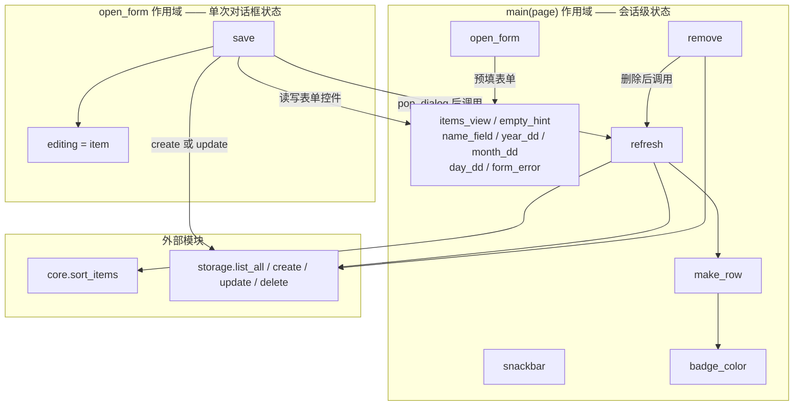
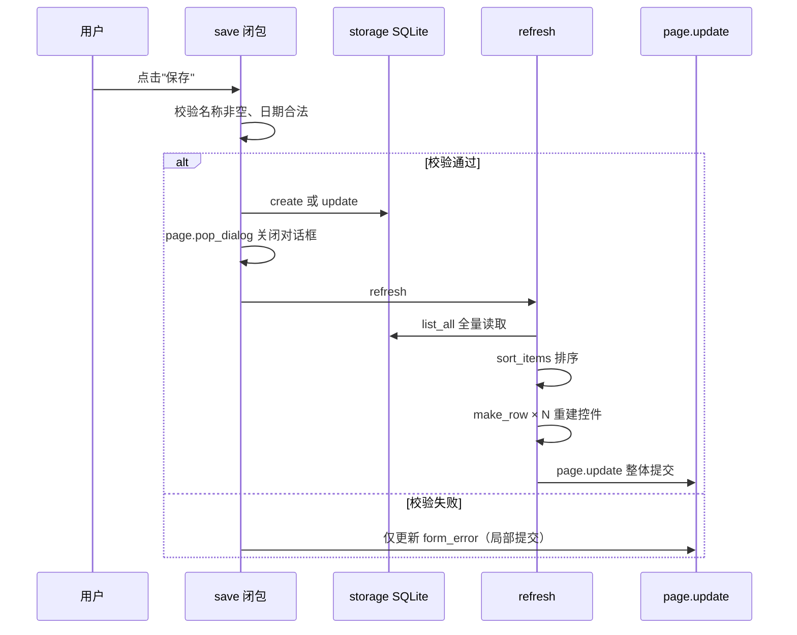

本页解释纪念日 App 的 UI 状态管理策略：**没有状态类、没有响应式框架、没有全局可变变量**，所有 UI 状态以局部变量形式存活在 `async def main(page)` 的函数作用域内，通过嵌套闭包函数读取和修改，并在每次数据变更后调用 `refresh()` 从数据库整体重建列表控件。理解这一模式，就理解了这个项目为什么能以约 160 行代码完成增删改查的完整闭环。

## 核心命题：状态存在闭包里，而非对象里

Flet 0.86 的入口是 `async def main(page: ft.Page)`，由 `ft.run(main)` 启动（入口模型的细节见 [Flet 0.86 声明式 UI 模型：async main 与 ft.run 入口](6-flet-0.86-sheng-ming-shi-ui-mo-xing-async-main-yu-ft-run-ru-kou)）。关键在于：**这个协程的栈帧在应用的整个生命周期内一直存活**，因此它的局部变量天然扮演了"会话级状态容器"的角色。`main()` 开头创建了两个持久控件——列表视图 `items_view` 和空态提示 `empty_hint`——随后又创建了对话框表单所需的五个控件（名称输入框、年/月/日三个下拉框、错误提示文本）。这些控件引用全部是 `main()` 的局部变量，后续定义的每个内嵌函数通过闭包直接访问它们，无需任何传递参数的管道。

Sources: [main.py](main.py#L18-L57), [main.py](main.py#L175)

这套设计可以概括为一张清单：

| 状态项 | 定义位置 | 类型 | 消费者（闭包） |
|---|---|---|---|
| `items_view` | main 局部变量 | `ft.ListView` | `refresh()` 重建其 `controls` |
| `empty_hint` | main 局部变量 | `ft.Text` | `refresh()` 切换 `visible` |
| `name_field` / `year_dd` / `month_dd` / `day_dd` | main 局部变量 | `ft.TextField` / `ft.Dropdown` | `open_form()` 预填、`save()` 读取 |
| `form_error` | main 局部变量 | `ft.Text` | `open_form()` 清空、`save()` 写入校验错误 |
| `editing` | **open_form 局部变量** | `dict \| None` | `save()` 判断新增还是编辑 |

Sources: [main.py](main.py#L33-L57), [main.py](main.py#L109-L115)

值得注意的是最后一行：`editing` 不在 `main()` 作用域，而在 `open_form()` 作用域——这体现了闭包的**层级化能力**。不同交互的状态放在不同层级，避免了所有状态都堆在同一层。

## 嵌套闭包结构：三层作用域的分工

`main()` 内定义了六个函数，`open_form()` 内又定义了 `save()`，形成三层作用域嵌套。先看整体结构（图中箭头表示读取或调用关系）：



六个函数各司其职：`snackbar(msg)` 是一行封装，把 `ft.SnackBar` 塞进 `page.show_dialog`；`badge_color(days)` 根据天数正负零返回颜色常量；`make_row(item)` 把一条数据库记录构造成一个 `ft.ListTile`，包括编辑和删除两个 `IconButton`；`refresh()` 是唯一的渲染入口；`remove(item)` 先删库再刷新；`open_form(item=None)` 负责打开新增/编辑对话框。

Sources: [main.py](main.py#L59-L106), [main.py](main.py#L108-L157)

### 双重闭包：save 与 editing 的"每次对话独立"状态

`open_form()` 每次被调用时，先执行 `editing = item`，再按新增或编辑两种情况预填表单（编辑时回填名称和日期，新增时填今天），然后才定义 `save(e)`。这意味着**每打开一次对话框，就产生一对全新的 `editing` 和 `save` 绑定**——`save` 通过闭包捕获的是"本次对话框正在编辑哪条记录"，两次打开对话框之间互不干扰。这种"状态随交互创建、随交互消亡"的特性，是闭包相对于全局变量最优雅的地方：对话框关闭后，那对 `editing`/`save` 没有任何引用，会被垃圾回收自然清理。

Sources: [main.py](main.py#L108-L138)

### lambda 的显式捕获：`it=item` 的防御性写法

`make_row` 中的两个事件处理器写作 `lambda e, it=item: open_form(it)` 和 `lambda e, it=item: remove(it)`。`it=item` 这个默认参数写法让 `item` 在**函数定义时刻按值捕获**，而不是在**调用时刻按名查找**。在本例中由于 `item` 是 `make_row` 的参数（每次调用独立绑定），两种写法行为一致；但这种显式捕获是规避 Python 闭包晚绑定（late binding）陷阱的惯用手法——当闭包在循环中批量创建且循环变量被复用时，只有默认参数写法能保证每个闭包拿到正确的值。这里可以视为一种防御性编码习惯的体现。

Sources: [main.py](main.py#L82-L91)

## refresh()：整体刷新的执行路径

整个模式的心脏只有四行代码：

```python
def refresh():
    items = core.sort_items(storage.list_all(), date.today())
    items_view.controls = [make_row(i) for i in items]
    empty_hint.visible = not items
    page.update()
```

它的执行逻辑是一条单向数据流：**从 SQLite 全量读取 → 纯函数排序 → 逐条构造新控件 → 整体替换 `controls` 列表 → 提交渲染**。注意第二行不是往 `controls` 里 append，而是直接赋值一个新的列表推导式——旧的 `ListTile` 对象全部废弃，由垃圾回收处理。空态提示的处理同样干脆：`empty_hint.visible = not items`，一个布尔翻转同时覆盖"有无数据"两种呈现（空态设计的完整讨论见 [列表渲染：ListView、ListTile 与条件空态提示](7-lie-biao-xuan-ran-listview-listtile-yu-tiao-jian-kong-tai-ti-shi)）。

Sources: [main.py](main.py#L97-L101), [core.py](core.py#L18-L23)

### 一个精确的例外：校验失败不走 refresh

`save()` 内部的两条校验失败路径（名称为空、日期非法）只更新 `form_error.value` 后直接调 `page.update()`，**不调用 `refresh()`**。这是一个有意为之的精确控制：校验失败时列表数据没有任何变化，重建整个列表既浪费又可能导致对话框闪烁。它说明"整体刷新"是该项目的默认策略，而非教条——当变更确实只涉及单个控件时，局部 `page.update()` 依然是正确选择（校验逻辑的完整分析见 [表单校验与用户反馈：名称非空、非法日期与 SnackBar](10-biao-dan-xiao-yan-yu-yong-hu-fan-kui-ming-cheng-fei-kong-fei-fa-ri-qi-yu-snackbar)）。

Sources: [main.py](main.py#L117-L132)

### 三个触发点与完整事件流

`refresh()` 在整个代码库中恰好被调用三次：

| 触发点 | 调用方 | 前置动作 | 位置 |
|---|---|---|---|
| 应用启动 | `main()` 主体 | 页面挂载 `appbar` 与列表容器之后 | L172 |
| 删除记录 | `remove()` | `storage.delete()` + snackbar 提示 | L106 |
| 保存成功 | `save()` | `storage.create()`/`update()` + `page.pop_dialog()` | L138 |

Sources: [main.py](main.py#L103-L106), [main.py](main.py#L133-L138), [main.py](main.py#L159-L172)

以"保存"为例的完整时序：



注意 `save()` 中 `pop_dialog()` 与 `refresh()` 的**调用顺序**：先关对话框再刷新列表。若顺序颠倒，用户会在对话框还开着时看到背后列表已变，且后续 `pop_dialog` 触发的页面更新可能与列表刷新产生视觉竞争（对话框生命周期的完整讨论见 [新增/编辑对话框：show_dialog 与 pop_dialog 的生命周期](8-xin-zeng-bian-ji-dui-hua-kuang-show_dialog-yu-pop_dialog-de-sheng-ming-zhou-qi)）。

Sources: [main.py](main.py#L133-L138)

## 为什么敢整体刷新：数据库是唯一权威状态源

这个模式最反直觉的地方是：**Python 侧不维护任何纪念日列表的副本**。不存在 `self.items` 这样的成员变量，`refresh()` 每次都从 `storage.list_all()` 重新读库。换言之，UI 是「数据库内容 + 今天日期」的纯投影函数，排好序的列表只是投影的中间产物，用完即弃。

这种"单一权威状态源"设计带来三个直接收益。**一致性免维护**：既然内存中不缓存列表，就永远不会出现"内存与数据库不同步"这类经典 bug，删除后调用 `refresh()` 拿到的必然是删除后的真实状态。**跨天自动正确**：`make_row` 每次都用 `date.today()` 现算天数（天数语义见 [天数计算与文案生成：days_until 与 label](12-tian-shu-ji-suan-yu-wen-an-sheng-cheng-days_until-yu-label)），应用跨天运行时只要触发任意一次 `refresh()`，所有"还有 N 天"文案都会自动纠正。**可测试性外移**：排序、天数等全部逻辑放在纯函数 `core.py` 中独立验证（见 [纯函数可测试性：无 IO 设计与边界断言策略](25-chun-han-shu-ke-ce-shi-xing-wu-io-she-ji-yu-bian-jie-duan-yan-ce-lue)），闭包层只做"取数—组装—提交"的粘合。

Sources: [main.py](main.py#L69-L70), [storage.py](storage.py#L58-L66), [core.py](core.py#L4-L23)

代价当然存在，但在这个项目的约束下可以接受：

| 维度 | 闭包 + 整体刷新 | 类组件状态（如 Flet UserControl 模式） | 响应式/状态库 |
|---|---|---|---|
| 代码量 | **最少**（约 160 行完成全部功能） | 中等（每个区域一个类） | 最多（引入绑定、订阅机制） |
| 状态一致性 | **天然一致**（无内存副本） | 需手动同步组件间状态 | 框架保证 |
| 局部更新能力 | 弱（每次重建全部行） | 中（可只 update 某组件） | 强（细粒度订阅） |
| 性能上限 | 低（行数多时每次全量重建） | 中 | 高 |
| 心智负担 | 低（单向数据流，一个渲染入口） | 中（生命周期、状态传递） | 高（需理解框架抽象） |
| 适用规模 | **几十条记录、单用户** | 中型 | 大型 |

对本项目而言——纪念日数量级在几十条、本地 SQLite 读取消耗可忽略、单用户单窗口——全量重建的实际成本趋近于零，而它换来的"一个渲染入口、零同步 bug"收益是实打实的。这就是**工程取舍**：用可忽略的性能余量，购买最简单的一致性模型。

Sources: [README.md](README.md#L4-L15), [storage.py](storage.py#L69-L115)

## 该模式的边界与扩展方向

识别这套模式的适用边界同样重要。三个信号出现时，就该考虑升级方案：其一，列表条目达到数百条以上，`refresh()` 全量重建的耗时可感知；其二，需要分页、虚拟滚动或行内局部编辑等局部交互；其三，`main()` 作用域内的闭包函数超过十个、开始出现职责混杂。届时自然的演进路径是把列表区域抽取为独立的组件类（持有自己的 `controls` 并暴露局部刷新方法），而 `storage` 作为权威状态源的设计可以原样保留——这正是该架构分层的好处：**状态管理的简化是 UI 层内部的决策，不牵动存储层**（分层职责见 [四层分层架构：UI、纯逻辑、存储、日志的职责划分](5-si-ceng-fen-ceng-jia-gou-ui-chun-luo-ji-cun-chu-ri-zhi-de-zhi-ze-hua-fen)，存储层实现见 [SQLite 裸 SQL CRUD：参数化查询与连接管理](15-sqlite-luo-sql-crud-can-shu-hua-cha-xun-yu-lian-jie-guan-li)）。

Sources: [main.py](main.py#L18-L101)

阅读完本页，你已经掌握了 UI 层的"状态与刷新"骨架。接下来建议深入两个方向：向上看列表渲染的控件细节（[列表渲染：ListView、ListTile 与条件空态提示](7-lie-biao-xuan-ran-listview-listtile-yu-tiao-jian-kong-tai-ti-shi)），或向下看 `refresh()` 依赖的排序纯函数（[排序设计：倒计时优先的元组排序键](13-pai-xu-she-ji-dao-ji-shi-you-xian-de-yuan-zu-pai-xu-jian)）。