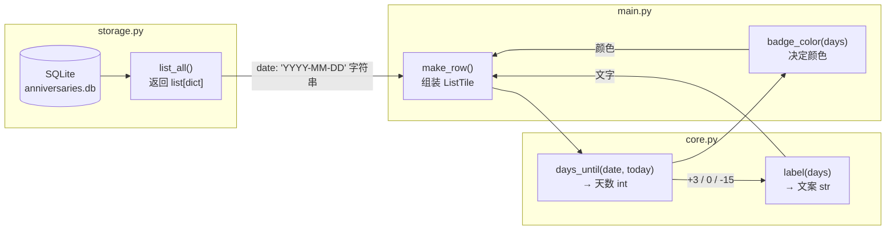
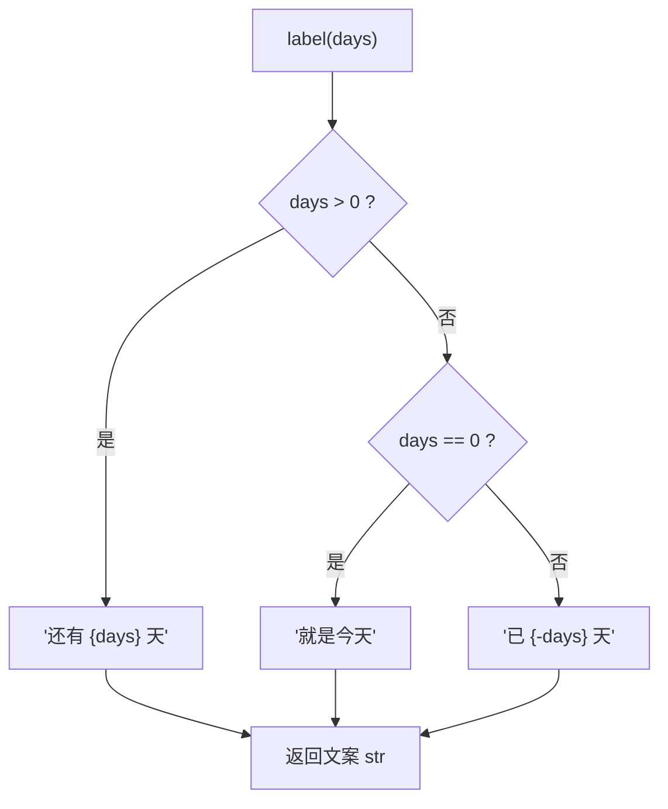

在这个纪念日 App 的四层架构中，`core.py` 承担着**纯逻辑层**的角色——它不碰数据库、不碰界面，只做纯粹的"输入 → 输出"计算。这一页聚焦其中最核心的两个函数：`days_until` 负责**把日期换算成天数**，`label` 负责**把天数翻译成用户能读懂的文案**。两者加起来不到 12 行代码，却体现了"计算与呈现分离"的经典设计思想。读完本页，你将理解它们各自的实现细节、为什么这样设计，以及 UI 层是如何消费它们的。

## 一、两个函数在架构中的位置

先看全景。整个 App 分为 UI（`main.py`）、纯逻辑（`core.py`）、存储（`storage.py`）、日志（`log.py`）四层。`days_until` 和 `label` 位于纯逻辑层，被 UI 层的 `make_row` 函数调用，输入来自存储层读出的数据。下图展示了数据从数据库到屏幕上那一行文字的完整旅程：



注意图中的一个关键细节：存储层交给 UI 的是**日期字符串**，而 `days_until` 的第一件事就是把它变成真正的日期对象——这正是它参数设计成联合类型的原因，下一节展开。

Sources: [core.py](core.py#L1-L15), [main.py](main.py#L69-L101), [storage.py](storage.py#L58-L66)

## 二、days_until：把"日期"变成"天数"

先看代码全貌，只有 4 行：

```python
def days_until(target_date: str | date, today: date) -> int:
    if isinstance(target_date, str):
        target_date = date.fromisoformat(target_date)
    return (target_date - today).days
```

| 参数 | 类型 | 含义 | 典型来源 |
|---|---|---|---|
| `target_date` | `str \| date` | 纪念日日期，既接受 ISO 字符串也接受 date 对象 | 数据库读出的 `"2025-12-25"` |
| `today` | `date` | "今天"，由调用方注入 | UI 层传入的 `date.today()` |
| **返回值** | `int` | 距今天数：正数在未来，0 是今天，负数已过去 | — |

### 2.1 为什么参数是 `str | date` 联合类型

`str | date` 是 Python 3.10+ 的联合类型语法（项目要求 Python ≥3.12，所以可以放心使用），表示"这个参数既可以是字符串，也可以是 `date` 对象"。这不是随意的设计，而是**向下兼容存储层的数据形态**：SQLite 中日期以 `TEXT` 列存储，`list_all()` 返回的字典里 `date` 字段就是 `"2025-12-25"` 这样的 ISO 字符串；而其他调用场景（比如测试或内部计算）手里可能已经是 `date` 对象。函数开头的 `isinstance` 检查在边界处一次性完成归一化——两种输入殊途同归，后续逻辑只面对统一的 `date` 类型。

Sources: [core.py](core.py#L4-L7), [storage.py](storage.py#L15-L22), [storage.py](storage.py#L58-L64), [pyproject.toml](pyproject.toml#L9)

### 2.2 日期相减：timedelta 的 `.days` 属性

`(target_date - today).days` 这一行用到了 Python 标准库的一个事实：两个 `date` 对象相减，得到的是 `timedelta`（时间差）对象，其 `.days` 属性就是整数天数。由于 `date` 不含时间成分，结果总是**精确的整天数**，不存在四舍五入的歧义。例如 `date(2025, 12, 25) - date(2025, 12, 20)` 的 `.days` 就是 `5`；反过来相减则是 `-5`。这个符号约定构成了整个 App 的分类基础：

| `days_until` 返回值 | 语义 | 例子（假设今天是 6 月 1 日） |
|---|---|---|
| `days > 0` | 纪念日在未来，倒计时中 | 目标 6 月 10 日 → `9` |
| `days == 0` | 就是今天 | 目标 6 月 1 日 → `0` |
| `days < 0` | 纪念日已过去 | 目标 5 月 20 日 → `-12` |

### 2.3 最值得注意的设计：`today` 是参数，不是内部计算

初学者容易忽略的一点：函数体内**没有**调用 `date.today()`，"今天"完全由调用方注入。这看似多此一举，实则是让函数保持**纯函数**性质的关键——相同的输入永远得到相同的输出，函数不依赖系统时钟这个隐藏的全局状态。两种写法的对比：

| 维度 | `days_until(d, today)`（当前写法） | 函数内部调用 `date.today()` |
|---|---|---|
| 可测试性 | 传入固定 `today` 即可断言结果 | 测试时结果随真实日期漂移 |
| 可复用性 | 可计算"距离任意参考日"的天数 | 只能算"距离今天" |
| 确定性 | 纯函数，无副作用 | 隐式依赖系统时间 |
| 灵活性 | UI 每次刷新时传入当下时间 | 写死，无法模拟其他日期 |

代价只是调用方多写一个参数——`main.py` 中每次调用都传 `date.today()`，把"什么时候取当前时间"这个决策留给了 UI 层。这种"时间作为参数注入"的模式在需要可测试性的项目中非常常见。

Sources: [core.py](core.py#L4-L7), [main.py](main.py#L70), [main.py](main.py#L98)

## 三、label：把"天数"变成"人话"

`days_until` 输出的是数字，但用户在界面上看到的应该是自然的中文。`label` 完成这最后一步翻译：

```python
def label(days: int) -> str:
    if days > 0:
        return f"还有 {days} 天"
    if days == 0:
        return "就是今天"
    return f"已 {-days} 天"
```

它的逻辑是一个清晰的三分支判断，可以用流程图直观呈现：



### 3.1 三种输出的完整映射

把 `label` 的输出和 UI 层配合它的 `badge_color` 函数放在一起看，会发现**同一个 `days` 值驱动了文字和颜色两套呈现**：

| `days` 取值 | `label` 输出 | `badge_color` 颜色 | 用户感知 |
|---|---|---|---|
| `9`（未来） | `还有 9 天` | `BLUE_400`（蓝） | 期待中的倒计时 |
| `0`（今天） | `就是今天` | `ORANGE_400`（橙） | 强调"重要的一天" |
| `-12`（过去） | `已 12 天` | `GREY_500`（灰） | 已翻篇的记忆 |

注意 `badge_color` 在 `main.py` 中是独立实现的，但它的三分支结构与 `label` 完全同构——**天数的正负号就是整个 App 唯一的分类依据**，文字、颜色、乃至后文的排序规则，都从这个符号派生。

### 3.2 一元负号技巧：`{-days}`

最有"代码味"的一行是 `return f"已 {-days} 天"`。走到这个分支时 `days` 必为负数（比如 `-12`），直接插值会显示成 `"已 -12 天"`，读起来很别扭。`-days` 是 Python 的一元负号运算，把 `-12` 翻转成 `12`，f-string 会把这个临时表达式的值格式化进字符串，得到 `"已 12 天"`。写成 `abs(days)` 效果完全相同，两者都是惯用写法；作者选择了负号形式，语义上更直白地表达"把负数翻正"。

Sources: [core.py](core.py#L10-L15), [main.py](main.py#L13-L15), [main.py](main.py#L62-L67)

## 四、UI 层如何消费这两个函数

`main.py` 中的 `make_row` 是这两个纯函数的最终消费现场。它先调用 `core.days_until` 拿到天数，再把天数分别喂给 `core.label`（生成文字）和本地的 `badge_color`（决定颜色），最后组装进 `ListTile` 的 `trailing` 区域：

```python
def make_row(item: dict) -> ft.ListTile:
    days = core.days_until(item["date"], date.today())
    return ft.ListTile(
        ...
        trailing=ft.Row([
            ft.Text(
                core.label(days),
                color=badge_color(days),
                ...
            ),
            ...
        ]),
    )
```

这里体现了分层架构的实际收益：UI 层完全不知道天数怎么算、文案怎么拼，它只负责**把纯函数的输出摆到正确的位置**。当 `refresh()` 被触发时（增删改之后），`sort_items` 先用 `days_until` 对所有条目排序，再由 `make_row` 逐条渲染——一次刷新中 `days_until` 会被调用两轮（排序一轮、渲染一轮），由于它是纯函数且极轻量，这个重复计算在设计上被坦然接受了。

Sources: [main.py](main.py#L69-L101)

## 五、为什么拆成两个函数：计算与呈现分离

最后回答一个初学者常问的问题：为什么不把 `label` 的逻辑直接写进 `days_until`，一步到位返回 `"还有 9 天"`？因为**天数的数值本身是多个消费方共用的中间结果**。`sort_items` 需要它做排序比较（排序设计的细节在下一页展开），`badge_color` 需要它决定颜色，未来如果加进度条、通知提醒等功能，同样只需要数字。拆成两个函数后，`days_until` 是稳定的数据基础，`label` 是可替换的呈现策略——换一种语言或文案风格，只改 `label` 十几行，其余代码纹丝不动。

这种拆分还天然带来了可测试性：两个函数都不依赖文件、网络、系统时间，给定输入即可断言输出，是教科书级的纯函数。仓库目前没有附带测试代码，但这份"无 IO"的设计已经为编写边界断言铺平了道路（该话题在工程化实践部分详细展开）。

Sources: [core.py](core.py#L1-L24), [core.py](core.py#L18-L23)

## 六、小结与延伸阅读

本页拆解了 `core.py` 中最核心的两个纯函数：`days_until` 通过联合类型参数兼容字符串与日期对象，用 timedelta 相减得到带符号的天数，并以"时间注入"的方式保持纯函数性质；`label` 用三分支把天数翻译成中文文案，其中 `{-days}` 一元负号负责把负数翻正。两者加上 UI 层镜像同构的 `badge_color`，共同构成了"以天数符号为分类轴"的呈现体系。

理解了这两个函数，接下来三条路径值得继续深入：

- **[排序设计：倒计时优先的元组排序键](13-pai-xu-she-ji-dao-ji-shi-you-xian-de-yuan-zu-pai-xu-jian)** —— 看 `sort_items` 如何复用 `days_until`，用元组键实现"未来靠前、已过去靠后"的排序；
- **[日期边界场景：当天、跨年与 2 月 29 日的处理](14-ri-qi-bian-jie-chang-jing-dang-tian-kua-nian-yu-2-yue-29-ri-de-chu-li)** —— 验证这两个函数在特殊日期下的行为；
- **[纯函数可测试性：无 IO 设计与边界断言策略](25-chun-han-shu-ke-ce-shi-xing-wu-io-she-ji-yu-bian-jie-duan-yan-ce-lue)** —— 学习如何为这两个函数编写测试。

如果想回顾它们所在的分层架构全貌，可以回到 [四层分层架构：UI、纯逻辑、存储、日志的职责划分](5-si-ceng-fen-ceng-jia-gou-ui-chun-luo-ji-cun-chu-ri-zhi-de-zhi-ze-hua-fen)。