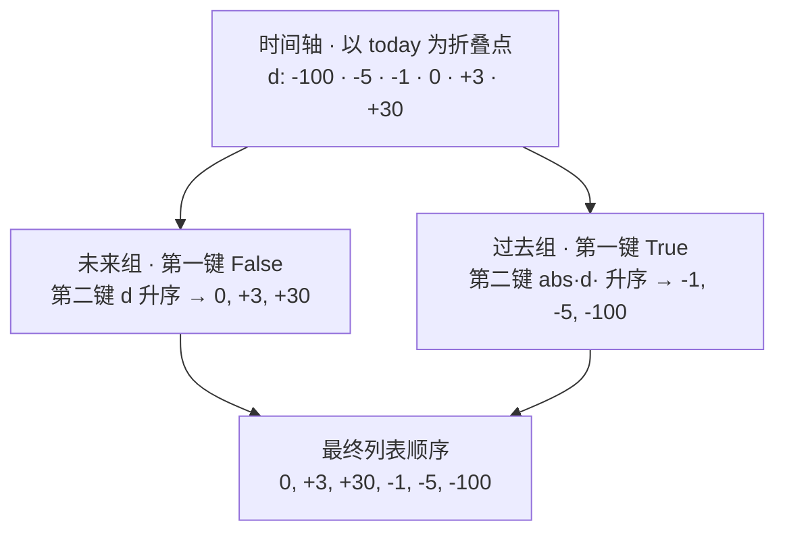
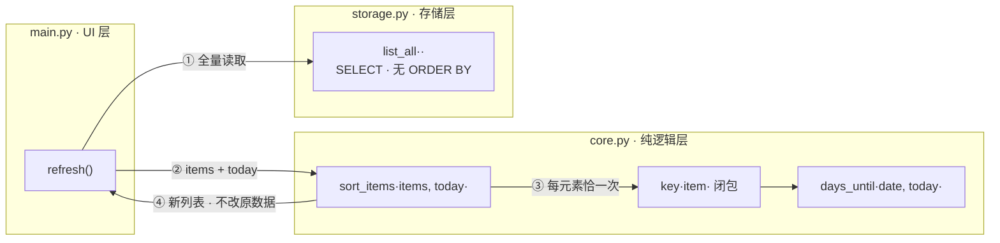

本页拆解 `core.py` 中仅 10 行的 `sort_items` 函数——它是决定纪念日列表呈现顺序的唯一仲裁者。我们将回答三个问题：为什么不直接按日期排序？`(d < 0, abs(d) if d < 0 else d)` 这个元组键如何在一行内实现"两段式折叠"排序？排序职责为何放在纯逻辑层而非 SQL 层？理解这 10 行代码，就理解了整个 App 最核心的产品语义：**用户最关心的永远是即将到来的事**。

## 设计问题：为什么不能直接按日期排序

面对一个按日期存储的列表，工程师的本能反应往往是在 SQL 里加一句 `ORDER BY date`。但这个项目的存储层恰恰没有这么做——`storage.list_all()` 执行的 SELECT 语句不带任何排序子句，返回的是数据库自然顺序的原始行 [storage.py](storage.py#L58-L66)。这是一个深思熟虑的职责划分：SQL 按日期排序得到的是**固定的日历顺序**，而用户视角中的"重要性"每天都在变化——昨天还很遥远的纪念日，今天可能就变成了"就是今天"。

问题的本质在于：**排序的基准不是日期本身，而是日期与"今天"的相对距离**。这个距离（差值天数 `d`）是一个随时间推移每日变化的角色，它无法在写入时固化到数据库里，只能在每个渲染时刻动态计算。因此排序被设计为一个以 `today` 为注入参数的纯函数，放在不依赖任何 IO 的 `core.py` 中，与 `days_until`、`label` 组成核心纯函数族。

Sources: [storage.py](storage.py#L58-L66), [core.py](core.py#L18-L23)

## 排序键拆解：一行元组的三重语义

完整的排序实现只有四行有效代码：

```python
def sort_items(items: list[dict], today: date) -> list[dict]:
    def key(item: dict) -> tuple[bool, int]:
        d = days_until(item["date"], today)
        return (d < 0, abs(d) if d < 0 else d)

    return sorted(items, key=key)
```

这行返回语句 `(d < 0, abs(d) if d < 0 else d)` 是全部魔法的所在。Python 对元组执行**字典序比较**：先比第一个元素，只有相等才比第二个。而 `bool` 是 `int` 的子类，`False == 0`、`True == 1`，因此第一键 `(d < 0)` 天然把所有条目切成两段——`d >= 0`（今天与未来）的 `False` 组排在 `d < 0`（已过期）的 `True` 组之前。第二键则在各组内部完成排序：未来组直接用 `d` 升序（越临近越靠前），过期组用 `abs(d)` 升序（越新近越靠前）。

值得注意的是 `d == 0` 的归属：由于判断条件是严格小于零，"今天"被划入未来组，其元组键 `(False, 0)` 是整个键空间中的**最小值**——只要存在当天的纪念日，它必然占据列表首位。这与 UI 层 `badge_color` 的三色语义严格对齐：未来蓝色、今天橙色、过期灰色，排序的分组边界与颜色的分组边界是同一套分区逻辑在两个层的投影 [core.py](core.py#L18-L23), [core.py](core.py#L4-L7), [main.py](main.py#L62-L67)。

用一张图直观展示这 10 行代码完成的"时间折叠"：



Sources: [core.py](core.py#L18-L23)

## 调用链：排序发生在渲染时刻

排序在整个 App 中只有一个调用点——UI 层的 `refresh()`。完整数据流是：`storage.list_all()` 取全量原始行 → `core.sort_items(items, date.today())` 排序 → `make_row` 逐条渲染为 `ListTile`。`sorted()` 返回**新列表**而不修改入参，条目字典本身不受影响；同时 CPython 保证 key 函数对每个元素恰好调用一次，即 `days_until` 在排序过程中每条数据只计算一遍 [main.py](main.py#L97-L101)。



将排序放在渲染时刻还有一个隐含收益：顺序无需持久化，也不会过期。每次 App 启动、每次增删改后的 `refresh()` 都以当下的 `date.today()` 重新计算，随着日期推移，昨天的"还有 1 天"自然滑落到过期组顶部，列表完成自我修正 [main.py](main.py#L97-L101), [main.py](main.py#L172)。

Sources: [main.py](main.py#L97-L101)

## 方案推演：三种候选排序键的对比

为了理解这行代码的取舍，不妨推演三种候选方案在同一组数据上的表现。假设列表中有五个条目：面试（`d=0`）、发薪日（`d=+3`）、生日（`d=+30`）、结婚周年（`d=-5`）、毕业典礼（`d=-100`）。

| 方案 | 排序键 | 得到的列表顺序 | UX 评估 |
|---|---|---|---|
| 按差值直接升序 | `d` | -100, -5, -1, 0, +3, +30 | 久远的往事霸占顶部，最值得关注的即将到来的事件沉入底部 |
| 按距今天数 | `abs(d)` | 0, ±1 交错, ±3 交错, … | 未来与过期条目混排，"接下来要发生什么"的分组语义丢失 |
| **元组键（实际方案）** | `(d < 0, abs(d))` | 0, +3, +30, -1, -5, -100 | 未来置顶且按临近度排序；过期沉底且按新近度排序，两组各得其所 |

逐条演算实际方案的键值与落位，可以完整看到元组比较的工作过程：

| 条目 | 日期差 `d` | 第一键 `d < 0` | 第二键 | 元组键 | 最终位次 |
|---|---|---|---|---|---|
| 面试 | 0 | `False` | 0 | `(False, 0)` | 1 |
| 发薪日 | +3 | `False` | 3 | `(False, 3)` | 2 |
| 生日 | +30 | `False` | 30 | `(False, 30)` | 3 |
| 结婚周年 | -5 | `True` | 5 | `(True, 5)` | 4 |
| 毕业典礼 | -100 | `True` | 100 | `(True, 100)` | 5 |

关键对比在于前两行的失败模式：单键 `d` 会让 `-100` 成为全列表首名——用户打开 App 第一眼看到的是一百年前（夸张地说）的旧事；单键 `abs(d)` 则让"还有 1 天"和"已 1 天"紧挨着出现，破坏了"未来 / 过期"这条最重要的认知分界线。元组键用第一个元素守住分界线，用第二个元素在界内排序，**以一次比较的代价买到了两级排序语义**。

Sources: [core.py](core.py#L18-L23)

## 稳定性与并列：同一天的多条目如何落位

当两个条目的元组键完全相等（例如两个都在 `+30` 天的纪念日），排序结果由 `sorted()` 的**稳定性**决定：CPython 的 Timsort 保证相等键的元素保持输入顺序，即维持 `storage.list_all()` 的返回顺序 [core.py](core.py#L23)。一个可验证的观察是：表结构中存在 `created_at` 字段，但它并未被用作第三级排序键——当前设计依赖稳定性加数据库自然行序即可获得确定性的并列落位，对个人纪念日这种规模的产品而言，这个简化是合理的 [storage.py](storage.py#L15-L22)。

Sources: [core.py](core.py#L18-L23), [storage.py](storage.py#L15-L22)

## 代码考古观察：冗余分支与自文档化

细读第二键的表达式 `abs(d) if d < 0 else d`，会发现一个有趣的事实：它在数学上**恒等于 `abs(d)`**——当 `d < 0` 时取 `abs(d)`，当 `d >= 0` 时 `d` 本身就等于 `abs(d)`。作者没有采用更简短的 `abs(d)`，而是显式写出了分支。这是一种自文档化选择：字面代码直接陈述了设计意图——"过期组按新近度（`abs`）排序，未来组按剩余天数（`d` 本身）排序"，读者无需在脑中展开 `abs` 在两个区间的行为。对于以教学与可读性为目标的代码库，这类"冗余换清晰"的权衡贯穿始终 [core.py](core.py#L19-L21)。

Sources: [core.py](core.py#L19-L21)

## 复杂度与规模边界

性能维度上，`sort_items` 的开销是 O(n) 次 key 计算（每次一次字符串日期解析与日期减法）加 O(n log n) 次元组比较。对于个人纪念日应用几十条量级的数据，这在任何设备上都可忽略；设计上也没有做任何缓存——每次 `refresh()` 重算，用最简单的代码换取顺序永远与"今天"同步的正确性。这种"简单优先于微优化"的取向，与整个项目零第三方依赖、纯函数至上的工程哲学一脉相承 [core.py](core.py#L18-L23), [main.py](main.py#L97-L101)。

Sources: [core.py](core.py#L18-L23), [main.py](main.py#L97-L101)

## 延伸阅读

- 想了解排序键赖以计算的 `days_until` 如何处理字符串与 `date` 双形态输入，见 [天数计算与文案生成：days_until 与 label](12-tian-shu-ji-suan-yu-wen-an-sheng-cheng-days_until-yu-label)
- 当天、跨年、2 月 29 日等边界输入如何影响 `d` 值与排序落位，见 [日期边界场景：当天、跨年与 2 月 29 日的处理](14-ri-qi-bian-jie-chang-jing-dang-tian-kua-nian-yu-2-yue-29-ri-de-chu-li)
- 排序的唯一调用点 `refresh()` 如何驱动整个列表刷新，见 [闭包式状态管理：refresh 驱动的整体刷新模式](11-bi-bao-shi-zhuang-tai-guan-li-refresh-qu-dong-de-zheng-ti-shua-xin-mo-shi)
- 存储层未采用的 SQL 排序路线及其 ISO 日期字符串的字典序优势，见 [表结构设计：ISO 日期字符串的字典序排序优势](17-biao-jie-gou-she-ji-iso-ri-qi-zi-fu-chuan-de-zi-dian-xu-pai-xu-you-shi)
- `today` 作为参数注入如何让 `sort_items` 成为可注入边界值的可测试纯函数，见 [纯函数可测试性：无 IO 设计与边界断言策略](25-chun-han-shu-ke-ce-shi-xing-wu-io-she-ji-yu-bian-jie-duan-yan-ce-lue)