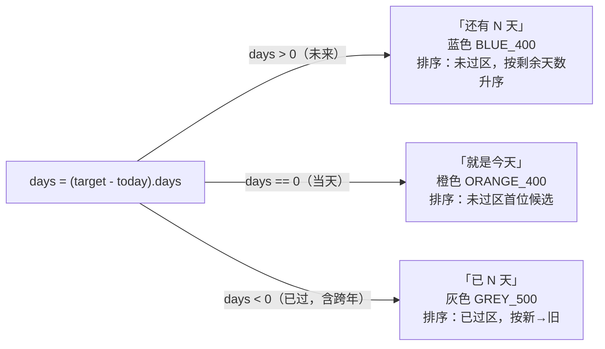
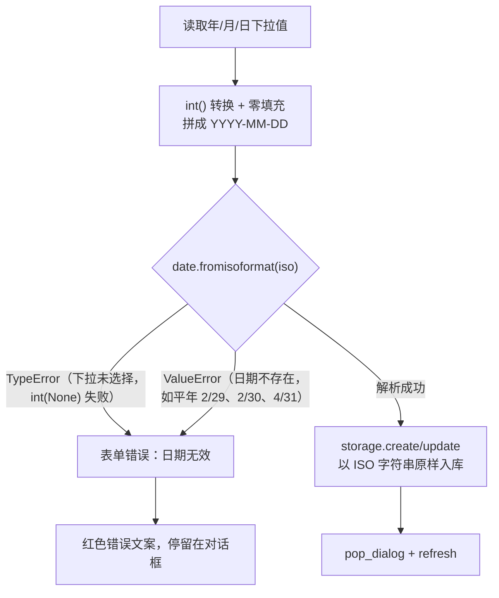

日期计算看似只有一行减法，真正的工程含量都藏在边界里：纪念日恰好是今天怎么显示？日期已经过去、跨过了一个甚至多个年份，天数怎么算？用户选择 2 月 29 日但当年不是闰年，谁能拦住这条脏数据？本页聚焦这三类边界场景在代码中的完整路径——从表单输入、入库校验到纯函数计算与 UI 呈现，说明这个 App 用一个核心设计决策（**一次性绝对日期模型**）让大部分边界被 Python 标准库的日历算术自然消化，只在入口处保留一道显式校验。

Sources: [core.py](core.py#L4-L15), [README.md](README.md#L12-L14)

## 设计前提：一次性绝对日期模型

理解所有边界行为的前提，是确认这个 App 记录的不是"每年循环的周年纪念日"，而是**一个固定的、一次性的日期**。`days_until` 的实现只有一行核心运算：`(target_date - today).days`，它返回带符号的整数差——目标在未来为正，已过为负，恰好命中为零。没有任何"如果今年的纪念日已过，就滚动到明年"的分支逻辑。[README.md](README.md#L12) 中"添加 / 编辑 / 删除纪念日（名称 + 一次性日期）"的表述也印证了这一模型选择。

Sources: [core.py](core.py#L4-L7), [README.md](README.md#L10-L14)

下图展示同一条减法运算在时间轴上划分出的三个区间，以及每个区间对应的文案、颜色与排序语义——后面三节将逐一展开每个边界：

三态行为的完整对照如下表，`label` 与 `badge_color` 是同一套三分支判断在纯逻辑层和 UI 层的镜像实现：

| days 取值 | 语义 | `label` 输出 | `badge_color` 颜色 | 排序归属 |
|---|---|---|---|---|
| `days > 0` | 未来 | `还有 {days} 天` | 蓝 `_FUTURE_COLOR` | 未过区，按 `days` 升序 |
| `days == 0` | 当天 | `就是今天` | 橙 `_TODAY_COLOR` | 未过区（0 最小，天然靠前） |
| `days < 0` | 已过（含跨年） | `已 {-days} 天` | 灰 `_PAST_COLOR` | 已过区，按 `abs(days)` 升序（新→旧） |

Sources: [core.py](core.py#L10-L23), [main.py](main.py#L13-L15), [main.py](main.py#L62-L67)

## 边界一：当天——days == 0 的精确命中

"纪念日就是今天"是三分支中最窄的一条缝隙，代码用**精确等值比较**命中它：`label` 中 `if days == 0: return "就是今天"`，`badge_color` 中 `if days == 0: return _TODAY_COLOR`。这一比较之所以可靠，源于 `datetime.date` 的类型特性——它只有年月日、没有时分秒成分，两个 `date` 相减得到的 `timedelta` 必然是精确的整数天，不存在"差 12 小时算不算当天"的模糊地带。当日命中后，未来分支的 `还有 N 天` 与过去分支的 `已 N 天` 都不会触发，文案与橙色高亮一一对应。

Sources: [core.py](core.py#L10-L15), [main.py](main.py#L62-L67)

当天边界还有一条隐性入口：新增纪念日时表单的**默认值就是今天**——`open_form` 在 `item` 为 `None`（新增而非编辑）时取 `d = date.today()` 回填三个下拉框。这意味着用户直接点保存，就会得到一条"就是今天"的记录，当天场景无需任何额外交互即可被触发。

Sources: [main.py](main.py#L108-L115)

值得注意的一个结构性细节是 **today 的多点采样**：`refresh` 在排序时调用一次 `date.today()`，但随后 `make_row` 渲染每一行时又各自独立调用 `date.today()`，表单默认值处再取一次。代码中不存在"将 today 作为快照传递给整个刷新流程"的约定——如果刷新恰好横跨午夜零点，排序基准与某几行的显示基准理论上可能取到不同的"今天"。这是极低概率的时序缝隙，属于当前实现的已知结构特征而非缺陷修复项，但它解释了为什么"当天"判定在代码里出现于多个采样点而非单一权威来源。

Sources: [main.py](main.py#L69-L70), [main.py](main.py#L97-L101)

## 边界二：跨年——负数区间的语义切换

当存储的日期早于今天，`(target - today).days` 自然取负，无论跨了几天、几个月还是好几年。语义切换由 `label` 的最后一个分支完成：`return f"已 {-days} 天"`——注意 **`-days` 的取反运算**，把负数差转成正数天数输出"已 N 天"，同时 `badge_color` 落入灰色 `_PAST_COLOR`，视觉上标记为"历史记录"。跨年在这里没有被特殊对待：2024 年存的日期在 2026 年查看，与上周刚过的日期走的是完全相同的代码路径。

Sources: [core.py](core.py#L10-L15), [main.py](main.py#L13-L15), [main.py](main.py#L62-L67)

跨年正确性最微妙的部分是**天数的日历准确性**，而这恰好不需要任何手写代码：Python 的 `date` 算术遵循格里高利历，差值自动包含路径上的闰日。两个可验证的例子：从 2024-01-01 跨到 2025-01-01，差值是 366 天（2024 是闰年，2 月 29 日被计入）；同样是从 2 月 28 日到 3 月 1 日，闰年差 2 天、平年差 1 天。`core.py` 中没有任何月份天数表、没有任何闰年判断分支——**日历复杂性被完全下沉给了标准库**。

Sources: [core.py](core.py#L4-L7)

UI 侧的跨年边界体现在年份下拉的取值范围：`range(1900, date.today().year + 101)`，即从 1900 年到"构建 UI 那一刻的今年 + 100"。两个事实值得注意：其一，上限在 `main()` 执行时固定，App 长期运行跨入新年后，可选上限不会自动增长（但余量有 100 年，实践中不会构成问题）；其二，上限远小于 `date.max`（9999-12-31），拼接出的 ISO 字符串不会触发 `fromisoformat` 的溢出错误。

Sources: [main.py](main.py#L42-L46)

把"绝对日期模型"与许多纪念日 App 采用的"滚动周年模型"对比，能看清这一决策消解了多少边界问题：

| 对比维度 | 本项目：绝对日期差 | 假想：滚动到下一次周年 |
|---|---|---|
| 已过日期的含义 | `已 N 天`（记录过去了多久） | 需计算"距下次周年还有 N 天" |
| 跨年处理 | 负数区间，无需分支 | 需判断"今年纪念日是否已过"，过了则年份 +1 |
| 2 月 29 日存档 | 直接存 `2024-02-29`，照常相减 | 平年需决策映射到 2/28 还是 3/1 |
| 天数闰日修正 | `date` 算术自动包含 | 同样依赖日历算术，但叠加循环逻辑 |
| 排序语义 | 未过在前、已过新→旧在后 | 全部为正数倒计时，语义单一 |

代价是产品语义的收窄——它回答"这件事发生在多久之前/多久之后"，而不回答"下一个周年纪念日还有多久"。README 用"一次性日期"四个字明确了这是有意的产品边界，而非实现疏漏。

Sources: [README.md](README.md#L12-L14), [core.py](core.py#L18-L23)

## 边界三：2 月 29 日——门卫只有 fromisoformat

2 月 29 日是这个 App 中唯一"输入合法性取决于年份"的日期：同一次选择 `02` + `29`，在闰年是合法日期，在平年是非法日期。处理策略的关键在于**门卫的唯一性**——三个下拉框中，日下拉的选项是静态的 `1..31`，不随所选月份联动收缩；年、月、日拼成 `YYYY-MM-DD` 字符串后，`save` 回调里唯一的合法性裁决者是 `date.fromisoformat(iso)` 这一行。下面的流程图展示保存时日期边界的完整判定路径：

`try/except (TypeError, ValueError)` 的双异常捕获精确对应两类失败：任一下拉未选择时 `int(None)` 抛 `TypeError`；字符串能拼出来但日期在日历上不存在时 `fromisoformat` 抛 `ValueError`。用户看到的错误文案是 `日期无效（如 2 月 30 日）`——括号里举的是 2 月 30 日这个最直观的例子，但**平年的 2 月 29 日同样命中这条提示**。完整的非法触发集合如下表：

| 用户输入组合 | 失败原因 | 用户反馈 |
|---|---|---|
| 年/月/日任一未选择 | `int(None)` → `TypeError` | 日期无效（如 2 月 30 日） |
| 平年 + 2 月 29 日（如 2023-02-29） | `ValueError` | 日期无效（如 2 月 30 日） |
| 任何年份 + 2 月 30/31 日 | `ValueError` | 日期无效（如 2 月 30 日） |
| 4/6/9/11 月 + 31 日 | `ValueError` | 日期无效（如 2 月 30 日） |
| 闰年 + 2 月 29 日（如 2024-02-29） | 解析成功 | 正常入库 |

Sources: [main.py](main.py#L52-L56), [main.py](main.py#L117-L132)

一旦通过门卫，2 月 29 日在后续全链路中**再无任何特殊处理**。存储层把 `date_iso` 字符串原样写入 `TEXT` 列，不解析、不复核；`days_until` 对 `2024-02-29` 的计算与对 `2024-03-15` 的计算走完全相同的减法——闰年判定（能被 4 整除且不被 100 整除，或能被 400 整除）在入口处由 `fromisoformat` 一次性完成，在计算处由 `date` 算术隐式保证，业务代码中找不到一个 `leap` 或 `feb` 字样。这条"入口严校验、链路零分支"的路径构成了一个闭环：库里永远只存合法日期，因此编辑回填时 `open_form` 里那句 `date.fromisoformat(item["date"])` 必然成功，闰日的 29 也在日下拉的静态选项 `01..31` 范围内，回显无恙。

Sources: [storage.py](storage.py#L69-L86), [core.py](core.py#L4-L7), [main.py](main.py#L108-L115)

回看设计前提一节的对比表就能理解这个闭环的价值：**绝对日期模型让 2 月 29 日从"循环周年模型中必须决策的映射难题"（平年归到 2/28 还是 3/1？）退化为"一次性的输入校验问题"**。模型选择在先，边界处理在后——这是本页三个场景共享的同一条设计逻辑。

Sources: [core.py](core.py#L4-L7), [README.md](README.md#L46)

## 边界责任的分层分布

三类边界并非由单一函数包办，而是沿四层架构自然分摊。下表归纳每个环节对边界的具体责任，可以看出"输入端集中校验、计算端零分支、展示端镜像三态"的分布模式：

| 环节 | 文件/函数 | 对边界的责任 |
|---|---|---|
| 输入构造 | `main.py` 年/月/日下拉 | 静态选项集（日恒为 1..31），不预判合法性；年份范围 1900..今+100 |
| 入口校验 | `main.py` `save` → `date.fromisoformat` | 拦截平年 2/29、2/30、大月 31 日及未选择，唯一的合法性门卫 |
| 持久化 | `storage.py` `create/update` | ISO 字符串原样存 `TEXT` 列，不做二次日期逻辑 |
| 纯计算 | `core.py` `days_until` | 一次带符号减法，当天/跨年/闰日均由 `date` 算术保证正确 |
| 展示 | `core.py` `label` + `main.py` `badge_color` | 三态镜像分支：文案与颜色一一对应 |
| 排序 | `core.py` `sort_items` | `d < 0` 布尔键把已过项隔离到列表尾部 |

Sources: [core.py](core.py#L4-L23), [main.py](main.py#L41-L57), [main.py](main.py#L117-L132), [storage.py](storage.py#L69-L86)

这种分布的可测试性收益是直接的：`days_until` 和 `label` 都是**无 IO 纯函数，且 `today` 作为显式参数注入**而非函数内部取 `date.today()`——这意味着"当天""跨一年含闰日""存 2 月 29 日"三类边界都可以用固定的日期字面量构造断言，不需要冻结系统时钟。README 在代码结构表中明确将 core.py 标注为"无 IO，边界已断言：跨年/当天/2月29"，将这三类场景列为该模块的验收基线。

Sources: [core.py](core.py#L4-L15), [README.md](README.md#L42)

## 小结与延伸阅读

三个边界场景最终收敛于同一个结论：**模型选择（一次性绝对日期 + 带符号差）先行，边界处理就只剩下入口处一道 `fromisoformat` 校验和展示端两组三分支**。当天由 `days == 0` 精确命中；跨年由负数区间自然切换为"已 N 天"，闰日计数下沉给标准库；2 月 29 日在闰年正常入库、在平年被入口拦截，链路上再无特殊分支。唯一的结构性留白是 today 的多点采样——它不破坏任何单次渲染的正确性，只是没有做成统一快照。

若想继续深入相关主题：`days_until` 与 `label` 两个函数的整体设计动机详见 [天数计算与文案生成：days_until 与 label](12-tian-shu-ji-suan-yu-wen-an-sheng-cheng-days_until-yu-label)；负数区间的元组排序键展开详见 [排序设计：倒计时优先的元组排序键](13-pai-xu-she-ji-dao-ji-shi-you-xian-de-yuan-zu-pai-xu-jian)；保存回调中名称校验与 SnackBar 反馈的完整流程详见 [表单校验与用户反馈：名称非空、非法日期与 SnackBar](10-biao-dan-xiao-yan-yu-yong-hu-fan-kui-ming-cheng-fei-kong-fei-fa-ri-qi-yu-snackbar)；ISO 字符串入库后的字典序特性详见 [表结构设计：ISO 日期字符串的字典序排序优势](17-biao-jie-gou-she-ji-iso-ri-qi-zi-fu-chuan-de-zi-dian-xu-pai-xu-you-shi)；纯函数边界断言的测试策略详见 [纯函数可测试性：无 IO 设计与边界断言策略](25-chun-han-shu-ke-ce-shi-xing-wu-io-she-ji-yu-bian-jie-duan-yan-ce-lue)。