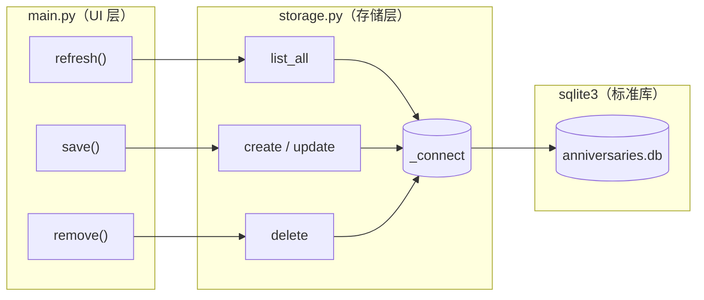
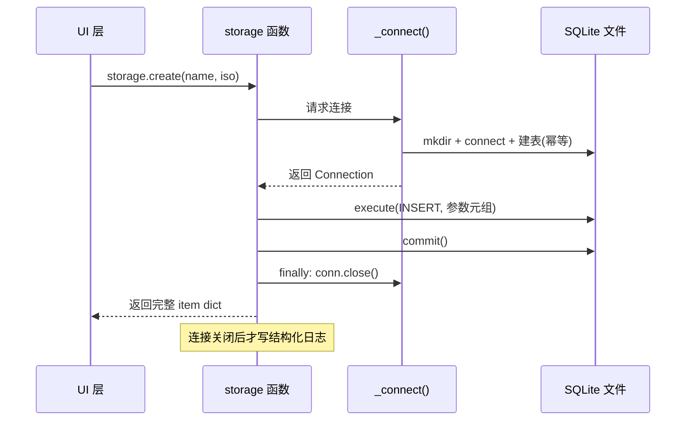

本文解析纪念日 App 持久化层 `storage.py` 的完整实现——它只依赖 Python 标准库的 `sqlite3` 模块，用四段手写 SQL 覆盖全部增删改查需求，没有 ORM、没有抽象基类、没有连接池。我们将聚焦三个核心问题：**参数化查询如何防御 SQL 注入**、**短生命周期连接如何用 `try/finally` 保证资源释放**、以及 **`rowcount` 如何充当轻量级存在性信号**。数据库路径的三级回退策略与坏库自愈机制有专文详述，本文仅在涉及处交叉引用。

Sources: [storage.py](storage.py#L1-L22)、[pyproject.toml](pyproject.toml#L12-L15)

## 定位：一个模块，四条通道

在[四层分层架构](5-si-ceng-fen-ceng-jia-gou-ui-chun-luo-ji-cun-chu-ri-zhi-de-zhi-ze-hua-fen)中，`storage.py` 是最底层的存储模块，向上仅暴露五个公开函数：`init`、`list_all`、`create`、`update`、`delete`。UI 层（`main.py`）从不直接触碰 SQL——它在启动时调用一次 `storage.init(db_file)` 设定数据库路径，之后所有读写都经由这四个 CRUD 函数完成。这种"窄接口"设计使得持久化的全部细节（连接、事务、异常恢复）都被压缩进 116 行代码里，交换格式则是最朴素的 `list[dict]` / `dict`，与 [core.py](core.py#L1-L24) 的纯函数层天然兼容。

上图展示了数据流的全貌：三个 UI 入口对应三个存储函数族，而它们共享同一个私有工厂 `_connect()` 作为通往 SQLite 文件的唯一咽喉。注意 `init()` 不在图中——它只在应用启动时执行一次，作用是把外部传入的路径写入模块级全局变量 `DB_PATH`，随后立即建连验证并关闭，属于"探针式"初始化。

Sources: [storage.py](storage.py#L25-L30)、[main.py](main.py#L29-L31)、[main.py](main.py#L97-L106)、[main.py](main.py#L133-L136)

## 连接管理：每次操作一条短命连接

`_connect()` 是整个存储层的连接策略核心。它不缓存连接、不维护连接池，而是**每次被调用时新建一条连接**，调用方用完即关。函数内部按固定顺序完成四件事：由 `_target_path()` 解析最终路径（三级回退策略见[数据库路径三级策略](16-shu-ju-ku-lu-jing-san-ji-ce-lue-xi-tong-mu-lu-ben-di-hui-tui-yu-anniversary_db-huan-jing-bian-liang)）；`mkdir(parents=True, exist_ok=True)` 确保父目录存在；`sqlite3.connect(path)` 建连并设置 `conn.row_factory = sqlite3.Row`；最后执行 `_SCHEMA` 中的 `CREATE TABLE IF NOT EXISTS` 并提交——这意味着**每一次连接都隐式完成幂等的建表**，无需单独的迁移步骤。

`sqlite3.Row` 这个一行设置是读路径的关键伏笔：它让查询结果不再是裸元组，而是支持按列名访问的行对象，`dict(r)` 一行即可转换为普通字典。若没有它，`list_all()` 就得写 `{"id": r[0], "name": r[1], ...}` 这样的位置索引，既脆弱又难以维护。

上图的时序揭示了三个纪律：写操作必须 `commit()` 才落盘；`close()` 放在 `finally` 块中，即使 `execute` 抛异常连接也必然释放；结构化日志（如 `anniversary_created`）在连接关闭**之后**才发出，保证日志出现即代表该操作已完整提交。`_connect()` 内部的 `except sqlite3.DatabaseError` 分支负责坏库检测与重建，详见[坏库自愈机制](18-pi-ku-zi-yu-ji-zhi-sun-pi-jian-ce-gai-ming-bei-fen-yu-zi-dong-zhong-jian)。

Sources: [storage.py](storage.py#L37-L55)、[storage.py](storage.py#L85-L86)

### 为什么不用长连接或连接池

| 策略 | 实现成本 | 并发安全 | 适用场景 | 本项目取舍 |
|---|---|---|---|---|
| **短命连接（本项目）** | 最低，无共享状态 | 天然隔离，单线程 Flet 事件循环下无竞争 | 单用户移动端、低频操作 | ✅ 采用 |
| 模块级长连接 | 需处理线程亲和与超时 | Flet 异步多协程下需加锁 | 高频读写的桌面服务 | ❌ 复杂度不值 |
| 连接池 | 引入第三方或手写池管理 | 池本身需并发控制 | Web 服务多请求 | ❌ 违背零依赖哲学 |

纪念日 App 的写操作仅发生在用户点击"保存"或"删除"的瞬间，读操作仅在 `refresh()` 时触发——单用户场景下每秒连接次数趋近于零，`sqlite3.connect` 的本地文件建连开销（微秒级）完全可以忽略。短命连接最大的优势是把"连接泄漏"这类问题从设计上消灭：`try/finally` 模式让每条连接的生命周期都封闭在单个函数栈帧内，可静态审计。

Sources: [storage.py](storage.py#L58-L66)、[main.py](main.py#L97-L101)

## 读路径：`list_all` 与列名映射

`list_all()` 是四个 CRUD 中唯一不产生写副作用的函数。它执行一条无参数的 `SELECT`，`fetchall()` 取回全部行，然后用列表推导 `[dict(r) for r in rows]` 把 `sqlite3.Row` 统一转为字典。值得注意的是它**不调用 commit**——普通 SELECT 在 SQLite 的默认隔离级别下不会开启需要提交的事务（建表语句除外），省略 commit 是有意为之的读写不对称纪律。

Sources: [storage.py](storage.py#L58-L66)

## 写路径：`create` 的 Python 端字段生成

`create(name, date_iso)` 最有分析价值的设计是：**四分之三的字段在 Python 端生成，而非交给 SQL**。`id` 用 `uuid4().hex`（32 字符十六进制，无连字符），`created_at` 用 `datetime.now(timezone.utc).isoformat(timespec="seconds")`——UTC 时间戳精确到秒。只有 `name` 和 `date` 来自调用方输入。这个选择带来一个直接收益：`create()` 可以把完整 `item` 字典原样返回，UI 层无需再执行一次 SELECT 来取回数据库生成的值。同时，日期以 ISO 字符串入库的排序优势见[表结构设计](17-biao-jie-gou-she-ji-iso-ri-qi-zi-fu-chuan-de-zi-dian-xu-pai-xu-you-shi)。

INSERT 语句本身是本模块参数化查询的典型样本：SQL 模板中四个 `?` 占位符与参数元组 `(item["id"], item["name"], item["date"], item["created_at"])` 一一对应，由 `sqlite3` 驱动完成转义绑定，用户输入永远不参与 SQL 文本的拼接。

Sources: [storage.py](storage.py#L69-L86)

## 更新与删除：`rowcount` 语义

`update()` 与 `delete()` 共享同一套模式：执行带 `WHERE id = ?` 的语句 → `commit()` → 读取游标的 `rowcount` 属性 → 返回 `rowcount > 0` 的布尔值。这个布尔返回值是一个**轻量级存在性信号**——它告诉调用方"这条 id 对应的记录是否真的存在并被改动"，而无需额外执行一次 SELECT 探测。两者还共享条件日志纪律：只有 `changed` 为真时才记录 `anniversary_updated` / `anniversary_deleted` 事件，日志因此天然过滤掉"对不存在 id 的无效操作"这类噪音。

| 函数 | SQL 语句 | 占位符数 | 返回值 | 写日志条件 |
|---|---|---|---|---|
| `list_all` | `SELECT ... FROM anniversaries` | 0 | `list[dict]` | 无 |
| `create` | `INSERT INTO ... VALUES (?, ?, ?, ?)` | 4 | 完整 `item` dict | 无条件 |
| `update` | `UPDATE ... SET name = ?, date = ? WHERE id = ?` | 3 | `bool`（是否命中） | 仅命中时 |
| `delete` | `DELETE FROM ... WHERE id = ?` | 1 | `bool`（是否命中） | 仅命中时 |

上表汇总了四条通道的完整契约。值得一提的是，UI 层目前**并未消费** `update`/`delete` 的布尔返回值（`main.py` 直接调用后即 `refresh()`），这个返回值是为未来"操作失败时提示用户"预留的接口余量——但按本页边界，那属于 UI 反馈的话题，可延伸阅读[表单校验与用户反馈](10-biao-dan-xiao-yan-yu-yong-hu-fan-kui-ming-cheng-fei-kong-fei-fa-ri-qi-yu-snackbar)。

Sources: [storage.py](storage.py#L89-L115)、[main.py](main.py#L103-L106)

## 参数化查询：`?` 占位符的防御边界

本模块所有接触用户数据的 SQL 一律使用 `?` 占位符。这是防御 SQL 注入的标准手段：驱动层将参数作为纯数据绑定到预编译语句，无论参数内容包含什么字符（引号、分号、注释符），都不会改变 SQL 的语法结构。作为对比，假设用 f-string 拼接：

| 维度 | f-string 拼接（❌ 反面示例） | `?` 参数化（✅ 本项目） |
|---|---|---|
| 注入风险 | 名称输入 `x'; DROP TABLE anniversaries; --` 即可破坏库 | 驱动转义，参数永远是数据 |
| 查询计划 | 每次拼接生成新 SQL 文本，无法复用 | 相同模板可复用预编译计划 |
| 可读性 | 引号嵌套地狱 | 模板与数据分离，一目了然 |
| 类型安全 | 需手动 `str()` 或引号包裹 | 驱动自动按 Python 类型绑定 |

注意一个边界细节：`_SCHEMA` 建表语句是**模块内写死的可信常量**，不含任何外部输入，因此它直接 `execute` 而无需参数化——参数化的防御对象是"不可信数据"，而非 SQL 语句本身。

Sources: [storage.py](storage.py#L15-L22)、[storage.py](storage.py#L78-L81)、[storage.py](storage.py#L92-L95)、[storage.py](storage.py#L108-L108)

## 事务纪律与零依赖哲学的呼应

本模块的事务模型极为朴素：**每个写函数自带一个微型事务**（execute + commit），没有跨函数的长事务，没有显式 `BEGIN`。在单用户、单条记录粒度操作的场景下，这是复杂度与安全性的最优点——最坏情况下崩溃只会丢失当前单条操作，绝不会留下半提交状态。这种"用标准库解决一切"的克制与 [uv 依赖管理与零第三方依赖哲学](24-uv-yi-lai-guan-li-yu-ling-di-san-fang-yi-lai-zhe-xue)一脉相承：`pyproject.toml` 的依赖清单里只有 `flet` 和 `structlog`，`sqlite3`、`uuid`、`pathlib`、`datetime` 全部来自标准库。结构化日志事件的命名（`anniversary_created` 等）遵循 [structlog 配置详解](19-structlog-pei-zhi-xiang-jie-chu-li-qi-lian-console-cai-se-yu-json-xuan-ran)中约定的蛇形事件名规范。

Sources: [storage.py](storage.py#L76-L84)、[pyproject.toml](pyproject.toml#L9-L15)

## 延伸阅读

理解了 CRUD 的调用契约后，自然的推进路径是：`refresh()` 驱动的整体刷新如何依赖 `list_all()` 的返回，见[闭包式状态管理](11-bi-bao-shi-zhuang-tai-guan-li-refresh-qu-dong-de-zheng-ti-shua-xin-mo-shi)；`_connect()` 内部的坏库恢复分支，见[坏库自愈机制](18-pi-ku-zi-yu-ji-zhi-sun-pi-jian-ce-gai-ming-bei-fen-yu-zi-dong-zhong-jian)；而 `_target_path()` 的三级回退决策链，见[数据库路径三级策略](16-shu-ju-ku-lu-jing-san-ji-ce-lue-xi-tong-mu-lu-ben-di-hui-tui-yu-anniversary_db-huan-jing-bian-liang)。