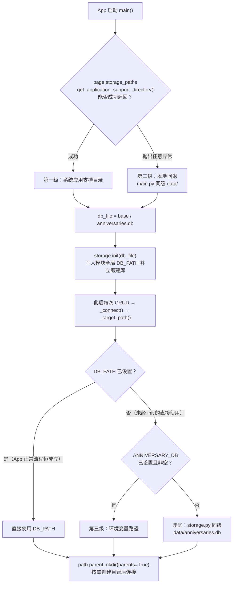
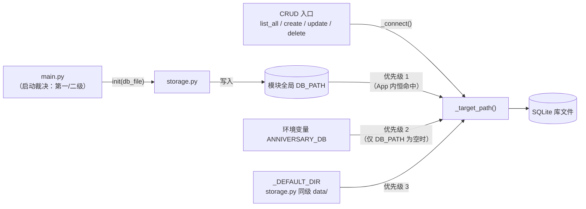

同一份代码要在两个世界运行：开发者的桌面（Windows/macOS）与用户的 Android 真机。前者有任意的可写目录，后者只有 App 沙箱内的一小块私有空间。数据库文件放在哪里，直接决定了数据"是否在卸载重装后依然存在、是否被系统清理、开发者能否手动检查"。本项目没有引入任何路径管理库，而是用约 10 行代码构建了一条**三级降级路径决策链**：优先使用系统应用支持目录，取不到时回退到项目本地 `data/` 目录，并额外预留 `ANNIVERSARY_DB` 环境变量作为旁路入口。本文解析这条链的每一级触发条件、代码位置，以及一个容易被忽略的优先级细节。

Sources: [README.md](README.md#L48-L52)

## 决策链全景：两个代码站点，一次"落子"

路径决策分布在两个文件中，理解这一点是看懂整条链的前提。`main.py` 在启动时负责**前两级的裁决**——尝试向 Flet 询问系统应用支持目录，失败则退回本地目录——然后把裁决结果通过 `storage.init(db_file)` 一次性"落子"到存储层；`storage.py` 内部的 `_target_path()` 则持有**环境变量与兜底逻辑**，在每次建立连接时重新求值。两站点通过模块级全局变量 `DB_PATH` 衔接：`init()` 写入，`_target_path()` 读取。

在阅读下图前需要知道三个事实作为前置：其一，`page.storage_paths.get_application_support_directory()` 是 Flet 的异步 API，依赖平台通道，在某些环境下可能抛异常；其二，`main()` 无论走 try 还是 except 分支，最终都会调用 `storage.init()`；其三，`_target_path()` 的判断顺序是 `DB_PATH` → 环境变量 → 默认路径，短路求值。



三级概览如下表，后文逐级展开：

| 级别 | 名称 | 裁决位置 | 触发条件 | 典型结果 |
|---|---|---|---|---|
| 第一级 | 系统应用支持目录 | `main.py` try 分支 | `storage_paths` API 成功返回 | 桌面为 OS 应用数据目录；真机为 App 沙箱 |
| 第二级 | 本地 `data/` 回退 | `main.py` except 分支 | `storage_paths` 抛出任意异常 | 项目根目录下 `data/anniversaries.db` |
| 第三级 | `ANNIVERSARY_DB` 环境变量 | `storage.py` `_target_path()` | `DB_PATH` 为空（即未经 `init()`）且变量非空 | 调用方指定的任意路径 |

Sources: [main.py](main.py#L18-L31), [storage.py](storage.py#L11-L34)

## 第一级：系统应用支持目录——生产环境的"正式住址"

`main()` 首先异步调用 `await page.storage_paths.get_application_support_directory()`，拿到基目录后拼上文件名 `anniversaries.db`。这是 Flet 封装的跨平台语义：桌面端返回操作系统约定的应用数据位置（如 Windows 的 `%APPDATA%` 对应区域、macOS 的 `~/Library/Application Support`），Android 端则落在**App 沙箱目录**内——卸载即清除、系统不会被其他 App 读写，这正是移动端数据的标准归宿。README 中"SQLite 数据在手机上位于 App 沙箱目录"的表述即对应此级。路径确定后，`logger.info("app_started", db=str(db_file))` 会把最终位置打到日志，这是事后验证当前命中哪一级的直接手段（启动日志中还存在一条事件名为空的 `logger.info("",base=base)`，仅携带 `base` 字段，是排查时的一个可辨识痕迹）。

Sources: [main.py](main.py#L24-L31), [README.md](README.md#L50-L52)

## 第二级：本地 `data/` 回退——可用性兜底

当 `storage_paths` 请求以任何方式失败时，`except Exception` 分支把基目录改为 `Path(__file__).parent / "data"`，即 **`main.py` 同级的 `data/` 目录**。这一级的价值在于保证"无论如何都能启动"：与其让路径获取失败导致整个 App 崩溃，不如退到一个确定可写的位置。两个工程细节值得注意：第一，`data/` 已被列入 `.gitignore`，回退产生的数据库文件不会混入版本库；第二，回退目录的锚点是 `main.py` 的 `__file__`，而存储层内部还有一个语义相同但锚点不同的常量 `_DEFAULT_DIR = Path(__file__).parent / "data"`（锚定 `storage.py`）——本项目两文件同在仓库根目录，结果一致，但这是两个独立的代码位点，若日后文件分属不同目录，二者将指向不同位置。

Sources: [main.py](main.py#L26-L27), [storage.py](storage.py#L13), [.gitignore](.gitignore#L6)

## 第三级：`ANNIVERSARY_DB` 环境变量——被遮蔽的旁路开关

第三级藏在 `_target_path()` 的一行表达式里：

```python
return DB_PATH or Path(os.getenv("ANNIVERSARY_DB") or _DEFAULT_DIR / "anniversaries.db")
```

由于 `/` 运算符优先级高于 `or`，该表达式的真实求值顺序是 `DB_PATH or Path(环境变量 or 默认路径)`——即**函数内部的优先级为 `DB_PATH` > 环境变量 > 默认路径**，且 `os.getenv` 返回 `None` 或空字符串时均视为未设置。这引出一个必须精确理解的事实：`main()` 无论走哪个分支都会先调用 `storage.init()` 写入 `DB_PATH`，此后的短路求值使环境变量分支**在 App 正常运行流程中永远不可达**。换言之，README 中"想换位置可设环境变量 `ANNIVERSARY_DB=<路径>` 后再启动"的描述与代码的实际优先级存在缝隙——按当前代码，通过 `main.py` 启动时该变量不会生效。它真正的服务对象是**绕过 `main()` 直接使用 `storage` 模块**的场景：测试脚本、数据迁移工具、REPL 中 `import storage` 后直接调用 CRUD——此时 `DB_PATH` 保持初始值 `None`，环境变量成为指定测试库位置的唯一入口。下表穷举四种输入组合的实际结果：

| `DB_PATH` 状态（`init()` 是否已调用） | `ANNIVERSARY_DB` | `_target_path()` 返回 |
|---|---|---|
| 已设置（App 正常启动，恒成立） | 无论是否设置 | `DB_PATH` 本身 |
| 未设置 | 已设置且非空 | 环境变量指定的路径 |
| 未设置 | 未设置 | `_DEFAULT_DIR / "anniversaries.db"` |
| 未设置 | 设置为空字符串 | 同上（空串为假值，等同未设置） |

Sources: [storage.py](storage.py#L11-L34), [main.py](main.py#L24-L31), [README.md](README.md#L35)

## 支撑机制：init() 的"落子"与 _connect() 的按需建目录

三级策略之所以"零配置即用"，靠的是两个配套机制。首先是 `init()`：它把传入路径经 `Path(db_path)` 规范化后写入全局 `DB_PATH`，随即调用 `_connect()` 立即建库（执行建表 SQL）并以 `db_initialized` 事件记录路径——这意味着路径裁决在启动阶段就完成并"落袋为安"，后续 CRUD 不再依赖 `main.py` 传入的任何信息。其次是 `_connect()` 开头的 `path.parent.mkdir(parents=True, exist_ok=True)`：无论最终命中哪一级，父目录若不存在都会被按需递归创建，回退目录和环境变量指定的目录因此无需预先准备。下图展示两个模块间的读写关系：



每次 CRUD 调用都会重新执行 `_target_path()` 求值，但由于 `DB_PATH` 一经设置不再变更，实际路径在整个进程生命周期内稳定；若库文件损坏，`_connect()` 中的自愈逻辑会改名备份并重建（详见[坏库自愈机制](18-pi-ku-zi-yu-ji-zhi-sun-pi-jian-ce-gai-ming-bei-fen-yu-zi-dong-zhong-jian)），路径本身不变。

Sources: [storage.py](storage.py#L25-L55)

## 设计取舍评估

用单一模块全局变量承载路径，换来的是 `_connect()` 处一行即可完成解析的极简实现，代价则是环境变量优先级被启动流程"吞掉"的语义陷阱；用 `except Exception` 兜住 `storage_paths` 的所有异常，换来的是启动永不因路径问题失败，代价是无法区分"通道暂不可用"与"真实错误"。三级各自的定位与风险归纳如下：

| 维度 | 第一级：系统目录 | 第二级：本地回退 | 第三级：环境变量 |
|---|---|---|---|
| 定位 | 生产数据的正式住址 | 可用性兜底 | 外部旁路（测试/运维） |
| 数据生命周期 | 跟随 OS/沙箱规则 | 跟随项目目录留存 | 完全由调用方决定 |
| 版本库影响 | 无（在项目外） | 已 gitignore，不入库 | 无 |
| 主要风险 | 依赖平台通道可用 | 开发者可能误以为数据在系统目录 | 在 App 流程中被 `DB_PATH` 遮蔽，与 README 描述存在偏差 |

对维护者的启示是：若希望环境变量真正成为启动期覆盖开关，需在 `main()` 中先检查 `os.getenv("ANNIVERSARY_DB")` 再决定是否走 `storage_paths`；而当前实现下，它是一个服务于 `storage` 模块独立使用场景的入口。连接管理、参数化查询等 `_connect()` 的其余职责属于另一话题，见[SQLite 裸 SQL CRUD：参数化查询与连接管理](15-sqlite-luo-sql-crud-can-shu-hua-cha-xun-yu-lian-jie-guan-li)。

Sources: [storage.py](storage.py#L33-L41), [README.md](README.md#L35-L52)

## 延伸阅读

- 想了解 `init()` 落子后库文件内部长什么样，见[表结构设计：ISO 日期字符串的字典序排序优势](17-biao-jie-gou-she-ji-iso-ri-qi-zi-fu-chuan-de-zi-dian-xu-pai-xu-you-shi)。
- 路径确定后若文件损坏如何自愈，见[坏库自愈机制：损坏检测、改名备份与自动重建](18-pi-ku-zi-yu-ji-zhi-sun-pi-jian-ce-gai-ming-bei-fen-yu-zi-dong-zhong-jian)。
- 同为"环境变量改运行时行为"的姊妹模式，见[运行时可调日志：LOG_LEVEL 与 LOG_JSON 环境变量](20-yun-xing-shi-ke-tiao-ri-zhi-log_level-yu-log_json-huan-jing-bian-liang)。
- 第一级路径在真机上的实际验证方法，见[桌面调试与真机验证的能力边界划分](23-zhuo-mian-diao-shi-yu-zhen-ji-yan-zheng-de-neng-li-bian-jie-hua-fen)。