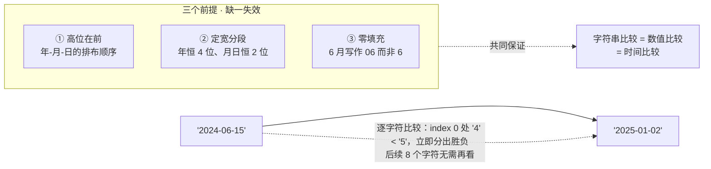
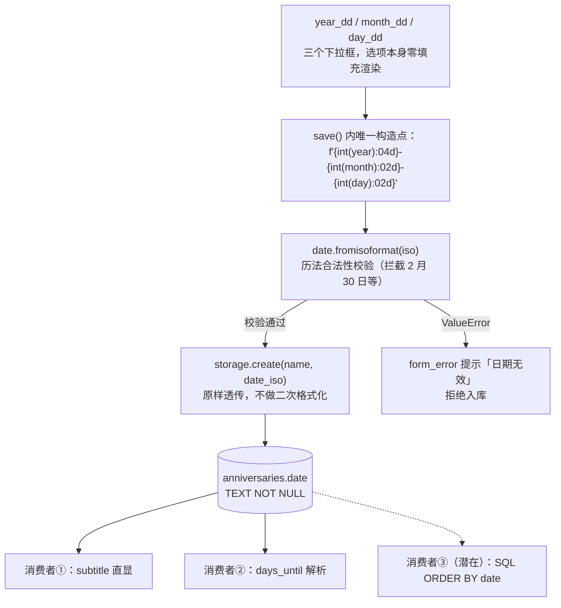

`storage.py` 中只有 8 行的 `_SCHEMA` 常量，是整个纪念日 App 唯一的数据契约——四个字段、全部 `TEXT`、零索引、零外键。本页解析这个极简表结构背后最核心的类型决策：**`date` 列为何以 ISO 8601 字符串（`YYYY-MM-DD`）而非整数时间戳存储**，以及这一选择带来的隐含红利——定宽零填充的 ISO 字符串天然满足"**字典序等于时间序**"，使纯字符串比较即可完成按时间排序与范围筛选，无需任何日期函数或类型转换。CRUD 语句本身的参数化细节见 [SQLite 裸 SQL CRUD：参数化查询与连接管理](15-sqlite-luo-sql-crud-can-shu-hua-cha-xun-yu-lian-jie-guan-li)，本页只聚焦表结构与类型语义。

Sources: [storage.py](storage.py#L15-L22)

## 四列全 TEXT：一张极简表的完整画像

先看全貌。`_SCHEMA` 定义了唯一一张表 `anniversaries`，通过 `CREATE TABLE IF NOT EXISTS` 保证幂等——它不仅在 `init()` 建库时执行，还在每次 `_connect()` 打开连接时重复执行（含坏库自愈重建路径），已存在则静默跳过，不存在则原样重建，这意味着**这 8 行字符串就是数据库结构的唯一事实来源**（自愈机制详见 [坏库自愈机制：损坏检测、改名备份与自动重建](18-pi-ku-zi-yu-ji-zhi-sun-pi-jian-ce-gai-ming-bei-fen-yu-zi-dong-zhong-jian)）：

```sql
CREATE TABLE IF NOT EXISTS anniversaries (
    id         TEXT PRIMARY KEY,
    name       TEXT NOT NULL,
    date       TEXT NOT NULL,
    created_at TEXT NOT NULL
)
```

逐列拆解其类型决策与数据来源：

| 列 | 类型与约束 | 写入来源 | 格式与语义 |
|---|---|---|---|
| `id` | `TEXT PRIMARY KEY` | `uuid4().hex`（32 位小写十六进制） | 定宽 32 字符，客户端生成，主键唯一性由 UUID 保证 |
| `name` | `TEXT NOT NULL` | 用户输入（UI 层已 `strip()` 并校验非空） | 任意 Unicode 文本 |
| `date` | `TEXT NOT NULL` | `main.py` 表单构造的 ISO 串 | **定宽 10 字符 `YYYY-MM-DD`，零填充** |
| `created_at` | `TEXT NOT NULL` | `datetime.now(timezone.utc).isoformat(timespec="seconds")` | 定宽 26 字符 `YYYY-MM-DDTHH:MM:SS+00:00`，恒为 UTC |

值得注意的是 `created_at` 的构造方式：`timezone.utc` 使时区偏移恒为 `+00:00`，`timespec="seconds"` 截断微秒——两者共同保证了该字符串**长度恒定**，因此它与 `date` 一样具备字典序可排序性（升序即时间先后序），尽管当前代码从未对它排序，它仍是一份随时可按时间审计的元数据。而 `id` 选择 `uuid4().hex` 而非 `INTEGER AUTOINCREMENT`，则是"ID 由应用层生成、数据库只做存储"的取舍：32 字符定宽十六进制串在 SQLite 的 B-tree 索引中键长均匀，且天然规避了多设备场景下的自增冲突。

Sources: [storage.py](storage.py#L15-L22), [storage.py](storage.py#L69-L86)

## 为什么不用整数时间戳：三种存储方案的权衡

面对"存日期"这个需求，SQLite 工程师通常有三个选项。这个项目选择 TEXT ISO 串，不是偷懒，而是与整个项目的约束条件（零第三方依赖、date-only 语义、UI 直显）精确对齐：

| 维度 | `TEXT`（ISO 串，本项目方案） | `INTEGER`（Unix 时间戳） | SQLite 原生日期函数 |
|---|---|---|---|
| 表示语义 | **纯日期，无时区、无时刻** | 时间点，必须选时区基准 | 内部即 Julian day 浮点数 |
| 人类可读性 | `2025-06-15`，可直接展示 | `1749945600`，必须格式化 | 不可见，仅在 SQL 内使用 |
| 字符串排序即时间排序 | ✅（前提见下节） | ❌ 数字字典序错乱 | 需 `julianday()` 转换后排序 |
| Python 互转成本 | `date.fromisoformat()` 一步 | 手动 `fromtimestamp` + 时区 | 需在 SQL 层拼函数 |
| 范围查询 | `WHERE date BETWEEN '2025-01-01' AND '2025-12-31'` 可直接命中 | 数值比较，语义等价 | 需函数包裹，可能绕过索引 |
| 依赖面 | 标准库 `datetime` 即可 | 标准库可胜任 | SQL 层出现日期函数调用 |

决定性的论据有两个。其一是**语义精确性**：纪念日的"日期"是一个日历概念而非时刻——"6 月 15 日"在东京和纽约是同一天，但对应两个不同的 Unix 时间戳；若存整数，写入时就已做出了时区假设，而这个 App 恰恰要在桌面与 Android 真机两个时区环境间运行同一份代码。其二是**消费端零成本**：UI 层把 `item["date"]` 原样塞进 `ListTile` 的 `subtitle` 直接展示——存储格式即显示格式，中间不存在任何格式化代码；反向亦然，编辑对话框回填时 `date.fromisoformat(item["date"])` 一步还原出 `date` 对象供下拉框拆解。一个 `TEXT` 列同时喂饱了"显示"和"解析"两类消费者，这正是 ISO 串作为**唯一规范表示**（single canonical representation）的价值，也与 [uv 依赖管理与零第三方依赖哲学](24-uv-yi-lai-guan-li-yu-ling-di-san-fang-yi-lai-zhe-xue)一脉相承。

Sources: [main.py](main.py#L69-L95), [main.py](main.py#L108-L115), [core.py](core.py#L4-L7)

## 字典序即时间序：定宽、补零、高位在前

现在进入本页的核心命题：为什么对 ISO 日期字符串做**纯字典序比较**，结果恰好等于按时间先后排序？答案由三个结构性前提共同保证，缺一即失效——**高位在前、定宽分段、零填充**：



逐字符拆解一次比较：`"2024-06-15"` 与 `"2025-01-02"` 首字符即 `'2'` vs `'2'` 相等，第二字符 `'0'` vs `'0'` 相等，第三字符 `'4'` vs `'5'` 分出胜负——**最早出现差异的字符位置恰好对应最高位的不同时间分量**，这是"高位在前"的直接收益；而"定宽 + 零填充"则保证位权对齐，任何年/月/日的数值差异都会落在同一语义位置的字符上。三个前提中任何一个被破坏，字典序立即偏离时间序，下表用三个反例验证：

| 存储写法 | 反例对 | 字典序结果 | 真实时间序 | 错位原因 |
|---|---|---|---|---|
| 不补零 `YYYY-M-D` | `"2024-2-1"` vs `"2024-12-01"` | `2 > 1` → 二月一日"更大" | 二月一日更早 | 违反定宽，`-` 与数字字符错位比较 |
| 斜杠分隔 `YYYY/M/D` | `"2024/6/15"` vs `"2024/10/1"` | `6 > 1` → 六月"更大" | 六月更早 | 同上，分隔符混入数值位 |
| 美式 `MM/DD/YYYY` | `"01/15/2025"` vs `"12/01/2024"` | `01 < 12` → 一月更早 | 2025 年 1 月更晚 | 高位不在前，月权高于年权 |

这张反例表反过来解释了为什么标准 `date.isoformat()` 的输出可以放心依赖：ISO 8601 的日历日期格式天生满足全部三个前提。这不是本项目的发明，而是**站在标准格式既有的不变量之上，让字符串比较免费获得时间语义**。

Sources: [storage.py](storage.py#L15-L22), [core.py](core.py#L4-L7)

## 写入端：唯一构造点上的格式不变量

字典序优势成立的前提是"进入数据库的每个 `date` 值都严格满足三前提"，这条不变量由 UI 层一个**唯一的构造点**把关。数据流全景如下：



构造点那一行值得逐段审视：`f"{int(year_dd.value):04d}-{int(month_dd.value):02d}-{int(day_dd.value):02d}"`。下拉框的选项虽然已经以 `f"{m:02d}"` 形式零填充渲染，但构造点并不信任这个表象——先用 `int()` 把选项值归一化回数字，再由格式说明符 `:04d` / `:02d` **强制重新补零**。这意味着无论上游以何种形态给出年月日，落库字符串的宽度和填充都由这一行的格式说明符独立保证。随后的 `date.fromisoformat(iso)` 则承担历法校验（拒绝 2 月 30 日这类"格式合法但日历不存在"的日期，详见 [表单校验与用户反馈：名称非空、非法日期与 SnackBar](10-biao-dan-xiao-yan-yu-yong-hu-fan-kui-ming-cheng-fei-kong-fei-fa-ri-qi-yu-snackbar)），而 `storage.create` 对 `date_iso` 原样入库、不做任何转换——**不变量的执行权集中在一处，存储层只负责保管**。

Sources: [main.py](main.py#L42-L56), [main.py](main.py#L117-L136), [storage.py](storage.py#L69-L86)

## 一个诚实的观察：优势被"保存"而未被"消费"

必须如实指出：当前代码**并未**在 SQL 层利用字典序排序。`list_all()` 的 SELECT 语句不带任何 `ORDER BY`，排序完全发生在 Python 层的 `core.sort_items`——因为排序基准是"距今天数"这个随时间漂移的动态量，无法在 SQL 中静态表达（该设计的完整推导见 [排序设计：倒计时优先的元组排序键](13-pai-xu-she-ji-dao-ji-shi-you-xian-de-yuan-zu-pai-xu-jian)）。那么字典序优势的意义何在？准确的定位是：**它是一份被刻意保存的架构选择权**。得益于 TEXT ISO 的存储格式，以下能力在任何时刻都零改库即可启用：

| 潜在 SQL 能力 | 依赖的性质 | 当前是否使用 |
|---|---|---|
| `ORDER BY date`（按日期先后排序） | 字典序 = 时间序 | 否（排序在 Python 层） |
| `WHERE date BETWEEN '2025-01-01' AND '2025-12-31'` | 字符串区间比较 = 时间区间 | 否 |
| `WHERE date >= '2025-06-15'`（筛选未来事项） | 同上 | 否 |
| `ORDER BY created_at`（按创建时间审计） | UTC 定长串的字典序 | 否 |

换句话说，这个表结构用"存文本"的代价，换来了**格式即索引友好的排序语义**——如果未来数据量增长到需要在数据库侧做范围筛选或分页排序，schema 无需任何迁移。这是典型的"为演化预留语义地基"的决策：当前消费者（直显、`fromisoformat` 解析）已经回本，潜在消费者（SQL 排序/筛选）是净赚的期权。

Sources: [storage.py](storage.py#L58-L66), [core.py](core.py#L18-L23)

## 边界与取舍：没有 CHECK 约束的信任模型

细心的读者会注意到 schema 中只有 `NOT NULL`，没有 `CHECK (date GLOB '????-??-??')` 之类的格式约束——即数据库本身**不防御**非法格式的 `date` 入库。这是一个明确的信任边界决策：该库是单应用私有库（路径策略见 [数据库路径三级策略：系统目录、本地回退与 ANNIVERSARY_DB 环境变量](16-shu-ju-ku-lu-jing-san-ji-ce-lue-xi-tong-mu-lu-ben-di-hui-tui-yu-anniversary_db-huan-jing-bian-liang)），唯一写入方是经过表单校验的 UI 流程，格式不变量由上节所述的唯一构造点把关；在 SQLite 中叠加 `CHECK` 与 `GLOB` 意味着每次写入多一次模式匹配，换来的防线上游早已筑好。同理，四个字段全 `TEXT` 也放弃了 SQLite 的类型亲和带来的数值比较能力——但如前所述，这个应用需要的比较语义（时间序）恰恰是 TEXT 亲和下字符串比较免费提供的。极简 schema 的每一处"没有"，都对应一处"由更合适的层承担"。

Sources: [storage.py](storage.py#L15-L22), [main.py](main.py#L123-L136)

## 小结

这张四列全 TEXT 的表用最少的结构承载了三类语义：`uuid4().hex` 的 `id` 承担身份、`date` 以定宽零填充的 ISO 串承担**可排序的时间语义**、`created_at` 以 UTC 定长串承担可审计的溯源语义。"字典序即时间序"不是玄学，而是 ISO 8601 格式三个结构前提（高位在前、定宽分段、零填充）在 SQLite TEXT 比较规则下的必然推论；它当前作为架构期权被保存，随时可兑换为 SQL 层的排序与范围查询。若想继续深入：排序逻辑如何在 Python 层实现"倒计时优先"，见 [排序设计：倒计时优先的元组排序键](13-pai-xu-she-ji-dao-ji-shi-you-xian-de-yuan-zu-pai-xu-jian)；这张表如何在库文件损坏后被原样重建，见 [坏库自愈机制：损坏检测、改名备份与自动重建](18-pi-ku-zi-yu-ji-zhi-sun-pi-jian-ce-gai-ming-bei-fen-yu-zi-dong-zhong-jian)。