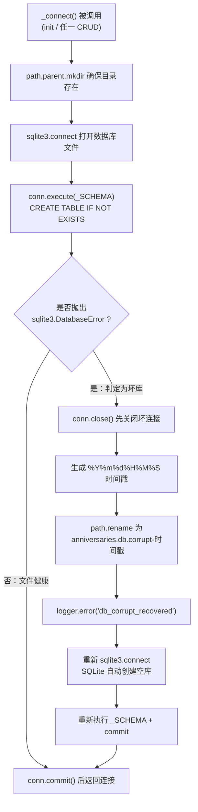

移动端的 SQLite 文件比桌面环境脆弱得多：进程被系统强杀、写入中途断电、存储介质抖动，都可能留下一个头部损坏或页结构残缺的数据库文件。如果没有自愈机制，应用会在下一次启动时反复崩溃在 `sqlite3.DatabaseError` 上，用户除了卸载重装别无他法。本项目在 `storage.py` 的 `_connect()` 内实现了一套约十行代码的自愈机制：**用建表语句充当损坏探针，将坏文件改名隔离，再原地重建空库**，让应用始终能拿到一个可用的连接。本文逐层拆解这套机制的设计取舍、触发时机与能力边界。

Sources: [storage.py](storage.py#L37-L55)

## 机制总览：一次连接尝试就是一次体检

整个自愈逻辑没有独立成函数，而是内嵌在唯一的连接工厂 `_connect()` 中。该函数的执行路径是：确保父目录存在 → 打开连接 → 执行 `CREATE TABLE IF NOT EXISTS` → 正常则提交并返回；若建表语句抛出 `sqlite3.DatabaseError`，则进入恢复分支——关闭坏连接、为坏文件追加 `.corrupt-时间戳` 后缀改名、记录一条 `db_corrupt_recovered` 错误日志，最后重新 `connect` 并再次执行建表语句，返回一个基于全新空库的连接。

在阅读下面的流程图之前需要说明：图中每个节点都对应 `_connect()` 中的一段真实代码，决策点只有一个——建表语句是否抛出 `sqlite3.DatabaseError`。这是整个机制唯一的健康判据，也是它足够轻量的原因。



值得注意的是恢复分支的代码形态：它没有用递归重试，而是把"建行工厂→设置 row_factory→执行建表"这段逻辑在 `except` 块内**原样重复了一遍**。这意味着恢复最多尝试一次——如果新库的建表仍然失败（例如磁盘已满），异常会直接向上抛出而不会陷入循环，行为是有界的。

Sources: [storage.py](storage.py#L37-L55)

## 探针设计：为什么用建表语句做健康检查

检测损坏最直觉的方案是先执行 `PRAGMA integrity_check`，但本实现选择了更经济的路径：`_SCHEMA` 常量本身就是探针。`CREATE TABLE IF NOT EXISTS` 在语义上要求 SQLite 解析数据库头部、读取 `sqlite_master` 系统表——任何一个环节遇到损坏（文件不是数据库、磁盘镜像畸形），都会立刻抛出 `sqlite3.DatabaseError` 及其子类。换言之，**每次连接时的幂等建表顺带完成了全头部级体检**，无需额外的检查语句和分支。

```python
_SCHEMA = """
CREATE TABLE IF NOT EXISTS anniversaries (
    id         TEXT PRIMARY KEY,
    name       TEXT NOT NULL,
    date       TEXT NOT NULL,
    created_at TEXT NOT NULL
)
"""
```

捕获 `sqlite3.DatabaseError` 而非更具体的异常类，是一个刻意放宽的网：Python `sqlite3` 的异常体系中，`OperationalError`、`InternalError`、`ProgrammingError` 等均继承自 `DatabaseError`，而典型的损坏症状——`file is not a database` 与 `database disk image is malformed`——都会以该基类（或其子类）形态抛出。用基类捕获能一网打尽这些变体；代价是 SQL 拼写错误这类编程问题也会被误判为"坏库"而触发隔离重建。在本项目中这个风险被收敛到零：`_SCHEMA` 是硬编码常量，不存在运行时拼接，一旦验证正确就永远正确。

Sources: [storage.py](storage.py#L15-L22), [storage.py](storage.py#L42-L54)

## 恢复流程分解：关闭、改名、重建的严格次序

恢复分支的四个动作有着不可调换的次序，每一步都对应 Windows 与 Android 双平台的真实约束。**第一步必须先 `conn.close()`**——Windows 不允许对仍被进程持有的文件执行 `rename`，如果跳过关闭直接改名，恢复本身就会抛 `PermissionError`。**第二步生成精确到秒的时间戳** `datetime.now().strftime("%Y%m%d%H%M%S")`，既作为坏文件的时间锚点，也天然规避了改名目标重名（`rename` 不能覆盖已存在文件）的碰撞问题。**第三步用 `path.with_name()` 改名**，保证 `.corrupt-*` 文件与原库落在同一目录，不产生跨盘移动。**第四步才是重建**——`sqlite3.connect(path)` 对不存在的路径会自动创建全新的空数据库文件，随后重复执行建表语句，一个结构完整的库就此重生。

```python
except sqlite3.DatabaseError:
    conn.close()
    stamp = datetime.now().strftime("%Y%m%d%H%M%S")
    corrupt_path = path.with_name(f"{path.name}.corrupt-{stamp}")
    path.rename(corrupt_path)
    logger.error("db_corrupt_recovered", renamed=str(corrupt_path))
    conn = sqlite3.connect(path)
    conn.row_factory = sqlite3.Row
    conn.execute(_SCHEMA)
    conn.commit()
```

这套次序的组合效果是：坏文件被**原地隔离而非删除**，新库在同一位置无痕接管。由于项目使用 SQLite 默认的回滚日志模式（未启用 WAL），数据库就是一个自包含的单文件，改名即完成了完整的现场保护，不存在需要一并处理的 `-wal`/`-shm` 伴生文件。

Sources: [storage.py](storage.py#L45-L54)

## 改名备份的工程权衡：可用性优先，证据保全

"改名备份"看似只是"删除前多走一步"，实则是三种候选策略中唯一同时满足**立即可用**与**可离线抢救**的方案。直接删除实现最简但让数据彻底不可逆；现场修复（`sqlite3 .recover` 或逐表抢救）能最大化保留数据，却要求在应用进程内解析恢复输出、处理半残 schema，复杂度与耗时都不可控。改名是 O(1) 的纯元数据操作——不复制任何字节、不受文件大小影响，应用在毫秒级回到可用状态，而原始坏文件完整保留在磁盘上，用户或开发者后续仍可通过 `adb pull` 取回，用桌面端 `sqlite3` 工具手工抢救。

| 维度 | 改名备份（本实现） | 直接删除 | 现场修复（.recover） |
|---|---|---|---|
| 原始数据 | 完整保留于 `.corrupt-*` 文件 | 永久丢失 | 尽力恢复，结果不确定 |
| 恢复耗时 | O(1) 元数据操作 | O(1) | 与库大小正相关，不可控 |
| 实现复杂度 | 约 10 行 | 最低 | 高：需解析输出、迁移残存行 |
| 应用可用性 | 立即恢复（空库） | 立即恢复（空库） | 阻塞时长不可控 |
| 事后可抢救性 | 高：原文件未动 | 无 | 已消耗（修复过程可能覆写） |

这个权衡隐含的价值观与项目整体一致：一款本地单表、数据量小、可快速重建的纪念日应用，**"应用永远能打开"比"数据绝对不丢"更重要**——前者失效意味着用户完全失联，后者只损失可重新录入的少量条目。而保留坏文件这一步，又为极端情况留下了后悔药，把"数据丢失"从不可逆降级为"默认丢失、可人工挽回"。

Sources: [storage.py](storage.py#L45-L54)

## 检测窗口：从启动体检到持续巡检

自愈机制的触发面由 `_connect()` 的调用方决定，而本项目采用**每次操作新建连接**的模式（详见 [SQLite 裸 SQL CRUD：参数化查询与连接管理](15-sqlite-luo-sql-crud-can-shu-hua-cha-xun-yu-lian-jie-guan-li)），这意味着探针的执行频率等于全部数据库操作的频率。启动时 `main()` 通过 `storage.init(db_file)` 完成首次连接，这是最主要的检测窗口——绝大多数损坏会在这一次建表尝试中暴露并被处理，用户在看到界面前就已拿到干净的库；此后每一次增删改查都重新走一遍探针，即使运行期间文件因外部原因损坏，下一次操作也会自动触发隔离重建。

| 触发入口 | 时机 | 自愈生效场景 |
|---|---|---|
| `storage.init()` | 应用启动（`main()` 内） | 冷启动时发现文件已损坏 |
| `storage.list_all()` | 每次列表刷新 | 运行期读取前发现损坏 |
| `storage.create()` / `update()` / `delete()` | 每次写操作 | 运行期写入前发现损坏 |

启动路径本身还有一层前置保障：`init()` 接收的路径来自 `main()` 的应用支持目录获取逻辑，失败时回退到本地 `data/` 目录，而 `_connect()` 内的 `mkdir(parents=True, exist_ok=True)` 兜住了目录缺失的情况——三种路径来源的细节见 [数据库路径三级策略：系统目录、本地回退与 ANNIVERSARY_DB 环境变量](16-shu-ju-ku-lu-jing-san-ji-ce-lue-xi-tong-mu-lu-ben-di-hui-tui-yu-anniversary_db-huan-jing-bian-liang)。

Sources: [storage.py](storage.py#L25-L30), [storage.py](storage.py#L58-L116), [main.py](main.py#L24-L31)

## 能力边界：探针粒度与已知局限

对高级读者而言，明确这套机制**不覆盖**什么与覆盖什么同样重要。第一，探针的检查粒度是头部与 schema 层——建表语句只读取数据库头和 `sqlite_master`，深藏在数据页内部的损坏（例如某个叶子页畸形）不一定会在此暴露；`list_all()` 中的 `SELECT` 位于 `_connect()` 返回之后、不在 `try` 保护范围内，若畸形页恰好在查询时才报错，该异常会直接向上传播而非触发自愈。第二，恢复是单次有界尝试，新库建表若再失败（磁盘满、目录无写权限），异常直接抛给调用方，不存在重试循环。第三，改名本身未被保护——若坏文件被其他进程锁定导致 `rename` 抛 `OSError`，该错误同样向上传播。第四，`ProgrammingError` 等编程性错误也在捕获范围内（因继承自 `DatabaseError`），理论上一次 SQL 拼写错误会"冤杀"健康库；本实现靠硬编码 `_SCHEMA` 常量将此风险收敛为零。这些边界共同勾勒出机制的适用定位：**应对"文件级不可读"这一最常见、最致命的损坏形态，而非穷尽所有完整性问题**。

Sources: [storage.py](storage.py#L42-L54), [storage.py](storage.py#L58-L66)

## 可观测性：db_corrupt_recovered 事件

自愈动作对用户是静默的——应用照常启动、列表变为空——因此日志成为事后定位问题的唯一线索。恢复分支在改名完成后立即发出 `logger.error("db_corrupt_recovered", renamed=str(corrupt_path))`：事件名点明"损坏且已恢复"，`renamed` 字段携带坏文件的完整落点，ERROR 级别确保即使在默认 INFO 级别过滤下也不会被吞掉。该事件流经 `log.py` 的 structlog 处理器链，默认渲染为开发者友好的彩色 Console 输出，设置 `LOG_JSON=1` 时输出结构化 JSON——在 Android 真机上用 `adb logcat` 抓取时，JSON 形态更便于按 `event` 字段过滤（日志体系的完整配置见 [structlog 配置详解：处理器链、Console 彩色与 JSON 渲染](19-structlog-pei-zhi-xiang-jie-chu-li-qi-lian-console-cai-se-yu-json-xuan-ran)与[运行时可调日志：LOG_LEVEL 与 LOG_JSON 环境变量](20-yun-xing-shi-ke-diao-ri-zhi-log_level-yu-log_json-huan-jing-bian-liang)）。运维层面的推论是：一旦在日志中看到该事件，就应到 `renamed` 指向的路径取证，判断损坏是偶发还是存储介质的前兆性故障。

Sources: [storage.py](storage.py#L50), [log.py](log.py#L13-L24)

## 小结与延伸阅读

这套自愈机制的全部智慧浓缩在三个决策里：用**必经的建表语句兼任探针**（零额外成本的持续体检）、用**改名代替删除**（O(1) 隔离 + 完整证据保全）、用**原地重建 + 有界单次尝试**（最快回到可用状态且无循环风险）。它不追求完整性覆盖，而是精准拦截"文件不可读"这一移动端 SQLite 最典型的致命故障，并以一条 ERROR 日志保留事后追责的完整链条——这正是小型本地应用在可靠性工程上"花 10 行代码买 90% 收益"的范本。

若想继续深入，建议按以下路径阅读：先看 [SQLite 裸 SQL CRUD：参数化查询与连接管理](15-sqlite-luo-sql-crud-can-shu-hua-cha-xun-yu-lian-jie-guan-li)理解"每次操作一连接"模式如何放大了本文探针的触发面；再看 [表结构设计：ISO 日期字符串的字典序排序优势](17-biao-jie-gou-she-ji-iso-ri-qi-zi-fu-chuan-de-zi-dian-xu-pai-xu-you-shi)了解重建后空库将接纳的数据形态；最后借助[桌面调试与真机验证的能力边界划分](23-zhuo-mian-diao-shi-yu-zhen-ji-yan-zheng-de-neng-li-bian-jie-hua-fen)掌握用 `adb` 拉取 `.corrupt-*` 文件做离线抢救的实操方法。