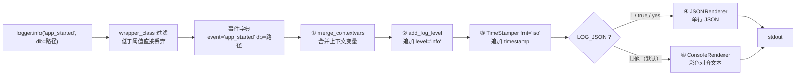
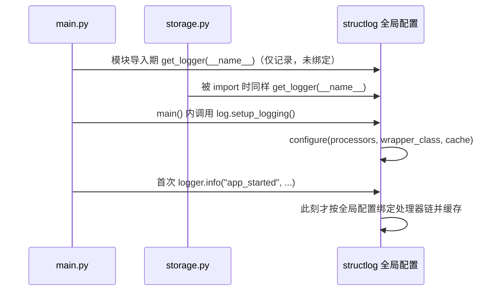

本页拆解 `log.py` 中 25 行的 `setup_logging()`——整个项目日志基础设施的全部实现。它回答三个问题：一条日志从 `logger.info(...)` 到终端文本之间经过了什么（**处理器链**）、开发时看到的彩色对齐输出是怎么来的（**ConsoleRenderer**）、以及为什么还能一键切换为单行 JSON（**JSONRenderer**）。理解这条链，你就掌握了 structlog 的核心心智模型：日志不是字符串拼接，而是一个**事件字典**在流水线上的顺序变换。环境变量 `LOG_LEVEL` 与 `LOG_JSON` 的运行时语义属于下一页主题，这里只把它们当作配置函数的两个输入。

Sources: [log.py](log.py#L8-L24)

## 全景：双日志系统的协作

先建立整体图景。`setup_logging()` 同时配置了两套东西：标准库 `logging` 的根记录器（`basicConfig` 一行），以及 structlog 的全局配置（`configure` 一次调用）。structlog 负责把结构化事件渲染成最终字符串，其默认输出通道（PrintLoggerFactory）直接写入 stdout；而 `basicConfig(format="%(message)s", stream=sys.stdout, level=level)` 为标准库侧的记录（例如第三方库产生的日志）建立同样指向 stdout、且**不做任何二次包装**的输出通道——`%(message)s` 裸消息格式确保即使标准库日志混入，也保持与 structlog 渲染结果一致的单行风格，不会出现 `LEVEL:name:message` 式的冗余前缀。两侧的级别阈值来自同一个 `level` 值，保证过滤口径统一。

Sources: [log.py](log.py#L9-L12)

用数据流把整条链画出来——每个节点接收事件字典、原地加工、传给下一个，最后的渲染器把它变成字符串：



这张图对应 `configure` 的三个关键参数：`processors` 是 ①②③④ 组成的有序列表（渲染器是列表的**最后一项**，链的终点）、`wrapper_class` 在进入链之前完成级别过滤、`cache_logger_on_first_use` 决定绑定结果是否被冻结缓存。下面逐一展开。

Sources: [log.py](log.py#L13-L24)

## 处理器链：事件字典的流水线

structlog 的处理器是一个 `(logger, method_name, event_dict) -> event_dict` 的函数，配置中的列表顺序即执行顺序。本项目的四个节点职责如下：

| 顺序 | 处理器 | 职责 | 对事件字典的影响 |
|---|---|---|---|
| ① | `structlog.contextvars.merge_contextvars` | 合并经 `bind_contextvars` 绑定的上下文键值 | 注入请求/会话级全局上下文 |
| ② | `structlog.processors.add_log_level` | 注入调用级别 | 追加 `level: "info"` 等键 |
| ③ | `structlog.processors.TimeStamper(fmt="iso")` | 注入时间戳 | 追加 `timestamp` 键，ISO 8601 格式 |
| ④ | `JSONRenderer()` 或 `ConsoleRenderer()` | 终端渲染 | 字典 → 字符串，流水线终点 |

**① merge_contextvars** 是为未来预留的钩子。当前项目没有调用过 `bind_contextvars`，但把它放在链首意味着：一旦将来需要为某次会话、某个页面请求打上统一标记（如 `request_id`），只需绑定一次，此后所有日志事件自动携带该字段，无需在每个调用点手动传参。它必须是第一个处理器，否则上下文键值就赶不上后续加工。

**② add_log_level** 做的事很朴素：把方法名写进字典。调用 `logger.info(...)` 时追加 `"level": "info"`。没有它，Console 彩色渲染失去了着色依据，JSON 输出也失去了按级别过滤检索的字段。

**③ TimeStamper(fmt="iso")** 生成 ISO 8601 格式时间戳（默认 UTC，形如 `2025-06-01T00:15:30.123456Z`）。相比 `fmt="unix"` 的纯秒数，ISO 字符串肉眼可读、字典序即时间序——这与项目存储层选择 ISO 日期字符串的动机一脉相承（详见 [表结构设计：ISO 日期字符串的字典序排序优势](17-biao-jie-gou-she-ji-iso-ri-qi-zi-fu-chuan-de-zi-dian-xu-pai-xu-you-shi)）。

Sources: [log.py](log.py#L15-L17)

## 渲染器二选一：Console 彩色与 JSON

链的终点是一个条件表达式——这是整个配置中唯一"分岔"的地方：

```python
structlog.processors.JSONRenderer()
if as_json
else structlog.dev.ConsoleRenderer(),
```

`as_json` 由 `LOG_JSON` 环境变量决定（详见 [运行时可调日志：LOG_LEVEL 与 LOG_JSON 环境变量](20-yun-xing-shi-ke-diao-ri-zhi-log_level-yu-log_json-huan-jing-bian-liang)），默认关闭，即**开发态走 Console，采集态走 JSON**。两种渲染器的输出形态对比如下（输出为示意，展示的是 `main.py` 中 `logger.info("app_started", db=str(db_file))` 这一真实调用经过链后的样子）：

| 维度 | `ConsoleRenderer()`（默认） | `JSONRenderer()`（LOG_JSON=1 时） |
|---|---|---|
| 输出形态 | 级别名着色、`key=value` 对齐的多列文本 | 单行 JSON 对象 |
| 典型消费者 | 开发者的终端 | 日志采集/聚合系统（Loki、ELK 等） |
| 结构化程度 | 视觉结构，机器不可直接解析 | 字段级可检索、可过滤 |
| 键顺序 | 按事件字典插入顺序排列 | 同左：`event` 在前，`level`/`timestamp` 靠后 |
| 色彩 | 依赖 colorama，自动检测 TTY | 无 |

Console 渲染输出（示意）：

```
2025-06-01T00:15:30.123456Z [info     ] app_started  db=/data/user/0/.../anniversaries.db
```

ConsoleRenderer 的彩色并非本项目的代码，而是 structlog 内置的默认行为：级别名按严重程度着色（`debug` 蓝、`info` 绿、`warning` 黄、`error`/`exception` 红、`critical` 红底白字），并且级别名统一填充到固定宽度（上例中 `[info     ]` 的补齐），使不同条目的 `key=value` 区域纵向对齐；非 TTY 环境或设置了 `NO_COLOR` 时自动降级为纯文本，因此在 CI 或重定向到文件时不会混入 ANSI 转义码。JSON 渲染输出（示意）：

```json
{"event": "app_started", "db": "/data/user/0/.../anniversaries.db", "level": "info", "timestamp": "2025-06-01T00:15:30.123456Z"}
```

一个值得注意的调用形态：`main.py` 中存在 `logger.info("", base=base)` 这样的**空事件名调用**——消息体完全放在键值参数里。经过链后，Console 输出的事件列为空、只有 `base=...`，JSON 中则是 `"event": ""` 加字段。这说明事件名只是字典中的一个键，不传也能渲染，适合"纯数据"型日志点。

Sources: [log.py](log.py#L18-L20), [main.py](main.py#L28-L31)

## 过滤与缓存：wrapper_class 与 cache_logger_on_first_use

`configure` 的另外两个参数决定了这条链的**性能形态**。`wrapper_class=structlog.make_filtering_bound_logger(level)` 把级别过滤从"生成完整事件再丢弃"提前到方法调用层：低于阈值的方法（例如 level 为 INFO 时的 `debug`）被编译成空操作，调用近乎零成本——这在热路径上打点时是本质区别。注意这个 `level` 与 `basicConfig` 的 `level` 是同一个值（第 9 行解析所得），stdlib 侧与 structlog 侧的过滤口径因此天然一致。

`cache_logger_on_first_use=True` 则声明：logger 第一次实际使用后，把"绑定好的处理器链 + 过滤后的方法集"整体缓存。代价是之后再次调用 `setup_logging()` 不会影响已使用过的 logger；收益是每次 `logger.info(...)` 不再重复做配置查找。这个取舍隐含了一个前提——**配置必须发生在首次日志调用之前**，这引出下一个话题。

Sources: [log.py](log.py#L22-L23)

## 时序问题：先取 logger、后配置，为什么能工作

项目里的调用顺序乍看违反直觉：`main.py` 与 `storage.py` 都在**模块顶层**就执行了 `structlog.get_logger(__name__)`，而 `setup_logging()` 要等到 `async def main(page)` 内部才被调用——即 logger 对象先于配置存在。这依赖 structlog 的一个关键设计：`get_logger()` 返回的是**惰性代理**（BoundLoggerLazyProxy），它不立即绑定任何配置，只在第一次真正调用 `info`/`debug` 等方法时，才读取当时的全局配置完成绑定；配合上节的 `cache_logger_on_first_use`，绑定结果随即冻结。时序如下：



因此规则可以概括为：**取 logger 可以早，打日志必须晚于配置**。只要首次日志调用发生在 `setup_logging()` 之后（本项目满足：`main()` 中第 19 行配置，第 28 行起才首次打点），缓存的就一定是正确配置；反之，若在配置前就输出过日志，该 logger 将永久使用 structlog 的默认配置。这是使用 `cache_logger_on_first_use=True` 时最需要警惕的边界。

Sources: [main.py](main.py#L11), [main.py](main.py#L18-L31), [storage.py](storage.py#L7-L9)

## 配置全景速查

把 `configure` 的三个参数收敛成一张表，作为本页的落点：

| `structlog.configure` 参数 | 本项目取值 | 语义 |
|---|---|---|
| `processors` | merge_contextvars → add_log_level → TimeStamper(iso) → 渲染器 | 事件字典流水线，渲染器收尾 |
| `wrapper_class` | `make_filtering_bound_logger(level)` | 级别过滤前置到调用层，低级别调用编译为空操作 |
| `cache_logger_on_first_use` | `True` | 首次使用后冻结绑定结果，换取零开销调用 |

`storage.py` 中 `logger.info("db_initialized", path=str(DB_PATH))` 是这条链的典型消费方：存储层只负责产出结构化事件，渲染成彩色文本还是 JSON 完全由 `setup_logging()` 的全局配置决定——这正是四层架构中"日志层"作为独立横切层的意义（见 [四层分层架构：UI、纯逻辑、存储、日志的职责划分](5-si-ceng-fen-ceng-jia-gou-ui-chun-luo-ji-cun-chu-ri-zhi-de-zhi-ze-hua-fen)）。而 structlog 作为 flet 之外唯一的运行时依赖（`structlog>=26.1.0`），其选型背景见 [uv 依赖管理与零第三方依赖哲学](24-uv-yi-lai-guan-li-yu-ling-di-san-fang-yi-lai-zhe-xue)。

Sources: [log.py](log.py#L13-L24), [storage.py](storage.py#L30), [pyproject.toml](pyproject.toml#L10-L13)

## 延伸阅读

处理器链是静态骨架，两条环境变量是运行时的开关——`LOG_LEVEL` 如何被 `getattr` 安全解析为 stdlib 常量、`LOG_JSON` 接受哪些值、在桌面与 Android 真机上分别怎么设置，请继续阅读 [运行时可调日志：LOG_LEVEL 与 LOG_JSON 环境变量](20-yun-xing-shi-ke-diao-ri-zhi-log_level-yu-log_json-huan-jing-bian-liang)。若想了解日志输出在桌面调试与真机验证中的实际观测方式，可参考 [桌面调试与真机验证的能力边界划分](23-zhuo-mian-diao-shi-yu-zhen-ji-yan-zheng-de-neng-li-bian-jie-hua-fen)。