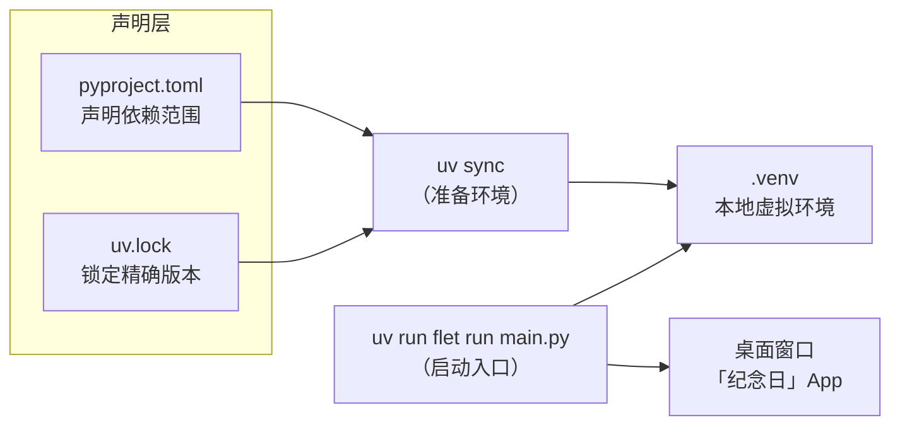
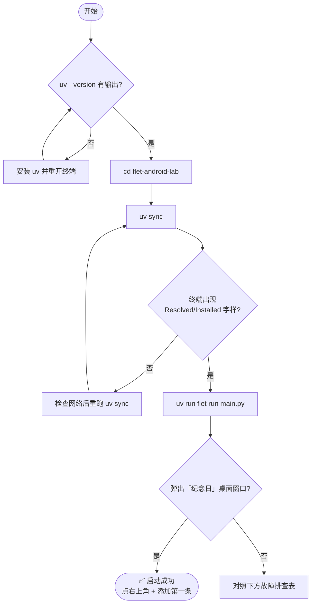

本页的目标只有一个：**从零开始，用大约 5 分钟在 Windows 桌面上把"纪念日"App 跑起来**。你将安装 Python 包管理器 uv、初始化项目环境、启动应用，并学会判断"启动成功"的标准。本文面向零基础的初学者，只需要一台 Windows 电脑，不需要预先安装 Python、Dart 或任何 Android 工具链——桌面运行是零额外依赖的（真机打包属于另一页内容）。

## 你在做什么：一句话架构预览

在动手之前，先建立一张最小心智地图。这个项目用**纯 Python + Flet 框架**构建跨平台应用：`main.py` 是 UI 入口，它调用 `core.py`（纯逻辑）、`storage.py`（SQLite 存储）、`log.py`（日志配置）三个模块。你接下来的两步命令 `uv sync` 和 `uv run flet run main.py`，本质上是"准备环境"和"启动入口"两件事。



理解这张图，你就理解了 uv 工作流的核心：**`pyproject.toml` 说明"我要什么"（flet、structlog），`uv.lock` 说明"精确装哪个版本"（flet 0.86.5），`uv sync` 把两者变成一个隔离的 `.venv` 虚拟环境，`uv run` 则保证命令在这个环境里执行**。项目要求 Python ≥ 3.12，且仓库自带 `.python-version` 文件固定为 3.12——如果本机没有这个版本，uv 会自动下载管理，你无需手动安装 Python。这种"锁文件 + 虚拟环境"哲学的深入讨论见 [uv 依赖管理与零第三方依赖哲学](24-uv-yi-lai-guan-li-yu-ling-di-san-fang-yi-lai-zhe-xue)。

Sources: [pyproject.toml](pyproject.toml#L1-L13)、[uv.lock](uv.lock#L1-L23)、[.python-version](.python-version#L1)、[README.md](README.md#L18-L35)

## 第一步：安装 uv

uv 是 Astral 公司推出的极快 Python 包管理器，本项目的安装、依赖解析、运行全部由它承包。**打开 PowerShell（按 `Win + X` 选择"终端"，或开始菜单搜索 powershell）**，粘贴执行以下一行命令：

```powershell
powershell -ExecutionPolicy ByPass -c "irm https://astral.sh/uv/install.ps1 | iex"
```

安装完成后，**关闭并重新打开一个终端窗口**（让 PATH 环境变量生效），然后验证：

```powershell
uv --version
```

只要输出了形如 `uv 0.x.x` 的版本号，就说明安装成功。如果提示 `'uv' 不是内部或外部命令`，最常见的原因就是没有重开终端，其次是安装脚本未成功执行——重跑一次安装命令即可。本项目的官方启动文档也正是采用这条安装路径。

Sources: [README.md](README.md#L18-L22)

## 第二步：理解你要运行的项目

进入项目目录后，先花 30 秒认识一下文件布局——初学者最容易在这里迷路，值得用一张表锚定：

```text
flet-android-lab/
├── main.py            ← UI 入口：列表、对话框、ft.run(main)
├── core.py            ← 纯函数：天数计算、文案、排序
├── storage.py         ← SQLite CRUD 存储层
├── log.py             ← structlog 日志配置
├── pyproject.toml     ← 项目声明：Python 版本 + 依赖
├── uv.lock            ← 锁定的精确依赖版本（勿手改）
├── .python-version    ← 固定 Python 3.12
└── .flet/             ← 运行 flet run 后自动生成的开发态目录
```

对"跑起来"这个目标而言，你只需要关心三样东西：**`pyproject.toml`（uv sync 的输入）、`main.py`（启动入口）、`.venv`（uv sync 的产物，首次运行后才会出现）**。其余模块的内部设计属于架构话题，见 [四层分层架构：UI、纯逻辑、存储、日志的职责划分](5-si-ceng-fen-ceng-jia-gou-ui-chun-luo-ji-cun-chu-ri-zhi-de-zhi-ze-hua-fen)。依赖方面，项目只声明了两个第三方包：`flet>=0.28.0` 和 `structlog>=26.1.0`，实际锁定解析到 flet 0.86.5。

Sources: [pyproject.toml](pyproject.toml#L9-L13)、[uv.lock](uv.lock#L19-L23)、[README.md](README.md#L37-L44)

## 第三步：两条命令启动 App

现在执行整个教程的核心步骤。在终端中依序运行：

```powershell
cd flet-android-lab        # 进入项目根目录
uv sync                    # 首次运行：创建 .venv 并安装锁定依赖
uv run flet run main.py    # 启动桌面窗口
```

完整决策流程如下面的流程图所示，每一步都有明确的"通过/失败"判据：



**如何确认启动成功？有两个信号**。其一是视觉信号：屏幕弹出一个标题栏为"纪念日"的桌面窗口，初始状态下窗口中央显示灰色提示"还没有纪念日，点右上角 + 添加"。其二是终端信号：运行命令的那个终端会输出彩色日志，包含 `db_initialized`（数据库初始化完成）和 `app_started`（应用启动，附带数据库路径）两条记录——这是 `main.py` 启动时先配置日志、再初始化数据库、最后渲染界面的固定顺序。看到窗口即成功，现在可以点右上角 **+** 号添加你的第一条纪念日了。

Sources: [README.md](README.md#L26-L32)、[main.py](main.py#L18-L31)、[main.py](main.py#L33-L39)

### 两种运行方式的对照

`uv run` 前缀只解决一件事：**在 `.venv` 环境中执行后面的命令**，与环境无关的部分两种方式完全等价。区别在于启动器不同：

| 命令 | 启动方式 | 热重载 | 适用场景 |
|---|---|---|---|
| `uv run flet run main.py` | flet 开发服务器 | ✅ 保存 `main.py` 自动重跑（界面状态重置） | 日常开发迭代 |
| `uv run python main.py` | 直接执行 Python | ❌ 无监视器 | 不需要热重载、想观察原生行为 |

两种方式走的是同一个入口：`main.py` 末尾的 `ft.run(main)`，所以**界面与数据行为完全一致**，切换无需改任何代码。热重载的机制细节与取舍在 [热重载开发工作流：flet run 与直接运行的区别](3-re-zhong-zai-kai-fa-gong-zuo-liu-flet-run-yu-zhi-jie-yun-xing-de-qu-bie) 中专门展开。

Sources: [README.md](README.md#L33-L34)、[main.py](main.py#L175)

## 首次运行后的两个"新目录"

启动成功后回到文件管理器，你会发现项目里多了两个目录，**它们都是自动生成的，不需要你创建或维护**：

| 目录 | 生成者 | 作用 | 能否删除 |
|---|---|---|---|
| `.venv/` | `uv sync` | Python 虚拟环境，存放所有依赖包 | 可删，重跑 `uv sync` 重建 |
| `.flet/` | `flet run` | 开发态存储目录（`storage/data`、`cache`、`temp`） | 可删，下次运行自动重建，但 `storage/data` 里的数据会丢 |

特别注意 `.flet/storage/data`：使用 `flet run` 启动时，应用的数据存储目录会映射到这里，你的 SQLite 数据库文件（`anniversaries.db`）就落在其中。这正是"桌面运行与打包后的真机行为保持一致"的设计——打包成 APK 后，同样的数据会写入手机的应用沙箱目录。数据库路径的完整三级策略（系统目录 → 本地回退 → 环境变量）见 [数据库路径三级策略：系统目录、本地回退与 ANNIVERSARY_DB 环境变量](16-shu-ju-ku-lu-jing-san-ji-ce-lue-xi-tong-mu-lu-ben-di-hui-tui-yu-anniversary_db-huan-jing-bian-liang)。

Sources: [.flet/README.md](.flet/README.md#L1-L12)、[README.md](README.md#L48-L52)、[main.py](main.py#L24-L30)

## 可选：三个环境变量

默认配置开箱即用，以下变量仅在你需要调整行为时设置（PowerShell 语法，设完再启动）：

| 环境变量 | 默认值 | 作用 | 详细文档 |
|---|---|---|---|
| `LOG_LEVEL` | `INFO` | 日志级别，如 `DEBUG` | [运行时可调日志：LOG_LEVEL 与 LOG_JSON 环境变量](20-yun-xing-shi-ke-tiao-ri-zhi-log_level-yu-log_json-huan-jing-bian-liang) |
| `LOG_JSON` | 空（Console 彩色） | 设为 `1` 输出机器可读 JSON 日志 | 同上 |
| `ANNIVERSARY_DB` | 系统应用数据目录 | 指定 SQLite 库文件完整路径 | [数据库路径三级策略](16-shu-ju-ku-lu-jing-san-ji-ce-lue-xi-tong-mu-lu-ben-di-hui-tui-yu-anniversary_db-huan-jing-bian-liang) |

```powershell
$env:LOG_LEVEL = "DEBUG"          # 本次会话生效
$env:ANNIVERSARY_DB = "D:\my.db"  # 固定数据库位置，方便备份或排查
uv run flet run main.py
```

Sources: [log.py](log.py#L8-L12)、[storage.py](storage.py#L33-L34)、[README.md](README.md#L72-L75)

## 故障排查速查表

| 症状 | 可能原因 | 解决办法 |
|---|---|---|
| `'uv' 不是内部或外部命令` | 未安装，或 PATH 未刷新 | 重跑安装脚本；安装后**重开终端**再验证 `uv --version` |
| `uv sync` 报网络/超时错误 | 无法访问 PyPI | 检查网络或配置镜像源后重跑 |
| `uv run` 提示找不到 `flet` 模块 | `.venv` 未同步或不完整 | 在项目根目录重新执行 `uv sync` |
| 命令无报错但窗口不弹出 | 首次下载运行时组件较慢 | 耐心等待首次启动；确认没有提前 `Ctrl+C` 中断 |
| 日志刷出 `db_corrupt_recovered` | 数据库文件损坏 | 属正常自愈：坏文件已改名 `.corrupt-<时间戳>` 备份并自动重建空库 |
| 重启后数据"消失" | 数据库路径随运行方式变化 | 用 `ANNIVERSARY_DB` 固定路径；排查见 [数据库路径三级策略](16-shu-ju-ku-lu-jing-san-ji-ce-lue-xi-tong-mu-lu-ben-di-hui-tui-yu-anniversary_db-huan-jing-bian-liang) |

其中坏库自愈是项目内置的防御机制，日志会以 error 级别记录改名备份动作，你无需手动清理。

Sources: [storage.py](storage.py#L44-L54)、[README.md](README.md#L65-L65)

## 下一步阅读

App 已经跑起来了，接下来建议按这个顺序继续：

1. **[热重载开发工作流：flet run 与直接运行的区别](3-re-zhong-zai-kai-fa-gong-zuo-liu-flet-run-yu-zhi-jie-yun-xing-de-qu-bie)** —— 弄清你刚才用的两条启动命令到底差在哪，高效开发的前提。
2. **[认识纪念日 App：功能、界面与交互流程](4-ren-shi-ji-nian-ri-app-gong-neng-jie-mian-yu-jiao-hu-liu-cheng)** —— 系统地过一遍增删改查与倒计时展示，为读源码建立预期。
3. **[四层分层架构：UI、纯逻辑、存储、日志的职责划分](5-si-ceng-fen-ceng-jia-gou-ui-chun-luo-ji-cun-chu-ri-zhi-de-zhi-ze-hua-fen)** —— 从"会运行"迈向"懂结构"的第一站。

如果目标是一路走到手机真机，可以先收藏 [APK 打包前置条件：JDK 17+、Android SDK 与 USB 调试](21-apk-da-bao-qian-zhi-tiao-jian-jdk-17-android-sdk-yu-usb-tiao-shi)，但不必现在动手——桌面窗口已覆盖日常开发的绝大部分验证场景。