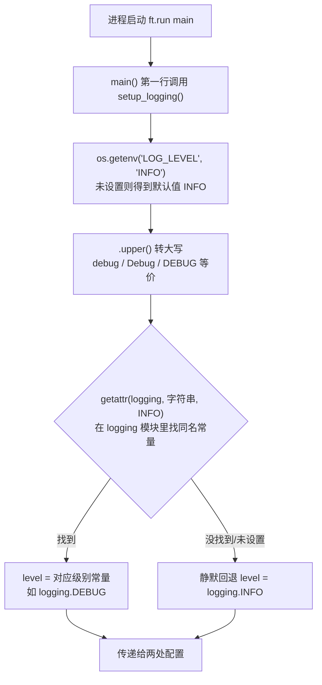
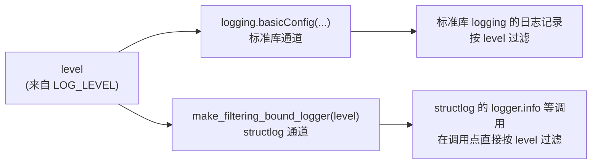

本页解释「数日子」App 日志体系的**运行时开关**：`LOG_LEVEL` 控制日志的详细程度（过滤哪些级别），`LOG_JSON` 控制日志的输出格式（人类可读还是机器可读）。它们的设计目标是——**不改一行代码**，只在启动命令前设置环境变量，就能改变整个日志子系统的行为。全部解析逻辑集中在 `log.py` 的 `setup_logging()` 函数中，共 17 行，本页将逐行拆解。处理器链的内部细节（Console 彩色渲染、JSON 渲染器的工作方式）属于姊妹页 [structlog 配置详解](19-structlog-pei-zhi-xiang-jie-chu-li-qi-lian-console-cai-se-yu-json-xuan-ran) 的范围，本页只聚焦「两个环境变量如何被读取、如何生效」。

## 为什么用环境变量做开关

设想一个常见场景：App 在你机器上运行一切正常，但日志太啰嗦（或太安静）；或者你想把日志喂给某个日志收集工具，而人眼看得舒服的彩色格式机器解析不了。如果这些行为写死在代码里，每次切换都要改源码、重新运行——开发期或许能接受，但一旦打包成 APK 部署，改代码的成本会陡增。环境变量是操作系统层面的标准做法：**同一个程序，不同的启动环境，不同的行为**，程序本身保持不变。

Sources: [log.py](log.py#L8-L11)

这个项目里恰好有两个维度需要调节，于是有两个变量。`LOG_LEVEL` 回答「**打多细**」——默认 `INFO` 级别，只显示重要事件，排查问题时可以调到 `DEBUG`；`LOG_JSON` 回答「**给谁看**」——默认 Console 彩色格式给人看，设为 `1` 时切换成 JSON 给机器看。README 中明确记录了这两个变量的用法约定：默认 Console 彩色格式、不输出 JSON、日志打到 stdout，并给出了 PowerShell 下的设置示例。
Sources: [README.md](README.md#L69-L75)

## LOG_LEVEL：一行代码里的三层解析

```python
level = getattr(logging, os.getenv("LOG_LEVEL", "INFO").upper(), logging.INFO)
```

这行代码是 `setup_logging()` 的第一句，虽然只有一个表达式，却由三层函数嵌套而成，从内到外依次是**取值、规范化、映射**三层。下面用一张流程图展示完整的判定路径（Mermaid 语法说明：`A --> B` 表示从 A 流向 B，菱形 `{}` 是判断分支，方括号 `[]` 是普通步骤）：



第一层 `os.getenv("LOG_LEVEL", "INFO")`：`os.getenv` 读取进程环境变量，第二个参数是**取不到时的默认值**。也就是说，你什么都不设，等价于设了 `"INFO"`。第二层 `.upper()` 把字符串统一转成大写，这让 `debug`、`Debug`、`DEBUG` 三种写法完全等价——对使用者宽容，是环境变量解析的好习惯。第三层 `getattr(logging, ..., logging.INFO)` 最巧妙：Python 标准库 `logging` 模块本身就定义了 `DEBUG = 10`、`INFO = 20`、`WARNING = 30`、`ERROR = 40`、`CRITICAL = 50` 这些常量，`getattr` 用字符串直接从模块上"按名字取属性"，把 `"DEBUG"` 变成真正的 `logging.DEBUG`；而它的第三个参数 `logging.INFO` 是**兜底默认值**——如果你手滑设了 `"VERBOSE"` 这种不存在的级别，不会抛异常崩溃，而是静默回退到 INFO。这三层组合起来，就是一个容错的「字符串 → 级别常量」转换器。
Sources: [log.py](log.py#L9)

根据上面的规则，各档取值在**当前代码库**中的实际效果如下表。注意一个诚实的结论：目前项目里只写入了 `info` 和 `error` 两种级别的日志（详见后文清单），所以调到 `DEBUG` 并不会多看到什么——但机制已经就位，未来添加 `logger.debug(...)` 时无需再动配置：

| LOG_LEVEL 取值 | 解析结果 | 当前 App 中的可见效果 |
|---|---|---|
| （未设置） | `logging.INFO` | 默认：显示全部 info + error 日志 |
| `DEBUG` / `debug` | `logging.DEBUG` | 与 INFO 相同（暂无 debug 日志） |
| `INFO` | `logging.INFO` | 同默认 |
| `WARNING` / `WARN` | `logging.WARNING` | info 日志被隐藏，仅剩 error 日志 |
| `ERROR` | `logging.ERROR` | 只剩坏库自愈这一条 error 日志 |
| `VERBOSE`（拼错/不存在） | 回退 `logging.INFO` | 同默认，不报错 |

Sources: [log.py](log.py#L9), [storage.py](storage.py#L30-L50)

## LOG_JSON：一个布尔开关决定渲染器

```python
as_json = os.getenv("LOG_JSON", "").lower() in ("1", "true", "yes")
```

第二行的解析比 LOG_LEVEL 简单：读取 `LOG_JSON`（默认空字符串），转小写，然后检查是否属于元组 `("1", "true", "yes")`。结果是布尔值 `as_json`——**默认 False，即默认人类可读的 Console 彩色输出**。判定规则表如下：

| LOG_JSON 取值 | 结果 | 输出格式 |
|---|---|---|
| （未设置 / 空字符串） | False | Console 彩色（默认） |
| `1` | True | JSON |
| `true` / `True` / `TRUE` | True | JSON |
| `yes` / `YES` | True | JSON |
| `on`、`y`、`0`、`false` | False | Console 彩色 |

注意这个白名单设计：只有 `1`、`true`、`yes` 三个词（不区分大小写）被认作"开"，其余任何值——包括 `on`、`y` 这类其他工具常用的写法——都被当作"关"。如果你设了 `LOG_JSON=on` 却看不到 JSON 输出，第一件事就该检查拼写是否在白名单里。
Sources: [log.py](log.py#L10)

`as_json` 只在**一个位置**被消费：处理器链的最后一环。`setup_logging()` 用条件表达式在 `JSONRenderer()` 和 `ConsoleRenderer()` 之间二选一，这是典型的**策略替换**——前面所有处理器（合并上下文变量、加级别字段、盖 ISO 时间戳）对两种格式完全一视同仁，只有最后渲染成什么样由这个开关决定。同一个 `app_started` 事件，两种格式的输出形态示意如下（JSON 行的键由处理器链决定：`event` 是事件名、`level` 来自 `add_log_level`、`timestamp` 来自 `TimeStamper`，其余键是调用时传入的参数）：

| 格式 | LOG_JSON | 同一条日志的示意形态 |
|---|---|---|
| Console 彩色 | 未设置 | `2025-01-15T10:30:00.123456 [info     ] app_started   db=C:\...\day_entries.db`（带颜色） |
| JSON | `1` | `{"db": "C:\\...\\day_entries.db", "event": "app_started", "level": "info", "timestamp": "2025-01-15T10:30:00.123456"}` |

Sources: [log.py](log.py#L13-L24)

## 一个变量、两处生效：level 的双通道

`LOG_LEVEL` 解析出的 `level` 值被同时传给了**两个互不相关的配置点**，这是初学者最容易忽略的细节：



第一处是 `logging.basicConfig(format="%(message)s", stream=sys.stdout, level=level)`：它配置的是 **Python 标准库 logging**，作用是兜底——如果 Flet 或其他第三方库用标准 logging 打日志，这些记录也会按同一级别过滤，并以裸消息格式（不带多余前缀）打到 stdout，与 structlog 的输出风格保持一致。第二处是 `wrapper_class=structlog.make_filtering_bound_logger(level)`：它配置的是 **structlog 自己的日志对象**——也就是项目中 `logger.info("entry_created", ...)` 这些调用走的通道。关键区别在于过滤发生的位置：`make_filtering_bound_logger` 让级别检查发生在 `logger.info(...)` **调用的一瞬间**，级别不够的日志当场丢弃，整条处理器链（合并上下文、加时间戳、渲染）根本不会执行。这不仅是行为差异，更是性能设计——被过滤的日志几乎没有开销。
Sources: [log.py](log.py#L12-L24)

与之配套的还有一行 `cache_logger_on_first_use=True`：每个日志对象在**第一次使用后会被缓存**，后续调用复用缓存的配置。它的直接推论是——**环境变量的读取窗口只有进程启动那一次**。`setup_logging()` 在 `main()` 函数的第一行被调用（Flet 启动 `main` 时执行），此后即使你在 shell 里重新设置 `$env:LOG_LEVEL`，也不会影响这个已经在运行的进程。想改变日志行为，唯一正确的做法是：退出当前进程 → 设置环境变量 → 重新启动。
Sources: [main.py](main.py#L18-L19), [log.py](log.py#L22-L24)

## 动手实践：启动前设置（Windows）

理解了机制，操作就非常简单。**口诀：先设置，后启动**。PowerShell 中用 `$env:` 语法（README 中记录的官方示例），cmd 中用 `set`：

```powershell
# PowerShell —— 想要机器可读的 JSON 日志
$env:LOG_JSON = "1"
uv run flet run main.py

# PowerShell —— 想要最详细的调试级别
$env:LOG_LEVEL = "DEBUG"
uv run flet run main.py

# PowerShell —— 两个一起设（JSON + DEBUG）
$env:LOG_JSON = "1"; $env:LOG_LEVEL = "DEBUG"
uv run flet run main.py
```

```bat
:: cmd —— 等价写法
set LOG_JSON=1
set LOG_LEVEL=DEBUG
uv run flet run main.py
```

环境变量是**会话级**的：`$env:` / `set` 设置的值只在当前终端窗口有效，关掉窗口即消失，不会污染系统。这正好适合日志开关这种"临时调整"的用途——下次打开新终端，一切回到默认。若想在本会话内撤销，PowerShell 用 `Remove-Item Env:LOG_JSON`，cmd 用 `set LOG_JSON=`（等号后留空）。
Sources: [README.md](README.md#L72-L75)

常见组合的速查表如下，建议把它当作调试时的"菜单"：

| 场景 | 命令前缀 | 效果 |
|---|---|---|
| 日常开发（默认） | 不设任何变量 | Console 彩色，INFO 级 |
| 感觉日志太吵 | `$env:LOG_LEVEL = "WARNING"` | 只剩 error 级坏库自愈日志 |
| 排查数据问题 | `$env:LOG_LEVEL = "DEBUG"` | 与默认相同（暂无 debug 日志，机制已就位） |
| 接入日志收集工具 | `$env:LOG_JSON = "1"` | 每条日志一行 JSON，可直接被解析 |
| 最简静默监控 | `$env:LOG_JSON = "1"; $env:LOG_LEVEL = "ERROR"` | 只在坏库时输出一条 JSON |

## 你会看到什么：当前代码的日志清单

调完开关，得知道每档下具体能看到哪些日志。当前代码库共有 7 条日志语句，集中在 `main.py` 和 `storage.py`，全部打到 stdout：

| 事件 | 级别 | 位置 | 触发时机 |
|---|---|---|---|
| （空事件名，携带 `base` 参数） | info | main.py 启动段 | 应用启动、确定数据目录后 |
| `app_started`（携带 `db` 路径） | info | main.py 启动段 | 数据库初始化完成、界面构建前 |
| `db_initialized`（携带 `path`） | info | storage.py `init()` | 每次调用 `init()` 建立连接后 |
| `entry_created`（携带 id/name/date） | info | storage.py `create()` | 新增记录成功 |
| `entry_updated`（携带 id/name/date） | info | storage.py `update()` | 编辑记录且确实改动了行 |
| `entry_deleted`（携带 id） | info | storage.py `delete()` | 删除记录且确实删掉了行 |
| `db_corrupt_recovered`（携带改名路径） | **error** | storage.py `_connect()` | 库文件损坏，自动改名备份并重建 |

Sources: [main.py](main.py#L28-L31), [storage.py](storage.py#L30-L50)

这张清单印证了前文的两个判断：其一，`LOG_LEVEL=ERROR` 是一个有效的"静默模式"——只在坏库自愈这种真正异常的时刻才出声；其二，`update()` 和 `delete()` 里的 info 日志都包在 `rowcount > 0` 的条件内，**没改到行就不打日志**，所以日志清单同时也是"操作确实生效"的凭证，而不只是"操作被尝试过"的记录。
Sources: [storage.py](storage.py#L97-L113)

## 陷阱清单：三个新手容易踩的坑

**坑一：拼错 LOG_LEVEL 不会报错。** `getattr` 的兜底设计让 `"VERBOSE"`、`"INFO "`（带空格）、`"TRACE"` 都静默回退到 INFO，程序照常运行，只是你以为的"DEBUG 模式"没生效。排查方法：如果改了级别却看不出差异，先确认取值是否为 `DEBUG/INFO/WARNING/ERROR/CRITICAL` 之一。
Sources: [log.py](log.py#L9)

**坑二：`on` 和 `y` 不算"开"。** `LOG_JSON` 的白名单只有 `1/true/yes`，其他值一律视为关闭。这是有意收窄的容错范围——宁可让用户发现"没生效"，也不让含义模糊的值悄悄改变输出格式。
Sources: [log.py](log.py#L10)

**坑三：改了环境变量必须重启进程。** 日志配置在 `main()` 第一行的 `setup_logging()` 中一次性读取，且 `cache_logger_on_first_use=True` 缓存了首次配置。使用 `flet run` 热重载时要特别注意：热重载会重新执行 `main()`（`setup_logging()` 会再跑一次），但**进程的环境变量在进程启动时就已固定**——你在新终端窗口里改 `$env:` 影响不了那个已经在跑的 flet 进程。正确顺序永远是：Ctrl+C 退出 → 设变量 → 重新 `uv run flet run main.py`。热重载机制本身详见 [热重载开发工作流](3-re-zhong-zai-kai-fa-gong-zuo-liu-flet-run-yu-zhi-jie-yun-xing-de-qu-bie)。
Sources: [main.py](main.py#L18-L19), [log.py](log.py#L22-L24)

## 设计要点回顾与本页边界

回看整个 `setup_logging()`，两个环境变量的处理体现了一套一致的哲学：**宽松读取、明确默认、单点消费**——`LOG_LEVEL` 经三层转换落到两个配置通道，`LOG_JSON` 经白名单判定落到唯一的渲染器位置；解析逻辑全部集中在这一个函数里，业务代码（`main.py`、`storage.py`）对此完全无感知，它们只管 `logger.info(...)`，不关心输出长什么样、过滤到哪一级。这种"配置与使用分离"正是日志体系能作为独立一层存在的根基（四层划分见 [四层分层架构](5-si-ceng-fen-ceng-jia-gou-ui-chun-luo-ji-cun-chu-ri-zhi-de-zhi-ze-hua-fen)）。
Sources: [log.py](log.py#L8-L24)

继续深入的推荐路径：想理解 `JSONRenderer` 与 `ConsoleRenderer` 内部如何渲染、处理器链为什么这样排序，读 [structlog 配置详解：处理器链、Console 彩色与 JSON 渲染](19-structlog-pei-zhi-xiang-jie-chu-li-qi-lian-console-cai-se-yu-json-xuan-ran)；想看那条唯一的 error 日志背后的完整自愈流程，读 [坏库自愈机制：损坏检测、改名备份与自动重建](18-pi-ku-zi-yu-ji-zhi-sun-huai-jian-ce-gai-ming-bei-fen-yu-zi-dong-zhong-jian)；想知道 structlog 为何进入依赖清单，读 [uv 依赖管理与零第三方依赖哲学](24-uv-yi-lai-guan-li-yu-ling-di-san-fang-yi-lai-zhe-xue)。