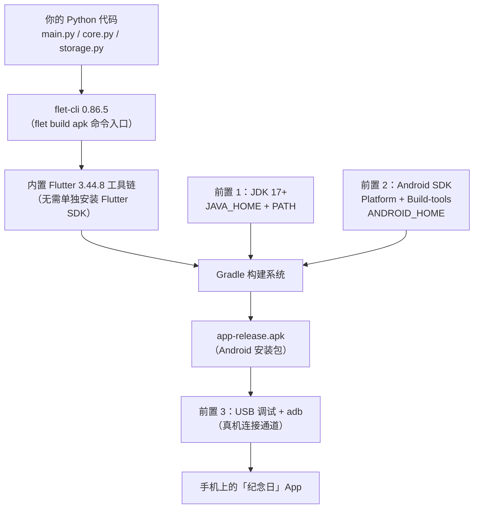
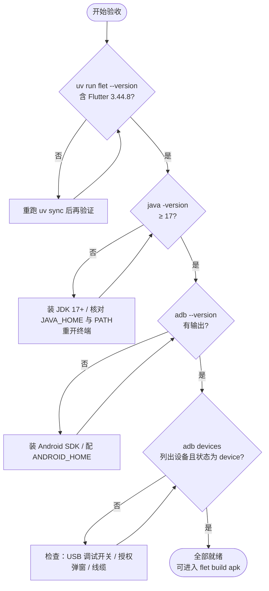

本页回答一个精确的问题：**在执行 `flet build apk` 之前，你的 Windows 机器和 Android 手机分别需要满足什么条件**。日常开发（`uv run flet run main.py` 弹出桌面窗口）是零额外安装的，但把 Python 代码变成手机上的 APK 安装包，需要引入一条完整的 Android 构建工具链——JDK、Android SDK、以及用于真机连接的 adb。本页将解释**每个组件为什么存在、承担什么职责、如何安装配置、用什么命令验证**；打包命令本身的执行流程属于下一页 [flet build apk 打包流程与 adb 真机安装](22-flet-build-apk-da-bao-liu-cheng-yu-adb-zhen-ji-an-zhuang) 的范围。项目当前的策略是「用到再装」——这些工具尚未安装在本机，本文是备好的行动清单。

Sources: [README.md](README.md#L77-L92)

## 心智模型：为什么打包和运行是两条完全不同的路径

先建立全页最关键的一次认知转换。这个项目的桌面调试链路极其轻量：`pyproject.toml` 声明依赖，`uv sync` 装进 `.venv`，`flet run main.py` 直接在桌面窗口渲染——UI 逻辑、增删改查、SQLite 读写全部可验证，**不需要任何 Android 相关工具**。而打包链路的本质是一次跨语言、跨平台的产物转换：Flet 应用基于 Flutter 渲染引擎，`flet build apk` 要把你的 Python 代码连同 Flutter 框架一起编译成 Android 原生安装包，这个过程由 Gradle 构建系统驱动，而 Gradle 是运行在 JVM 上的 Java 程序——这就是 JDK 成为硬性前置的根本原因；同时 Android 平台的资源编译、字节码转换等环节需要 Android SDK 提供的工具，签名与安装则需要 SDK 附带的 adb。

下面的架构图展示三个前置条件在整条链路中的精确位置：



这张图隐含一个重要的减负事实：**Flutter SDK 不在你的安装清单上**。`flet-cli`（0.86.5）已内置 Flutter 3.44.8 打包工具链，用 `flet --version` 即可验证——这一条在你装好 uv 并 `uv sync` 之后就已经满足了，所以真正需要动手准备的只剩图中右侧三个高亮前置。还需要说明的是选择真机路径的动机：SQLite 数据在手机上位于 App 沙箱目录，小屏触摸适配、虚拟键盘、生命周期切换这些桌面覆盖不了的行为，只有装进真机才能验证（这部分的详细划分见 [桌面调试与真机验证的能力边界划分](23-zhuo-mian-diao-shi-yu-zhen-ji-yan-zheng-de-neng-li-bian-jie-hua-fen)）。

Sources: [README.md](README.md#L77-L92)、[uv.lock](uv.lock#L28-L29)、[.flet/README.md](.flet/README.md#L5-L9)

## 前置条件总览：一张表锚定三个组件

在逐项展开之前，先用一张总表建立全局视图。注意「验证命令」一列——每个前置条件都有独立的、可执行的验证手段，装完后你不需要靠猜测判断是否成功：

| 组件 | 职责 | 关键配置 | 验证手段 | 未装/配错的典型症状 |
|---|---|---|---|---|
| **JDK 17+** | 为 Gradle 构建系统提供 JVM 运行时 | `JAVA_HOME` 环境变量；`%JAVA_HOME%\bin` 加入 `PATH` | `java -version` 输出 17 或更高 | 构建启动即报错，提示找不到 java 或 JAVA_HOME |
| **Android SDK** | 提供 Android 平台资源与编译工具（Platform + Build-tools），附带了 adb | `ANDROID_HOME` 环境变量 | `adb --version` 有输出 | 构建中段失败，提示 SDK 路径或组件缺失 |
| **USB 调试** | 打开手机与电脑之间的 adb 通信通道 | 手机端开发者选项中开启；USB 连接电脑 | `adb devices` 列出设备 | `adb devices` 列表为空或显示 unauthorized |
| flet-cli（已具备） | 打包命令入口，内置 Flutter 3.44.8 | 无需额外配置 | `uv run flet --version` | 版本号中看不到 Flutter 工具链信息 |

表格最后一行刻意列出 flet-cli——它**已经是完成态**：`pyproject.toml` 中 `flet>=0.28.0` 的声明经 uv 解析后锁定为 0.86.5，`uv sync` 之后这条就已经就绪。前文提到的 `uv run flet --version` 值得现在就跑一次，确认输出中包含 Flutter 3.44.8 工具链信息，为后面三个组件的安装排除掉一个变量。

Sources: [README.md](README.md#L84-L92)、[pyproject.toml](pyproject.toml#L10-L13)、[uv.lock](uv.lock#L27-L40)

## 前置一：JDK 17+——Gradle 的运行时地基

**为什么是 17 这个版本号**：`flet build apk` 的构建过程由 Flutter 驱动的 Gradle 完成，Gradle 是 Java 程序，必须运行在 JVM 上，因此 JDK 是整条链路最底层的外部依赖；当前 Android 构建工具链约定的基线就是 JDK 17，项目文档中明确要求 **JDK 17+**（17、21 均可）。安装本身的操作很直接：从任一发行版（如 Eclipse Temurin、Oracle JDK）安装 17 或更高版本，然后完成两步环境变量配置——这是新手最容易漏的环节：

```powershell
# 1. 设置 JAVA_HOME 指向 JDK 安装根目录（路径按你的实际安装位置调整）
#    例如：C:\Program Files\Eclipse Adoptium\jdk-17.x.x
# 2. 将 %JAVA_HOME%\bin 加入 PATH
#    两者都通过「系统属性 → 环境变量」图形界面设置，或用 setx 命令
```

配置完成后**必须重开一个终端窗口**（让新环境变量对当前会话生效——这与安装 uv 之后的操作完全同构，参见 [快速开始：安装 uv 并运行纪念日 App](2-kuai-su-kai-shi-an-zhuang-uv-bing-yun-xing-ji-nian-ri-app) 的排障经验），然后执行验证：

```powershell
java -version
# 期望输出：openjdk version "17.x.x" 或更高；报「不是内部或外部命令」= PATH 没配好或没重开终端
```

一个容易踩的坑值得预先指出：如果机器上曾装过其他版本的 JDK（或某些软件自带 JRE），`java -version` 可能输出版本号但 Gradle 仍报错——因为 Gradle 优先读取的是 `JAVA_HOME`，而终端里的 `java` 命令走的是 `PATH`。所以两个配置**必须同时做**，只用 `java -version` 验证 PATH 侧，构建报错时再回头核对 `JAVA_HOME` 的值是否指向 17+ 的安装目录。

Sources: [README.md](README.md#L86-L86)

## 前置二：Android SDK——平台工具与编译工具的来源

Android SDK 是三个前置中体积最大、组件最多的一项，但本项目的需求范围其实很窄：**SDK Platform + Build-tools** 两组件即可满足 APK 构建。安装路径有两条，按你的使用深度选择：

| 安装方式 | 适合场景 | 操作要点 |
|---|---|---|
| **Android Studio**（完整 IDE） | 打算长期做 Android 相关开发、需要模拟器和可视化 SDK Manager | 安装后在其 SDK Manager 中勾选所需 Platform 与 Build-tools |
| **Command-line Tools**（纯命令行） | 只想要最小体积的工具链、不装 IDE | 下载 Google 官方 cmdline-tools，用 `sdkmanager` 命令安装组件 |

无论哪条路径，安装完成后的共同动作是配置 **`ANDROID_HOME` 环境变量**指向 SDK 根目录（Windows 上典型位置是 `%LOCALAPPDATA%\Android\Sdk`）。SDK 目录下有几个子目录值得认识，它们直接对应后面的使用环节：`platform-tools/` 里有 adb（前置三的主角，同时也是 `adb install` 的执行者）、`build-tools/` 里是资源编译相关的工具、`platforms/` 里是各版本的 Android 平台定义。验证 SDK 是否就绪的最轻量手段，就是直接调用它附带的 adb：

```powershell
adb --version
# 有版本输出 → ANDROID_HOME/PATH 至少一侧配置正确
```

这里有一个与项目哲学呼应的观察：本项目 Python 侧坚持「零第三方依赖」（Flet 之外全部标准库），但打包环节无可避免地引入外部工具链——这正是「用到再装」策略的由来：这些工具不进入 `.venv`、不写入 `uv.lock`，与 Python 依赖管理完全隔离，不污染日常开发环境。关于这种隔离设计的更多讨论见 [uv 依赖管理与零第三方依赖哲学](24-uv-yi-lai-guan-li-yu-ling-di-san-fang-yi-lai-zhe-xue)。

Sources: [README.md](README.md#L87-L88)、[pyproject.toml](pyproject.toml#L10-L13)

## 前置三：USB 调试——手机侧的通信开关

前两个前置解决「电脑能不能构建」，第三个前置解决「构建产物能不能送达手机」。它跟前两者性质不同：**配置动作发生在手机上，验证手段在电脑上**。操作序列如下：

1. 手机进入「设置 → 关于手机」，连续点击「版本号」7 次，解锁**开发者选项**（各厂商路径略有差异，但「连点版本号」是通行手势）；
2. 返回设置，进入新出现的「开发者选项」，开启 **USB 调试**开关；
3. 用 USB 线连接手机与电脑，手机上会弹出「是否允许 USB 调试」的授权确认——**必须点允许**（这一步漏掉是 `unauthorized` 状态的头号原因）；
4. 电脑终端执行验证：

```powershell
adb devices
# 期望输出两行：设备序列号 + "device" 状态
# 列表为空 → 驱动/线缆/开关问题；显示 "unauthorized" → 手机上没点授权弹窗
```

`adb devices` 是整个前置体系的**总验收命令**——它能列出设备，意味着手机开关、USB 连接、授权、电脑侧 adb（来自 Android SDK）全部打通。这个通道后续承担两个职责：真机调试时的实时日志查看，以及 `adb install` 安装 APK——后者是打包链路的最后一米，具体执行见下一页。

Sources: [README.md](README.md#L89-L89)

## 完整验证流程：装完之后跑一遍

三个组件的安装顺序没有强制依赖，但**验证必须全部通过**才能进入打包环节。下面的流程图把全页内容收敛为一次可重复执行的验收流程，每个判定节点都有明确的两条出路：



注意流程的第一个节点放在 `flet --version` 上——它是唯一不需要任何安装就能通过的检查项，把它放在最前面可以尽早确认「Python 侧没问题，剩余问题全部在 Android 工具链侧」，缩小排障范围。全部通过后，你与第一个 APK 之间只差两条命令的距离：`uv run flet build apk` 与 `adb install build/app/outputs/flutter-apk/app-release.apk`，这两条命令的完整执行流程、产物位置与常见构建问题，是下一页的主题。

Sources: [README.md](README.md#L91-L99)

## 排障速查表

最后汇总本页范围内的高频问题与判定思路，供安装过程中随时对照：

| 症状 | 定位到的前置 | 排查顺序 |
|---|---|---|
| 构建报错找不到 java / JAVA_HOME | JDK | ① `JAVA_HOME` 是否指向 JDK 根目录 ② `PATH` 是否含 `%JAVA_HOME%\bin` ③ 是否重开了终端 |
| `java -version` 正常但构建仍失败 | JDK | 终端里的 java 走 PATH、Gradle 读 JAVA_HOME——两者指向的版本可能不一致，逐一核对 |
| 构建中段报 SDK / 组件缺失 | Android SDK | ① `ANDROID_HOME` 是否指向 SDK 根目录 ② SDK Platform 与 Build-tools 是否都已安装 |
| `adb` 命令不存在 | Android SDK | adb 位于 SDK 的 `platform-tools/` 子目录，检查 `ANDROID_HOME` 配置 |
| `adb devices` 列表为空 | USB 调试 | ① 开发者选项中 USB 调试是否开启 ② 换 USB 线/端口 ③ 检查手机驱动 |
| `adb devices` 显示 unauthorized | USB 调试 | 查看手机屏幕，点击 USB 调试授权弹窗；错过则 revoke 后重插 |
| 装上手机后找不到数据库 | 运行时预期行为 | 并非故障：SQLite 数据在手机上位于 App 沙箱目录，与桌面路径不同（详见[数据库路径三级策略](16-shu-ju-ku-lu-jing-san-ji-ce-lue-xi-tong-mu-lu-ben-di-hui-tui-yu-anniversary_db-huan-jing-bian-liang)） |

表中最后一行值得强调：它不是故障，而是**预期行为的差异**——桌面端的数据库路径策略在真机上会落入 App 沙箱目录，提前知道这一点可以避免把正常现象当 bug 排查。

Sources: [README.md](README.md#L84-L92)、[.flet/README.md](.flet/README.md#L5-L5)

## 下一步

环境验收全部通过后，本页使命完成。继续阅读：

- **[flet build apk 打包流程与 adb 真机安装](22-flet-build-apk-da-bao-liu-cheng-yu-adb-zhen-ji-an-zhuang)**——执行 `flet build apk`，理解产物在 `build/app/outputs/flutter-apk/` 的组织方式，并用 `adb install` 装进手机；
- **[桌面调试与真机验证的能力边界划分](23-zhuo-mian-diao-shi-yu-zhen-ji-yan-zheng-de-neng-li-bian-jie-hua-fen)**——如果你还在犹豫「是否值得为真机准备这一整套环境」，这篇分析桌面与真机各自能验证什么，帮你做决策。