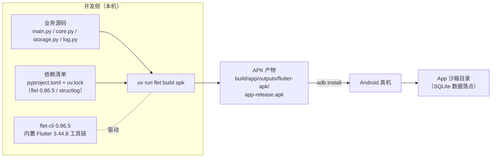
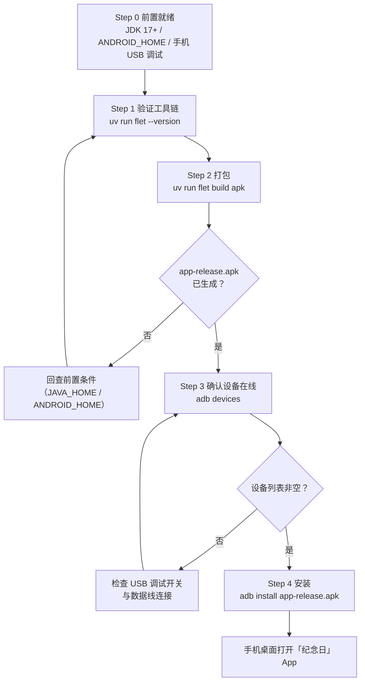

本页是"打包与真机部署"系列的操作主线：从 `uv run flet build apk` 这一条命令出发，讲清楚 APK 是怎么产出的、产物落在哪、以及如何用 `adb` 把它装进 Android 真机并确认 App 正常运行。前置工具链（JDK 17+、Android SDK、USB 调试）的安装与配置属于上一页 [APK 打包前置条件：JDK 17+、Android SDK 与 USB 调试](21-apk-da-bao-qian-zhi-tiao-jian-jdk-17-android-sdk-yu-usb-diao-shi)的范围，本页只做就绪性检查；"桌面调试能覆盖什么、真机必须验证什么"的边界讨论留给下一页 [桌面调试与真机验证的能力边界划分](23-zhuo-mian-diao-shi-yu-zhen-ji-yan-zheng-de-neng-li-bian-jie-hua-fen)。

Sources: [README.md](README.md#L77-L99)

## 全链路总览：从源码到手机桌面

在进入逐步操作之前，先建立全局图景。下图展示的是本项目的打包-安装-运行链路：开发侧只有源码、依赖清单和 flet 自带的工具链三样输入；中间经过一次构建命令产出 APK；再经 `adb install` 进入真机；App 启动后，SQLite 数据自动落在 Android 的 **App 沙箱目录** 中——这是 `main.py` 里存储路径策略在设备上的自然结果，不需要为打包改一行代码。



（上图节点均为可验证事实：命令与产物路径来自 README 的打包章节；工具链版本来自 `flet --version` 的说明与 `uv.lock` 的版本锁定；沙箱落点来自 `main.py` 的路径策略。）

这条链路的设计取向很明确：**打包是"按需启用"的最后一步，而不是日常开发的一环**。本机桌面窗口调试零额外安装、覆盖绝大部分场景，只有当你要把 App 真正装进手机日常使用时，才需要走完上图整条链路。这也是为什么 README 把前置条件标注为"本机当前未装，用到再装"。
Sources: [README.md](README.md#L77-L92)

## 零配置打包的三个约定

`flet build apk` 在这个项目里不需要任何打包配置文件（没有 `Dockerfile` 式的构建描述、没有 Android 工程模板），这背后靠的是三个已经就位的约定：

| 约定 | 内容 | 为什么足以支撑打包 |
|---|---|---|
| **入口约定** | `main.py` 中 `async def main(page)` + `ft.run(main)` | Flet 默认以 `main.py` 为入口，桌面运行与打包复用同一个入口函数 |
| **依赖约定** | `pyproject.toml` 声明 `flet>=0.28.0`、`structlog>=26.1.0`，`uv.lock` 锁定 `flet==0.86.5` | 构建时依赖集合是封闭且可复现的，打包进 APK 的 Python 运行时内容确定 |
| **工具链约定** | `flet-cli`（0.86.5）内置 Flutter 3.44.8 打包工具链 | 无需单独安装 Flutter SDK，`flet --version` 即可验证 |

第三点尤其关键：**这个项目从头到尾没有安装过 Flutter SDK**。`uv sync` 装进 `.venv` 的 `flet` 包自带打包所需的 Flutter 工具链，`flet build apk` 内部调用它完成 Android 侧的编译。JDK 与 Android SDK 才是仅有的两个外部前置（前者服务于 Android 的 Gradle 构建，后者提供平台与构建工具），它们正是上一页配置的内容。
Sources: [pyproject.toml](pyproject.toml#L1-L13), [uv.lock](uv.lock#L27-L37), [README.md](README.md#L91-L92)

## 第一步：验证工具链与打包

先确认版本，再执行构建。两条命令都在项目根目录 `flet-android-lab` 下运行：

```bash
uv run flet --version    # 预期能看到 flet-cli 0.86.5 与内置 Flutter 3.44.8
uv run flet build apk    # 产物在 build/app/outputs/flutter-apk/
```

`uv run` 前缀保证调用的是 `.venv` 中由 `uv.lock` 锁定的那个 flet 版本，而不是系统里可能存在的其他版本——这与日常 `uv run flet run main.py` 是同一套调用习惯。构建成功后，唯一的交付物是 `build/app/outputs/flutter-apk/app-release.apk`。

时间预期上要有一个心理建设：**首次构建明显慢于后续构建**。第一次运行时工具链要完成初始化和完整编译，之后再次执行同样的命令会快得多。构建产物所在的 `build/`、`dist/` 目录都已写入 `.gitignore`——产物被视为可再生成的临时输出，永不进版本库，任何人拿到源码都能重新构建出等价 APK。
Sources: [README.md](README.md#L91-L99), [.gitignore](.gitignore#L1-L7)

## 第二步：adb 真机安装

APK 产出后，安装链路是固定的三步。下图把"检查 → 打包 → 安装 → 验证"串成一条带决策回路的流程，任何一步失败都能明确回退到对应的检查点：



Step 3 的 `adb devices` 是安装前的强制闸门：它列出当前所有已连接且授权的 Android 设备，只有列表中能看到你的手机，`adb install` 才有目标可装。Step 4 的完整命令（注意路径要从项目根目录出发）：

```bash
adb devices                                            # 确认真机在线
adb install build/app/outputs/flutter-apk/app-release.apk
```

日常迭代中常用的 adb 操作可以归纳为下表（`adb devices` 与 `adb install` 是项目 README 明确记载的用法，其余为 adb 的通用能力）：

| 命令 | 作用 | 使用时机 |
|---|---|---|
| `adb devices` | 列出已连接/已授权设备 | 每次安装前确认真机在线 |
| `adb install <apk路径>` | 安装 APK 到设备 | 首次安装 |
| `adb install -r <apk路径>` | 覆盖安装，保留应用数据 | 迭代后更新新版本，SQLite 数据不丢 |
| `adb uninstall <包名>` | 卸载应用 | 需要彻底清空数据重来时 |

安装成功的最终标志不在命令行，而在手机桌面：出现"纪念日"图标，点开能看到空列表提示"还没有纪念日，点右上角 + 添加"，此时添加一条数据即完成端到端验证。
Sources: [README.md](README.md#L88-L99), [main.py](main.py#L33-L39)

## 装上手机之后：数据落在哪里

这是打包链路里最容易被忽略、却最能体现架构设计的一环。`main.py` 的启动逻辑对数据库路径做了两级取值：优先调用 `page.storage_paths.get_application_support_directory()`，取不到才回退到项目内 `data/` 目录。

```python
try:
    base = Path(await page.storage_paths.get_application_support_directory())
except Exception:
    base = Path(__file__).parent / "data"
db_file = base / "anniversaries.db"
storage.init(db_file)
```

在真机上，`storage_paths` 一定可用，它返回的就是 **App 沙箱目录**——Android 分配给该应用的私有存储空间，卸载即随之清除、其他应用不可访问。也就是说：桌面端的"回退到项目 `data/`"分支在设备上根本不会走到，同一份代码无需任何条件编译就完成了两个平台的适配。这也意味着换手机、卸载重装（非 `-r` 覆盖）都会丢数据——数据只活在沙箱里，这是与桌面端项目目录最大的行为差异。三级路径策略（系统目录、本地回退、`ANNIVERSARY_DB` 环境变量）的完整解析见 [数据库路径三级策略：系统目录、本地回退与 ANNIVERSARY_DB 环境变量](16-shu-ju-ku-lu-jing-san-ji-ce-lue-xi-tong-mu-lu-ben-di-hui-tui-yu-anniversary_db-huan-jing-bian-liang)。
Sources: [main.py](main.py#L24-L31), [README.md](README.md#L91-L92), [storage.py](storage.py#L25-L34)

值得补充的是，开发期的 `.flet/storage/` 目录正是这套沙箱机制的**本机模拟**：`flet run` 会创建它，并通过 `FLET_APP_STORAGE_DATA/CACHE/TEMP` 环境变量暴露三个存储位置，行为与打包后的 App 在设备上一致。换句话说，桌面开发阶段你已经一直在"准真机"的存储语义下写代码了，打包上线只是把这个语义搬到真正的沙箱里。

| 维度 | 桌面开发（`uv run flet run main.py`） | 真机（`adb install` 后） |
|---|---|---|
| 获取 App 的方式 | 命令启动桌面窗口 | `adb install` 安装 APK |
| 渲染引擎 | 本机 Flutter 桌面引擎 | APK 内置的 Android 引擎 |
| SQLite 库落点 | 系统应用数据目录，失败回退项目 `data/` | App 沙箱目录（`storage_paths` 必然可用） |
| 数据生命周期 | 跟随本机目录，可手动备份 | 跟随 App：卸载即清空，`-r` 覆盖安装保留 |
| 分发形态 | 无产物 | `app-release.apk` 可直接拷贝给他人安装 |

Sources: [.flet/README.md](.flet/README.md#L3-L11), [main.py](main.py#L24-L31)

## 故障排查

按链路顺序，从构建到安装的常见故障与定位方式：

| 现象 | 大概率原因 | 处理方向 |
|---|---|---|
| `flet build apk` 报找不到 `java` | `JAVA_HOME` 未配置或 `%JAVA_HOME%\bin` 不在 `PATH` | 回到前置配置：安装 JDK 17+ 并配好环境变量 |
| 构建报 Android SDK 相关错误 | `ANDROID_HOME` 未配置，或缺 SDK Platform / Build-tools | 通过 Android Studio 或 Command-line Tools 补装并配置 |
| `flet --version` 异常 | `.venv` 中 flet 未就绪 | 先 `uv sync`，确认 `uv.lock` 锁定的 flet 0.86.5 已安装 |
| `adb devices` 列表为空 | 手机未开 USB 调试、未授权弹窗、或数据线仅供电 | 检查 USB 调试开关与连接，参见前置条件页 |
| 安装后闪退 / 数据异常 | 代码本身问题，而非打包问题 | 先在桌面窗口复现并修复——桌面与真机共用同一入口 `ft.run(main)` |
| 找不到 APK 文件 | 构建实际未成功，或路径拼错 | 确认 `build/app/outputs/flutter-apk/app-release.apk` 完整存在再执行安装 |

排查的总原则：**构建阶段的问题查本机工具链，安装阶段的问题查设备连接，运行阶段的问题回桌面复现**。第三条之所以成立，是因为桌面与真机跑的是完全相同的 `main.py` 入口与业务代码，桌面能复现的缺陷不需要真机参与调试。
Sources: [README.md](README.md#L84-L99), [main.py](main.py#L18-L31)

## 小结与下一步

这一页的完整闭环是：三个约定（入口、依赖、内置工具链）支撑起零配置的 `uv run flet build apk`，产物固定落在 `build/app/outputs/flutter-apk/app-release.apk`，`adb devices` 确认连接后 `adb install` 完成安装，App 启动后数据自动进入沙箱目录。整个过程不修改任何业务代码——打包不是一次"移植"，只是一次"交付"。

接下来推荐按两条线继续：

- 向前补全背景：若前置条件尚未配置，先读 [APK 打包前置条件：JDK 17+、Android SDK 与 USB 调试](21-apk-da-bao-qian-zhi-tiao-jian-jdk-17-android-sdk-yu-usb-diao-shi)；
- 向后理解边界：装上真机之后该验证什么、桌面调试已经替你验证了什么，见 [桌面调试与真机验证的能力边界划分](23-zhuo-mian-diao-shi-yu-zhen-ji-yan-zheng-de-neng-li-bian-jie-hua-fen)；
- 若想理解"为什么 APK 里的依赖集合是确定的"，延伸阅读 [uv 依赖管理与零第三方依赖哲学](24-uv-yi-lai-guan-li-yu-ling-di-san-fang-yi-lai-zhe-xue)。