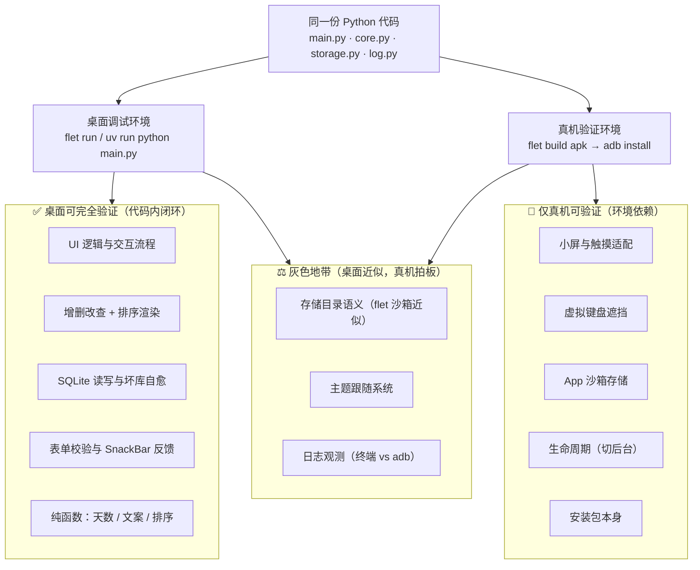
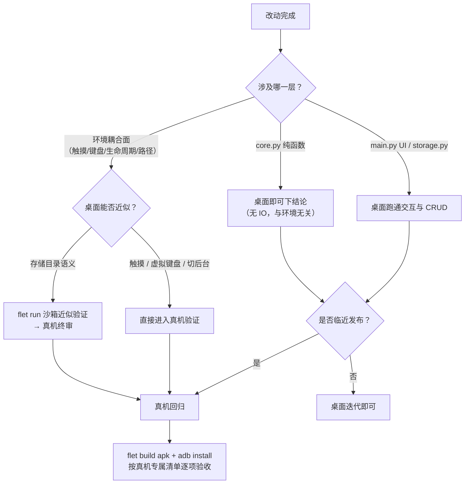

本页回答一个贯穿开发全程的工程决策问题：在"纯 Python + Flet"的技术路线下，**哪些验证可以在桌面窗口内闭环，哪些必须装进手机才算数**。项目 README 对此给出了明确的战略表述——日常开发的绝大部分场景（UI 逻辑、增删改查、SQLite 读写）桌面即可覆盖，真机只在"想把 App 装进手机日常使用"时才需要，用于验证桌面覆盖不了的部分。本页的任务是从代码层面解释这条边界**为什么画在这里**、**靠什么机制维持**，以及在边界模糊处如何拍板。

Sources: [README.md](README.md#L77-L83)

## 边界的由来：一份代码，两个宿主

划分能力边界之前，先回到第一性原理：桌面与真机运行的是**同一份 Python 代码**。四个模块（`main.py`、`core.py`、`storage.py`、`log.py`）在两种环境下执行完全相同的逻辑，入口都是 `ft.run(main)`，不存任何平台分支代码。因此，两条验证路径的差异不可能来自代码本身，只能来自**宿主环境提供的外部服务**——渲染宿主（Flutter 桌面窗口 vs Android 应用进程）、输入方式（鼠标滚轮 vs 触摸与虚拟键盘）、文件系统位置（系统应用数据目录 vs App 沙箱）、日志通道（终端 stdout vs 无终端）。

由此可以推导出本页的核心判据：**凡是只依赖代码内部逻辑的行为，桌面验证即可等价于真机；凡是依赖宿主环境服务的行为，桌面最多近似，真机才能拍板**。这个判据解释了为什么项目的验证策略敢于"桌面优先"——因为绝大部分代码属于前者。

Sources: [main.py](main.py#L1-L18), [main.py](main.py#L175-L175)

## 能力边界全景

下 图（Mermaid 流程图）展示三个能力区域与两种运行环境的关系：内环是代码层完全等价的"桌面可验证区"，外环是环境依赖的"真机专属区"，中间是桌面可近似、真机终审的"灰色地带"。阅读前只需知道：箭头表示"该环境对此区域拥有验证能力"，虚线区域表示桌面无法覆盖。

两个环境在关键维度上的差异，构成了边界的物理基础：

| 维度 | 桌面调试（flet run / 直接运行） | 真机验证（APK） | 代码依据 |
|---|---|---|---|
| 渲染宿主 | Flutter 桌面窗口 | Android 应用进程 | `ft.run(main)` 同一入口 |
| 输入方式 | 鼠标、滚轮、物理键盘 | 触摸、虚拟键盘 | README 明列为真机专属项 |
| 应用数据目录 | 系统应用数据目录，失败回退项目 `data/` | App 沙箱目录 | `main.py` 的 try/except 探测 |
| 日志通道 | 终端 stdout 直读 | 无终端承接 | `log.py` 输出到 stdout |
| 环境变量 | 启动前可设（`LOG_LEVEL` 等） | 无从注入 | README 的 PowerShell 示例 |
| 启动成本 | 秒级，支持热重载 | 需打包 + `adb install` | README 两阶段策略 |

Sources: [main.py](main.py#L18-L31), [log.py](log.py#L8-L24), [README.md](README.md#L72-L83)

## 桌面端可完全验证的能力

"桌面可完全验证"的含义是：**验证结果可以无损外推到真机**，因为这些行为只由代码决定。项目 README 明确将 UI 逻辑、增删改查、SQLite 读写划入此区，代码结构也支持这一划分——UI 层的列表渲染、对话框生命周期、表单校验（名称非空、`date.fromisoformat` 拒绝 2 月 30 日）、SnackBar 反馈，全部在 Python 侧完成，不触及任何平台 API；存储层的裸 SQL CRUD 与坏库自愈（改名 `.corrupt-<时间戳>` 备份后重建）是纯代码 + 文件系统逻辑，桌面行为即真机行为。

Sources: [README.md](README.md#L79-L80), [main.py](main.py#L117-L138), [storage.py](storage.py#L37-L55)

下表给出各项能力的验证方式与"桌面即终审"的依据：

| 验证项 | 桌面验证方式 | 为何桌面即终审 |
|---|---|---|
| 纯函数（`days_until` / `label` / `sort_items`） | 直接调用或断言 | 无 IO，与环境零耦合 |
| UI 交互流程（添加/编辑/删除/空态） | 桌面窗口操作走通 | 控件行为由 Flet 声明式代码决定 |
| 表单校验与错误提示 | 构造非法输入观察 `form_error` | 校验逻辑在 Python 侧执行 |
| SQLite CRUD 与排序渲染 | 增删改后观察列表顺序 | SQL 语句与排序键为纯逻辑 |
| 坏库自愈 | 手动破坏 `.db` 文件后重启观察恢复 | 检测、改名、重建均为代码内逻辑 |
| 日志格式与级别 | 设 `LOG_JSON` / `LOG_LEVEL` 后看终端 | 渲染器选择发生在进程启动时 |

两个桌面专属的调试便利进一步放大了这一区域的价值：其一，启动时会打出实际解析出的数据库路径（`app_started` 事件），终端里一眼可见数据落在何处；其二，`ANNIVERSARY_DB` 环境变量可以把库文件指到任意位置，为隔离测试提供了注入点——这个注入点只在桌面可达，本质上是**为桌面调试预留的开关**。此外，`flet run` 还带热重载（保存即重跑、无需重启命令），使这一区域的迭代成本压到最低。

Sources: [main.py](main.py#L28-L31), [storage.py](storage.py#L33-L34), [README.md](README.md#L33-L35)

## 真机专属验证项

另一端的清单在 README 中被逐项列明：**小屏与触摸适配、虚拟键盘遮挡、App 沙箱存储、生命周期（切后台）、最终安装包本身**。这些项的共同特征是验证对象不是代码逻辑，而是**代码与 Android 环境的耦合面**：下拉选日期的三列布局在桌面宽窗口里永远从容，但小屏上是否拥挤、触摸滚动是否顺手，只有真机知道；`TextField` 聚焦时虚拟键盘是否遮挡表单，桌面上根本不存在这个变量；切后台再回来、进程被杀后重启，App 能否从 SQLite 正确恢复列表，取决于 Android 生命周期与沙箱持久化的实际行为；而 APK 安装包本身能否正常构建、安装、启动，则是打包链路（flet-cli 内置的 Flutter 工具链）的最终验收。

Sources: [README.md](README.md#L81-L92)

一个容易忽略的例子是 `page.theme_mode = ft.ThemeMode.SYSTEM`：这一行代码声明 App 跟随系统主题，但"跟随"的实际效果在桌面（跟随桌面系统的深浅色）与真机（跟随 Android 深色模式）由各自的宿主解析。代码层面桌面已可确认声明正确，但用户在手机上切换深色模式时的实际观感，属于真机验收范围。

Sources: [main.py](main.py#L22-L22)

## 灰色地带：桌面近似、真机拍板

边界上存在三类"桌面可近似、但不等于真机"的情况，需要明确**终审权归属真机**。

**其一，存储目录语义。** `flet run` 运行时会创建 `.flet/` 目录并将工作目录指向 `.flet/storage/data`，同时注入 `FLET_APP_STORAGE_*` 系列环境变量——Flet 官方说明这是刻意"对齐打包应用在设备上的行为"。这意味着桌面调试在存储语义上已是一个**高保真模拟环境**，日常开发无需真机即可获得接近设备的路径行为。但模拟终究是模拟：真机上 `get_application_support_directory()` 返回的是 App 沙箱目录，其权限边界、卸载即清除等特性，桌面无法复现，发布前仍需真机确认一次数据落点。

Sources: [.flet/README.md](.flet/README.md#L3-L11), [main.py](main.py#L24-L30), [README.md](README.md#L50-L52)

**其二，日志观测能力的不对称。** 桌面端拥有"终端直读 + 环境变量可调"的完整日志调试体验——`LOG_LEVEL`、`LOG_JSON` 在启动前用 PowerShell 一行即可切换，坏库自愈这类 error 级事件当场可见。真机环境没有终端承接 stdout，环境变量也无从在启动前注入，这两个调节旋钮在设备上实际失效。由此得出的实践结论是：**日志驱动的排障应以桌面为主战场**，真机验证聚焦用户可感知的行为；确需真机日志时，只能借助 `adb logcat` 一类通用通道。

Sources: [log.py](log.py#L8-L24), [README.md](README.md#L67-L75)

**其三，"未验证行为"的规避范式。** README 记录了一个典型案例：Flet 0.86 的 `DatePicker` 与表单 `AlertDialog` 的对话框叠加行为**未经验证**，项目因此改用年/月/日下拉的稳妥方案。这揭示了边界管理的第三种手段——不只是"决定哪些项去真机测"，还包括**通过设计选择消除需要真机才能验证的不确定性**。当某个控件行为在目标环境存疑时，把它从依赖清单里移除，比带着未知风险进入真机验收阶段成本更低。

Sources: [README.md](README.md#L46-L46)

## 边界背后的三处架构支点

这条边界之所以清晰、且能被低成本维持，依赖三处具体设计，它们分别对应[四层分层架构](5-si-ceng-fen-ceng-jia-gou-ui-chun-luo-ji-cun-chu-ri-zhi-de-zhi-ze-hua-fen)中的三个层：

**支点一：路径解析的环境探针。** `main.py` 启动时用 try/except 探测 `page.storage_paths.get_application_support_directory()`，取不到则回退项目内 `data/` 目录；`storage.py` 的 `_target_path()` 再叠加 `ANNIVERSARY_DB` 环境变量注入点。这一小段代码是全项目唯一的"环境感知点"，把宿主差异封装在路径解析一处，其余代码对运行环境完全无感——这是"一份代码跑两个宿主"得以成立的技术前提（策略细节见[数据库路径三级策略](16-shu-ju-ku-lu-jing-san-ji-ce-lue-xi-tong-mu-lu-ben-di-hui-tui-yu-anniversary_db-huan-jing-bian-liang)）。

Sources: [main.py](main.py#L24-L30), [storage.py](storage.py#L11-L34)

**支点二：纯函数层的零环境耦合。** `core.py` 的三个函数不碰任何 IO，天数计算、文案生成、排序在桌面的验证结果在数学上等价于真机。这使"桌面即终审"在最核心的业务逻辑上成为定理而非假设（可测试性设计见[纯函数可测试性](25-chun-han-shu-ke-ce-shi-xing-wu-io-she-ji-yu-bian-jie-duan-yan-ce-lue)）。

Sources: [core.py](core.py#L1-L23)

**支点三：日志作为跨边界的观测面。** 日志独立成层、打到 stdout，且在启动、增删改、坏库自愈等关键节点均有事件。在桌面它是排障主通道；进入真机阶段后，它又承担"启动路径确认"等交接验证——只要日志体系不依赖终端之外的任何东西，它在两种环境下就都能工作。

Sources: [log.py](log.py#L8-L24), [README.md](README.md#L67-L70)

## 验证升级的决策路径

综合以上分析，可以固化一条"何时停在桌面、何时升级真机"的决策流程。下图（Mermaid 流程图）中，升级真机只有一个充分条件：**改动触及环境耦合面，或临近发布**；纯逻辑改动永远可以在桌面下结论。

这条流程的底层逻辑与[热重载开发工作流](3-re-zhong-zai-kai-fa-gong-zuo-liu-flet-run-yu-zhi-jie-yun-xing-de-qu-bie)一脉相承：把高频、低成本的验证（桌面秒级迭代）留给日常，把低频、高成本的验证（真机打包安装）留给发布关口，避免为验证一个纯逻辑改动而付出打包链路的成本。

Sources: [README.md](README.md#L77-L83), [README.md](README.md#L94-L99)

## 小结与延伸阅读

能力边界划分的最终图景是：**代码等价性是边界的内侧，环境耦合性是边界的外侧，架构上的三个支点（路径探针、纯函数层、独立日志）保证内侧尽可能大、外侧尽可能窄**。桌面承担日常开发的绝大部分验证并因此获得热重载级的迭代速度；真机只在环境耦合面与发布关口出场，验收清单固定为小屏触摸、虚拟键盘、沙箱存储、生命周期与安装包本身五项。

继续深入的建议路径：真机验证的环境准备见[APK 打包前置条件：JDK 17+、Android SDK 与 USB 调试](21-apk-da-bao-qian-zhi-tiao-jian-jdk-17-android-sdk-yu-usb-tiao-shi)，打包与安装的具体操作见[flet build apk 打包流程与 adb 真机安装](22-flet-build-apk-da-bao-liu-cheng-yu-adb-zhen-ji-an-zhuang)；边界内侧的两大支柱可分别阅读[数据库路径三级策略](16-shu-ju-ku-lu-jing-san-ji-ce-lue-xi-tong-mu-lu-ben-di-hui-tui-yu-anniversary_db-huan-jing-bian-liang)与[纯函数可测试性](25-chun-han-shu-ke-ce-shi-xing-wu-io-she-ji-yu-bian-jie-duan-yan-ce-lue)。