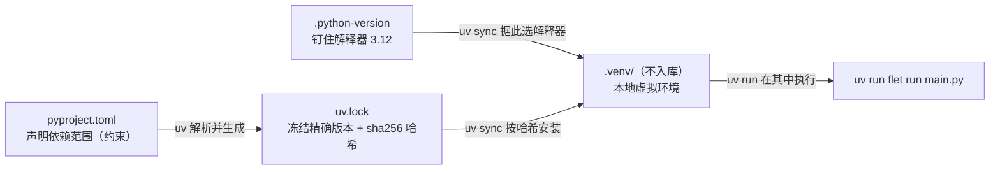
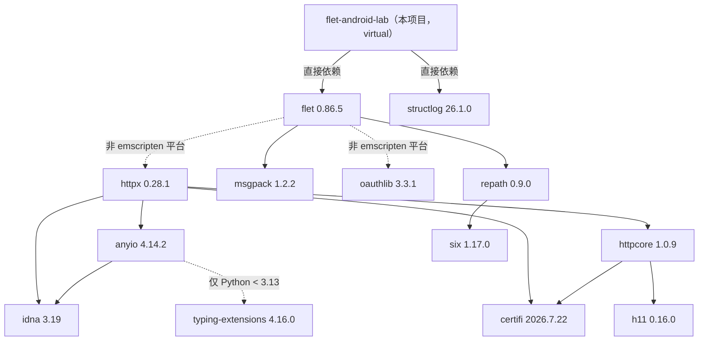
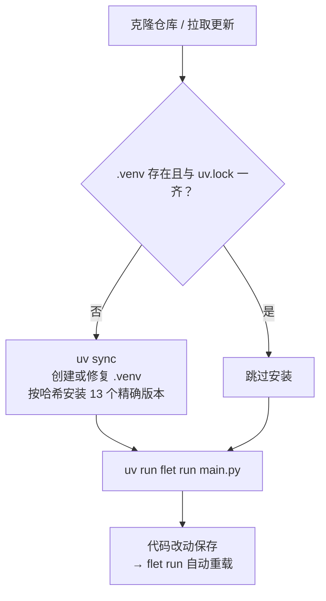

这个页面回答两个问题：**uv 是如何管理这个项目的依赖的**（pyproject.toml、.python-version、uv.lock、.venv 四件套如何协作），以及**"零第三方依赖"这条项目哲学具体指什么**（第三方库只允许出现在哪些代码层、业务逻辑如何做到零依赖）。读完本页，你应该能解释：为什么一个能打包成 Android APK 的项目，`dependencies` 列表里只有两行。

## 核心结论：两个直接依赖，锁出十三个包

打开 [pyproject.toml](pyproject.toml) 你会看到整个依赖声明只有 14 行：项目名 `flet-android-lab`、版本 `0.1.0`、Python 版本要求 `>=3.12`，以及 `dependencies` 数组里的两个条目——`flet>=0.28.0` 和 `structlog>=26.1.0`。前者是 UI 框架（基于 Flutter 渲染引擎的 Python 声明式 UI），后者是结构化日志库。项目 README 把这套取向总结为一句话："依赖管理：uv（`.venv` + `uv.lock`），Python 3.12，零第三方依赖（Flet 之外全部标准库）"——注意这里的表述强调了 Flet 这个最大的依赖；对代码做精确审计后可以发现，全项目实际使用的第三方 import 只有 `flet` 与 `structlog` 两个名字，其余全部来自 Python 标准库，其中 structlog 只负责日志输出、不参与任何业务逻辑（详见后文"import 审计"一节）。

Sources: [pyproject.toml](pyproject.toml#L1-L14), [README.md](README.md#L7)

两个直接依赖的角色分工如下表：

| 依赖 | 声明约束 | 锁定版本（uv.lock 实际解析） | 在项目中的角色 |
|---|---|---|---|
| flet | `>=0.28.0` | 0.86.5 | UI 渲染框架：`main.py` 全部界面控件的来源 |
| structlog | `>=26.1.0` | 26.1.0 | 结构化日志：`log.py` / `storage.py` / `main.py` 的日志输出 |

值得注意的是，这份 pyproject.toml **没有** dev 依赖组、可选依赖（optional-dependencies）或构建配置段——清单刻意保持极简，"用到再装"是这个项目的明确风格（README 对 JDK/Android SDK 等打包前置条件也采用同样态度）。

Sources: [pyproject.toml](pyproject.toml#L9-L13), [README.md](README.md#L84-L89)

## uv 的四件套：从声明到运行

uv（Astral 出品的 Python 包管理器）在本项目中通过四个工件协作，各自职责边界清晰：**pyproject.toml 负责"声明范围"，.python-version 负责"钉住解释器"，uv.lock 负责"冻结精确版本"，.venv 负责"本地落地安装"**。其中前三个文件提交进 Git 仓库，而 `.venv/` 被 .gitignore 排除——虚拟环境是随时可以用 `uv sync` 重建的派生产物，不配进入版本库。

Sources: [.gitignore](.gitignore#L1-L1)

先解释一下下面这张图的阅读方法（Mermaid 图需要渲染支持，若看不到图形可直接读文字）：`pyproject.toml` 里的 `>=0.28.0` 这类**约束**（constraint）只回答"允许装哪些版本"；uv 解析后把**精确版本加哈希**写进 `uv.lock`；`uv sync` 读锁文件、按哈希校验后安装到 `.venv/`；`uv run` 则保证后续命令在这个环境里执行，无需手动 activate。

`.python-version` 文件内容只有一行 `3.12`，与 pyproject.toml 的 `requires-python = ">=3.12"`、uv.lock 头部的 `requires-python = ">=3.12"` 三处呼应：解释器版本下限声明在清单里，实际用的具体版本钉在 `.python-version` 里，锁文件又继承了这个要求——三份文件口径一致，是 uv 项目的标准布局。

Sources: [.python-version](.python-version#L1-L1), [pyproject.toml](pyproject.toml#L9-L9), [uv.lock](uv.lock#L1-L3)

## 解剖 uv.lock：约束如何变成精确版本

锁文件解决的是**可复现性**问题。`flet>=0.28.0` 是一个开口向上的范围——今天解析出 0.86.5，明年可能解析出更高版本；如果只凭范围安装，不同时间、不同机器装出的环境可能不一致。uv.lock 把解析结果一次性冻结：flet 永远是 0.86.5、structlog 永远是 26.1.0，任何人在任何机器执行 `uv sync`，得到的都是同一组包。对初学者来说可以记住这条对应关系：**改 pyproject.toml 是"改需求"，uv.lock 是"需求的可执行快照"**。

Sources: [pyproject.toml](pyproject.toml#L10-L13), [uv.lock](uv.lock#L27-L40)

uv.lock 里有两个值得驻足的细节。第一，**项目本身也是依赖图中的一个节点**：文件中有一条 `name = "flet-android-lab"` 的记录，`source = { virtual = "." }` 表示它是本地目录、不发布到 PyPI；紧随其后的 `[package.metadata]` 段落保存了原始约束（`flet>=0.28.0`、`structlog>=26.1.0`），所以锁文件同时携带"解析结果"和"原始需求"两层信息。第二，**每个包的源码包（sdist）和每个 wheel 都带 sha256 哈希**，例如 anyio 的记录中完整列出了下载地址与哈希值——uv 安装前会校验哈希，防止包在传输或镜像环节被篡改，这是一道供应链安全防线。

Sources: [uv.lock](uv.lock#L42-L55), [uv.lock](uv.lock#L5-L16)

第三个细节是**环境标记（environment marker）**。锁文件里 flet 对 httpx、oauthlib 的依赖标注了 `marker = "sys_platform != 'emscripten'"`（浏览器平台跳过），anyio 对 typing-extensions 标注了 `marker = "python_full_version < '3.13'"`（仅旧版 Python 需要）。这意味着一份 uv.lock 同时描述了多平台的安装规则：在你的 Windows 开发机和别的系统上，uv 会各自挑选适用的子集，而锁文件仍然只有一份。

Sources: [uv.lock](uv.lock#L31-L36), [uv.lock](uv.lock#L9-L12)

### 完整传递闭包：十三个包

两个直接声明，经过**传递依赖**（依赖的依赖）展开后共 13 个包。下表按引入路径列出全部成员（"一般用途"列描述的是这些包在生态中的通行角色）：

| 包名 | 锁定版本 | 引入路径 | 一般用途 |
|---|---|---|---|
| flet | 0.86.5 | 直接声明 | UI 框架 |
| structlog | 26.1.0 | 直接声明 | 结构化日志 |
| httpx | 0.28.1 | flet → | 现代 HTTP 客户端 |
| msgpack | 1.2.2 | flet → | 二进制序列化 |
| oauthlib | 3.3.1 | flet → | OAuth 授权协议 |
| repath | 0.9.0 | flet → | 路径/正则匹配工具 |
| anyio | 4.14.2 | flet → httpx → | 异步运行时兼容层 |
| certifi | 2026.7.22 | httpx → httpcore → | CA 根证书集合 |
| httpcore | 1.0.9 | httpx → | HTTP 底层传输 |
| idna | 3.19 | httpx / anyio → | 国际化域名处理 |
| h11 | 0.16.0 | httpcore → | HTTP/1.1 协议实现 |
| six | 1.17.0 | repath → | Python 2/3 兼容工具 |
| typing-extensions | 4.16.0 | anyio →（仅 Python < 3.13） | 类型标注扩展 |

Sources: [uv.lock](uv.lock#L27-L49), [uv.lock](uv.lock#L57-L101), [uv.lock](uv.lock#L177-L223)

依赖图的形状如下（虚线边表示带环境标记的条件依赖）：

一个值得体会的对照：**直接依赖你选了 2 个，但最终环境里有 13 个包**。传递闭包的规模由框架决定、不受你控制——这正是"少加一个直接依赖"价值巨大的原因：每新增一个直接依赖，引入的可能是一整棵子树。

Sources: [uv.lock](uv.lock#L5-L55)

## 零第三方依赖哲学：依赖只能出现在"边框"上

这条哲学的精确表述来自代码审计。对四个源码文件的 import 语句逐一清点，结果如下：

| 文件 | 标准库 import | 第三方 import | 分层角色 |
|---|---|---|---|
| main.py | `datetime`、`pathlib` | `flet`、`structlog` | UI 层（边框） |
| core.py | `datetime` | **（无）** | 纯逻辑层（内核） |
| storage.py | `os`、`sqlite3`、`datetime`、`pathlib`、`uuid` | `structlog`（仅日志） | 存储层 |
| log.py | `logging`、`os`、`sys` | `structlog` | 日志层（边框） |

Sources: [main.py](main.py#L1-L11), [core.py](core.py#L1-L7), [storage.py](storage.py#L1-L9), [log.py](log.py#L1-L5)

可以看出依赖的分布规律：**第三方库只出现在"边框"上——UI 渲染（flet）和日志格式化（structlog）这类外围设施；而业务规则的内核（天数计算、文案生成、排序）完全不依赖任何第三方**。最纯粹的样本是 core.py：整个文件只有一个 `from datetime import date`，三个函数（`days_until`、`label`、`sort_items`）全部是输入决定输出的纯函数，没有网络、没有文件、没有数据库、没有第三方库。这不是巧合，而是分层设计的直接产物——内核越干净，越容易测试、越不容易被依赖升级波及。

Sources: [core.py](core.py#L1-L23)

存储层是这条哲学的第二个典型案例。README 对 storage.py 的定位写得非常明确："`sqlite3` 标准库 + 裸 SQL CRUD（参数化 `?` 占位，不用 ORM）"——数据库选 SQLite（Python 自带 `sqlite3` 模块，零安装），数据访问选裸 SQL 加参数化占位（不引 SQLAlchemy 之类的 ORM），连主键都直接用标准库的 `uuid4().hex` 生成。每一条都是在"标准库够用"与"引入第三方"之间选了前者。

Sources: [README.md](README.md#L42-L43), [storage.py](storage.py#L1-L5), [storage.py](storage.py#L69-L75)

### 收益与代价

任何哲学都有交换条件。这套取舍的账目大致如下：

| 维度 | 收益 | 代价 |
|---|---|---|
| 供应链安全 | 直接依赖仅 2 个，review 面积极小；uv.lock 全量 sha256 哈希防篡改 | 框架自身传递闭包（11 个包）仍需信任 |
| 可复现性 | 任何机器 `uv sync` 得到同一组 13 个精确版本 | 升级依赖需重新解析并提交新的 uv.lock |
| 心智负担 | 业务代码只需理解标准库语义；跨版本 Python 升级风险低 | 无 ORM——手写 SQL 与连接管理（本页范围的取舍详见 [SQLite 裸 SQL CRUD：参数化查询与连接管理](15-sqlite-luo-sql-crud-can-shu-hua-cha-xun-yu-lian-jie-guan-li)） |
| 功能边界 | 日历运算全靠 `datetime`，行为完全可预期 | 复杂功能（如更精细的日期库能力）需自行实现边界处理 |
| 可测试性 | core.py 零 IO 零依赖，测试无需任何夹具 | —— |

Sources: [README.md](README.md#L42-L44), [pyproject.toml](pyproject.toml#L10-L13)

## 日常工作流：uv sync 与 uv run

README 记录的启动流程浓缩了日常全部操作：克隆仓库后先 `uv sync`（首次运行会创建 `.venv` 并按 uv.lock 安装依赖），之后一律用 `uv run` 执行命令——它保证命令跑在正确的虚拟环境里，省去手动 activate。uv 的安装本身也是一条 PowerShell 命令（`irm https://astral.sh/uv/install.ps1 | iex`），详见 [快速开始：安装 uv 并运行纪念日 App](2-kuai-su-kai-shi-an-zhuang-uv-bing-yun-xing-ji-nian-ri-app)。

Sources: [README.md](README.md#L16-L30)

| 命令 | 行为 | 适用场景 |
|---|---|---|
| `uv sync` | 创建/对齐 `.venv`，按 uv.lock 的精确版本与哈希安装 | 克隆后首次运行；拉取他人更新的 uv.lock 之后 |
| `uv run flet run main.py` | 在 `.venv` 中以热重载模式启动桌面窗口 | 日常开发（细节见 [热重载开发工作流：flet run 与直接运行的区别](3-re-zhong-zai-kai-fa-gong-zuo-liu-flet-run-yu-zhi-jie-yun-xing-de-qu-bie)） |
| `uv run python main.py` | 当普通 Python 程序直接运行，无监视器 | 不需要热重载、想要"纯净"行为时 |
| `uv run flet build apk` | 调用 Flet 打包工具链产出 APK | 真机部署（流程见 [flet build apk 打包流程与 adb 真机安装](22-flet-build-apk-da-bao-liu-cheng-yu-adb-zhen-ji-an-zhuang)） |

Sources: [README.md](README.md#L26-L35), [README.md](README.md#L94-L99)

`uv sync` 的决策流程可以用下图概括（同样是 Mermaid 流程图，箭头表示判断分支）：

## 小结与下一步阅读

本页的主线可以压缩成三句话：**声明极简**（pyproject.toml 只有 flet 与 structlog 两个直接依赖）；**锁定极严**（uv.lock 冻结 13 个包的精确版本、哈希与平台标记，`uv sync` 一键复现）；**边界极清**（第三方库只出现在 UI 与日志这些边框层，core.py 业务内核零依赖、storage.py 只用标准库 sqlite3）。这套"uv 管外围、标准库管内核"的组合，是这个小项目在工程化上最有迁移价值的部分。

如果想继续深入，推荐按这条路径阅读：先看 [四层分层架构：UI、纯逻辑、存储、日志的职责划分](5-si-ceng-fen-ceng-jia-gou-ui-chun-luo-ji-cun-chu-ri-zhi-de-zhi-ze-hua-fen) 理解依赖边界背后的分层依据；再看 [纯函数可测试性：无 IO 设计与边界断言策略](25-chun-han-shu-ke-ce-shi-xing-wu-io-she-ji-yu-bian-jie-duan-yan-ce-lue) 了解零依赖内核的测试红利；structlog 这个"边框依赖"的完整用法则在 [structlog 配置详解：处理器链、Console 彩色与 JSON 渲染](19-structlog-pei-zhi-xiang-jie-chu-li-qi-lian-console-cai-se-yu-json-xuan-ran) 中展开。