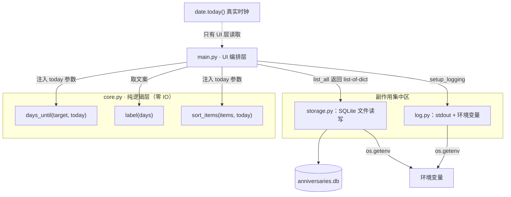

本文回答一个工程化问题：这个项目为什么"还没写一行测试，却已经具备了廉价的测试能力"。答案藏在 [core.py](core.py) 的 24 行代码里——**三个函数、零 IO、时钟作为参数注入**。我们将从依赖图谱出发，解释副作用被推到了哪些模块，然后给出针对"当天、跨年、2 月 29 日"等日历钉子场景的**边界断言策略**。需要说明的是：仓库当前并未包含测试套件（[pyproject.toml](pyproject.toml#L10-L13) 的依赖只有 `flet` 与 `structlog`），本文讨论的是设计层面"如何让测试变得便宜"，示例测试代码均为示范性质。

## 一、纯度清单：core.py 的三个函数

[core.py](core.py) 是整个项目的纯逻辑层，全文只有三个函数，唯一的 import 是标准库的 `from datetime import date`——没有 `structlog`、没有 `flet`、没有项目内其他模块。所谓**纯函数**，在这里指两个可验证的性质：**引用透明**（相同输入永远得到相同输出）与**无副作用**（不读写文件、不打印、不打日志、不修改全局状态、不改传入参数）。

| 函数 | 签名 | 输入来源 | 输出 | 纯度依据 |
|---|---|---|---|---|
| `days_until` | `(target_date: str \| date, today: date) -> int` | UI 层注入的 ISO 字符串或日期对象 | 整数差值 | 内部不调用 `date.today()`，时间完全由参数决定 |
| `label` | `(days: int) -> str` | `days_until` 的返回值 | 中文文案 | 三分支纯映射，无任何外部依赖 |
| `sort_items` | `(items: list[dict], today: date) -> list[dict]` | `storage.list_all()` 返回的字典列表 | 新列表 | 使用 `sorted()` 返回新对象，**不改动入参列表** |

Sources: [core.py](core.py#L1-L23)

值得注意的细节有两处。其一，`days_until` 接受 `str | date` 双类型入参，字符串路径走 `date.fromisoformat()` 解析——这正好匹配 `storage.py` 从 SQLite 取出的 `date` 列（TEXT 类型的 ISO 字符串），因此纯逻辑层可以直接消费存储层吐出的原始数据，无需中间转换层；同时，非法日期（如 `"2024-02-30"`）会抛出确定性的 `ValueError`，异常路径同样可测。其二，`sort_items` 选用内置 `sorted()` 而非 `list.sort()`，前者返回新列表、后者原地修改——这一选择让"输入未被改动"成为一条可断言的性质。业务语义层面（文案规则、排序键的设计取舍）分别在 [天数计算与文案生成：days_until 与 label](12-tian-shu-ji-suan-yu-wen-an-sheng-cheng-days_until-yu-label) 与 [排序设计：倒计时优先的元组排序键](13-pai-xu-she-ji-dao-ji-shi-you-xian-de-yuan-zu-pai-xu-jian) 中展开，本文聚焦其可测试性。

Sources: [core.py](core.py#L4-L7), [core.py](core.py#L18-L23), [storage.py](storage.py#L58-L66)

## 二、副作用都去哪了：一张依赖与 IO 地图

可测试性的根源不是"core.py 写得好"，而是**整个项目把副作用系统性地推离了纯逻辑层**。时钟、文件、环境变量、日志这四类典型副作用，在四个模块中的分布如下表——`core.py` 一栏全空，这正是它可测的全部秘密：

| 模块 | 时钟 | 文件 / DB | 环境变量 | 日志 | 全局可变状态 |
|---|---|---|---|---|---|
| `core.py` | **无**（today 为参数） | 无 | 无 | 无 | 无 |
| `main.py` | `date.today()` × 4 处 | 无（委托 storage） | 无 | `logger` | Flet 控件树 |
| `storage.py` | `datetime.now()` × 2 处 | SQLite 读写、`mkdir`、`rename` | `ANNIVERSARY_DB` | `info` / `error` | 模块级 `DB_PATH` |
| `log.py` | 无 | `sys.stdout` | `LOG_LEVEL` / `LOG_JSON` | `basicConfig` | logging 全局配置 |

Sources: [core.py](core.py#L1-L23), [main.py](main.py#L45-L110), [storage.py](storage.py#L11-L54), [log.py](log.py#L8-L12)

下面的 Mermaid 图（Wiki 平台会渲染为架构图；若在纯文本环境查看，可按文字描述理解箭头方向）展示了调用关系与副作用注入点。注意箭头的方向性：`main.py` 是唯一的"混合层"，它读取真实时钟 `date.today()`，然后把时间**作为参数**传给纯函数；而 `core.py` 三个函数没有任何指向外部的依赖边：



对比 `storage.py` 可以看清这条边界的另一侧：它持有模块级全局变量 `DB_PATH`（初始化时写入），每次操作调用 `datetime.now()` 生成 `created_at`，读取 `ANNIVERSARY_DB` 环境变量决定库文件路径——这些都是典型的**不可重复输入**，也正是它们被隔离在存储层的原因。这种职责切分与 [四层分层架构：UI、纯逻辑、存储、日志的职责划分](5-si-ceng-fen-ceng-jia-gou-ui-chun-luo-ji-cun-chu-ri-zhi-de-zhi-ze-hua-fen) 描述的整体架构一致，本文从"测试视角"重新审视了同一条切缝。

Sources: [storage.py](storage.py#L11-L34), [storage.py](storage.py#L69-L86), [main.py](main.py#L70-L98)

## 三、today 作为参数：把时钟从函数里赶出去

日期逻辑最常见的可测试性杀手是**隐藏时钟**——函数内部偷偷调用 `date.today()`。下表对比了反例写法与本项目的实际实现：

| 维度 | 反例：隐藏时钟 | 本项目：时钟注入 |
|---|---|---|
| 签名 | `days_until(target: str) -> int` | `days_until(target, today) -> int` |
| "今天"从哪来 | 函数内部 `date.today()` | 调用方显式传入 |
| 同一输入的输出 | **随运行日期变化**，不可复现 | 恒定，**引用透明** |
| 测试 2 月 29 日场景 | 只能在闰年 2 月 28 日当天运行才可验证 | 任意时刻，固定 `today` 即可验证 |
| 依赖方向 | 函数依赖系统时钟（隐式 IO） | 函数只依赖参数 |

Sources: [core.py](core.py#L4-L7)

`main.py` 承担了读取真实时钟的全部责任，共四处调用 `date.today()`：生成年份下拉框的范围上限（L45）、渲染每一行时计算天数（L70）、刷新列表时排序（L98）、打开表单时填充默认日期（L110）。这个模式的本质是**时钟的依赖注入**：UI 层是"现实世界"的入口，由它把现实翻译成参数，交给活在"数学世界"里的纯函数。测试因此获得了一种自由——把 `today` 钉死在任意历史或未来日期，断言结果永远确定。

Sources: [main.py](main.py#L42-L46), [main.py](main.py#L69-L70), [main.py](main.py#L97-L98), [main.py](main.py#L108-L110)

## 四、边界断言策略：把日历上的钉子钉进测试

有了纯函数与时钟注入，**边界断言**的策略就变得直白：选定一个固定的 `today`，围绕日历上的特殊位置构造输入，断言精确的输出值。下面三张表给出完整的断言矩阵。各边界场景的业务语义（为什么跨年只差 1 天、闰日如何处理）详见 [日期边界场景：当天、跨年与 2 月 29 日的处理](14-ri-qi-bian-jie-chang-jing-dang-tian-kua-nian-yu-2-yue-29-ri-de-chu-li)，本文只关心"断言什么"。

**`days_until` 断言矩阵**（固定 `today` 后逐一断言）：

| 断言场景 | 固定 today | 输入 target | 期望输出 | 钉住的边界 |
|---|---|---|---|---|
| 当天 | `2025-12-31` | `"2025-12-31"` | `0` | 零点分支 |
| 跨年 | `2025-12-31` | `"2026-01-01"` | `1` | 年份切换不产生额外天数 |
| 刚过去 | `2025-12-31` | `"2025-12-30"` | `-1` | 负数符号方向 |
| 闰年 2 月 29 日 | `2024-02-28` | `"2024-02-29"` | `1` | 闰日存在 |
| 平年无 2 月 29 日 | `2023-02-28` | `"2023-03-01"` | `1` | 平年 2 月只有 28 天 |
| 非法日期 | 任意 | `"2024-02-30"` | 抛 `ValueError` | 确定性异常路径 |

Sources: [core.py](core.py#L4-L7), [main.py](main.py#L123-L130)

**`label` 断言矩阵**——三个分支恰好构成完整的分支覆盖，三条断言即 100% branch coverage：

| 输入 days | 期望输出 | 钉住的边界 |
|---|---|---|
| `1` | `"还有 1 天"` | 正数分支 |
| `0` | `"就是今天"` | 零分支（`==` 精确匹配） |
| `-1` | `"已 1 天"` | **`{-days}` 取反逻辑**——若漏写负号会输出 `"已 -1 天"`，断言立即失败 |

Sources: [core.py](core.py#L10-L15)

**`sort_items` 断言矩阵**——除了顺序，还要断言**非突变性**：

| 断言场景 | 构造输入（`today = 2025-06-15`） | 期望 |
|---|---|---|
| 未来的排前面、按天数升序 | `[B(+5), A(0), C(-5), D(+3)]` | 输出顺序 `A, D, B, C` |
| 过去的排最后 | 同上 | `C`（过去项）位于末尾 |
| 输入未被改动 | 任意乱序列表 | 断言前后原列表顺序一致 |
| 稳定性 | 两个同天数项 | 保持原始相对顺序（`sorted` 稳定排序保证） |
| 鸭子类型契约 | 字典只含 `"date"` 键 | 不要求 `id` / `name` 等其他键也存在 |

Sources: [core.py](core.py#L18-L23)

最后一个"鸭子类型契约"值得展开一句：`sort_items` 内部只读取 `item["date"]` 一个键，而 `storage.list_all()` 返回的字典带 `id`、`name`、`date`、`created_at` 四个键。这意味着测试数据**不必**从真实数据库取——手写 `{"date": "2025-06-20"}` 这样的最小字典即可，因为纯函数依赖的是"有 `date` 键的 dict"这一最小契约，而非存储层的完整行结构。

Sources: [core.py](core.py#L19-L21), [storage.py](storage.py#L58-L66)

## 五、示范：零测试框架也能完成断言

由于 `core.py` 不 import `flet` 也不 import `structlog`，对它的测试**不需要安装项目的任何第三方依赖**——这与 [uv 依赖管理与零第三方依赖哲学](24-uv-yi-lai-guan-li-yu-ling-di-san-fang-yi-lai-zhe-xue) 一脉相承：连测试本身都可以零依赖。下面的示范代码（仓库当前未包含，属于本文的演示）用纯标准库 `assert` 即可运行，保存为 `check_core.py` 后 `uv run python check_core.py` 直接执行；若未来引入 pytest，同样的断言可原样迁移为测试函数：

```python
# 示范代码：仓库当前未包含测试套件
from datetime import date
import core

# 边界断言：当天 / 跨年 / 过去
today = date(2025, 12, 31)
assert core.days_until("2025-12-31", today) == 0
assert core.days_until("2026-01-01", today) == 1
assert core.days_until("2025-12-30", today) == -1

# 闰日边界：闰年 vs 平年
assert core.days_until("2024-02-29", date(2024, 2, 28)) == 1
assert core.days_until("2023-03-01", date(2023, 2, 28)) == 1

# 文案三分支：完整分支覆盖 + 取反逻辑
assert core.label(1) == "还有 1 天"
assert core.label(0) == "就是今天"
assert core.label(-1) == "已 1 天"

# 确定性异常路径
try:
    core.days_until("2024-02-30", today)
    raise AssertionError("应抛出 ValueError")
except ValueError:
    pass

# 排序：顺序正确 + 非突变
items = [
    {"name": "B", "date": "2025-06-20"},
    {"name": "A", "date": "2025-06-15"},
    {"name": "C", "date": "2025-06-10"},
]
result = core.sort_items(items, date(2025, 6, 15))
assert [i["name"] for i in items] == ["B", "A", "C"]       # 原列表未动
assert [i["name"] for i in result] == ["A", "B", "C"]      # 新列表有序

print("all assertions passed")
```

Sources: [core.py](core.py#L1-L23), [pyproject.toml](pyproject.toml#L9-L13)

还有一个跨层细节可以佐证"core 是校验的唯一真相源"：`main.py` 的保存逻辑在 L123-L130 捕获 `(TypeError, ValueError)` 并提示"日期无效（如 2 月 30 日）"，其判断依据正是 `date.fromisoformat(iso)` 抛出的异常——UI 层自己不做日期合法性规则，只消费纯解析函数的确定性异常。换句话说，非法日期的知识只需要在一处断言（core 的解析行为），UI 的提示文案自然继承其正确性。

Sources: [main.py](main.py#L123-L132), [core.py](core.py#L5-L6)

## 六、纯度的边界：badge_color 为什么留在 main.py

一个自然的疑问是：`main.py` 里的 `badge_color` 函数与 `core.label` 拥有**完全相同的三分支结构**（`>0` / `==0` / 其余），为什么不把它也搬进 `core.py` 消除重复？答案是依赖方向：`badge_color` 返回的是 `ft.Colors.BLUE_400` 等 **Flet UI 常量**，一旦搬入 `core.py`，纯逻辑层就会 import `flet`，第一节列出的纯度清单（"唯一 import 是 datetime"）随之崩塌，测试也将被迫安装 Flet。当前的重复其实是**判定与呈现的分离**：数值判定（还有几天）属于纯逻辑，呈现决策（什么颜色）属于 UI 层。若未来确实想收敛这处结构重复，可行方向是让 core 返回一个分类值（如 `"future"` / `"today"` / `"past"`），UI 层再映射到颜色——但这属于扩展设想，当前的镜像结构本身就是一个清晰的边界教学样本。

Sources: [main.py](main.py#L62-L67), [core.py](core.py#L10-L15)

## 小结

这个项目用最小的代价实现了可测试性设计：**副作用系统性外移**（时钟归 UI、文件归存储、配置归日志模块），**时钟作为参数注入**让任意日期边界可被钉死复现，**`sorted()` 的新列表语义**让非突变成为可断言性质，**双类型入参与确定性异常**让解析路径也纳入断言范围。仓库当前没有测试套件，但补上它的边际成本接近于零——不需要 mock，不需要测试数据库，不需要冻结时间的第三方库，只需要 `from datetime import date` 和几个 `assert`。

建议的延伸阅读路径：先回到 [四层分层架构：UI、纯逻辑、存储、日志的职责划分](5-si-ceng-fen-ceng-jia-gou-ui-chun-luo-ji-cun-chu-ri-zhi-de-zhi-ze-hua-fen) 从架构视角看这条切缝的全貌；再进入 [日期边界场景：当天、跨年与 2 月 29 日的处理](14-ri-qi-bian-jie-chang-jing-dang-tian-kua-nian-yu-2-yue-29-ri-de-chu-li) 理解本文断言矩阵中每个边界背后的业务语义；最后阅读 [uv 依赖管理与零第三方依赖哲学](24-uv-yi-lai-guan-li-yu-ling-di-san-fang-yi-lai-zhe-xue)，看零依赖哲学如何在测试环节继续兑现。