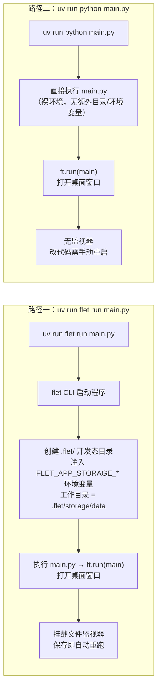
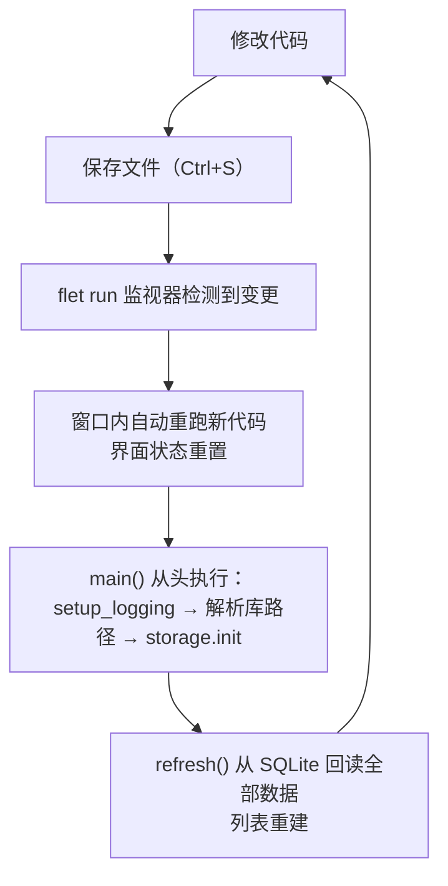

这个项目只有一个入口文件 `main.py`，却有两种启动方式：`uv run flet run main.py` 和 `uv run python main.py`。它们打开的是同一个桌面窗口，跑的是同一份代码，为什么还要分两条路？答案在于**开发效率**——前者附带"热重载"能力（保存代码即自动重跑，无需重启命令），后者则是一个不帶任何监视器的普通 Python 程序。本页面向初学者讲清楚：两种方式各自的工作原理、热重载会重置什么/保留什么、以及日常开发中如何选择。

## 一条入口，两种启动：为什么两种命令都能跑起来

先看一个容易被忽略的设计细节：`main.py` 的最后一行是 `ft.run(main)`，它写在模块顶层、不属于任何函数。这意味着 `main.py` 是一个**自启动文件**——只要用 Python 执行它，`ft.run(main)` 就会被触发，自动打开桌面窗口并运行界面逻辑。`flet run` 启动时执行的也是这份文件，所以两种方式殊途同归，README 对此的结论是：直接运行"行为完全一样"，只是"无监视器"。

Sources: [main.py](main.py#L175)、[README.md](README.md#L33-L34)

这个设计的另一个关键点是**模块导入链**：`main.py` 顶部 `import core / log / storage`，把纯逻辑、存储、日志三个模块挂到入口之下。无论用哪种方式启动，程序都是从 `main.py` 开始执行、逐层加载这四个文件——这为后面理解"热重载重跑的是整个程序"打下基础。

Sources: [main.py](main.py#L1-L9)

顺带回答一个初学者常见疑问：`flet` 这个命令行工具从哪来？项目的依赖声明里只有 `flet>=0.28.0` 和 `structlog>=26.1.0` 两个包，锁文件中也只锁定了一个 `flet` 包——也就是说，执行 `uv sync` 之后，`flet` 命令（含 `flet run`、`flet build` 等子命令）就已经随包一起装进 `.venv`，用 `uv run flet ...` 即可调用，无需额外安装任何东西。

Sources: [pyproject.toml](pyproject.toml#L10-L13)、[uv.lock](uv.lock#L28)

## 两种启动方式总览对比

先给出全貌。下表按维度对比两条路径的差异，其中最影响日常体验的是"文件监视"和"改代码后如何生效"两行：

| 维度 | `uv run flet run main.py` | `uv run python main.py` |
|---|---|---|
| 本质 | flet CLI 启动程序 + 打开桌面窗口 + 挂载文件监视器 | 把 `main.py` 当普通 Python 程序直接执行 |
| 文件监视 | 有，README 记载监视 `main.py` | 无 |
| 改代码后生效方式 | 保存文件即自动重跑，**无需重启命令** | 需手动停止（Ctrl+C）后重新运行 |
| 界面状态 | 重载时重置 | 每次重启后同样是全新状态 |
| `.flet/` 开发态目录 | 会在项目下创建 | 不创建 |
| `FLET_APP_STORAGE_*` 环境变量 | 注入（模拟打包后在设备上的存储行为） | 不注入 |
| 程序工作目录 | 被设为 `.flet/storage/data` | 保持你启动命令时所在的目录 |
| 适用场景 | 改代码为主的开发阶段 | 少改动、长时间运行，或想观察"裸"环境 |

Sources: [README.md](README.md#L28-L35)、[.flet/README.md](.flet/README.md#L3-L5)

下面的流程图描绘了两条路径从敲下命令到窗口出现的完整过程。如果你所在的阅读器不渲染 Mermaid 图，按文字箭头顺序阅读即可——图里没有任何超出上文表格的信息：

两条路径最终都汇合到同一个动作——`ft.run(main)` 打开窗口、执行 `async def main(page)` 里的界面逻辑。关于 `ft.run` 这个 Flet 0.86 入口机制的深入解析，见后续章节 [Flet 0.86 声明式 UI 模型：async main 与 ft.run 入口](6-flet-0-86-sheng-ming-shi-ui-mo-xing-async-main-yu-ft-run-ru-kou)。

Sources: [README.md](README.md#L8)、[main.py](main.py#L18)

## flet run 的工作原理：监视、重跑与 .flet 目录

`flet run` 启动时会做三件事：执行你的程序、打开桌面窗口、**监视源文件**。README 的记载是：它监视 `main.py`，保存后窗口内自动重跑新代码，无需重启命令——代价是界面状态会重置。需要注意一个细节：README 明确承诺监视的是 `main.py` 这个入口；本项目代码分散在 `main.py / core.py / storage.py / log.py` 四个文件里，如果只改了 `core.py` 这类被导入的模块，稳妥做法是随后保存一下 `main.py`（或干脆重启命令）来确保触发一次完整重跑。

Sources: [README.md](README.md#L33-L34)

`flet run` 还有一个初学者容易困惑的"副作用"：项目根目录会多出一个 `.flet/` 文件夹。它是 **flet CLI 创建的项目级开发态目录**，本机局部、可安全删除（下次运行会自动重建），且通过 `.flet/.gitignore`（内容为一行 `*`）整体排除在版本控制之外。更重要的是它的用途：当 `flet run` 活跃时，程序工作目录被设为 `.flet/storage/data`，同时向你的 Python 代码注入 `FLET_APP_STORAGE_DATA / CACHE / TEMP` 三个环境变量——**刻意模拟打包后的 App 在真机上的存储行为**，让桌面开发环境更接近设备环境。

Sources: [.flet/README.md](.flet/README.md#L3-L5)、[.flet/README.md](.flet/README.md#L9-L11)、[.flet/.gitignore](.flet/.gitignore#L1)

把热重载的完整循环画成流程图，核心是"保存 → 重跑 main() → 从数据库回读"这一闭环：

一个可以直接观察到的证据：每次保存触发重载后，终端里都会**重复出现启动日志**——因为 `main()` 开头的 `log.setup_logging()` 和 `logger.info("app_started", ...)` 会随每次重跑重新执行一遍。看到日志重复打印，就是热重载刚发生的信号。

Sources: [main.py](main.py#L18-L31)

## 热重载重置什么、保留什么

热重载不是"原地修补界面"，而是**整个程序从头重跑**，所以必须分清两类状态的命运。简单说：**内存里的都会丢，写进数据库的都会回来**。

| 状态类别 | 具体内容 | 重载后 | 原因 |
|---|---|---|---|
| 会丢失 | 正在填写、尚未保存的表单内容 | ❌ 消失 | 只存在于内存变量中，程序重跑即清空 |
| 会丢失 | 已打开的新增/编辑对话框 | ❌ 关闭 | 对话框由运行时代码创建，不持久化 |
| 会丢失 | SnackBar 提示等临时反馈 | ❌ 消失 | 同上 |
| 会保留 | 已保存的全部纪念日数据 | ✅ 完整回读 | 存在 SQLite 库文件里，与进程无关 |
| 会保留 | 数据库文件本身及其路径 | ✅ 不受影响 | `storage.init` 的建表语句是 `CREATE TABLE IF NOT EXISTS`，重跑不会破坏已有表 |

Sources: [storage.py](storage.py#L15-L22)

"数据会回来"的代码依据有两处。其一是 `storage.init()` 每次重跑都执行，但建表用的是幂等的 `CREATE TABLE IF NOT EXISTS`——表已存在就直接复用，不会清空重建；其二是 `main()` 末尾的 `refresh()` 会调用 `storage.list_all()` 重新查询全表并重建列表控件，于是重载后的窗口瞬间被数据库里的数据填满。这个"整体刷新"模式的细节属于另一个专题，见 [闭包式状态管理：refresh 驱动的整体刷新模式](11-bi-bao-shi-zhuang-tai-guan-li-refresh-qu-dong-de-zheng-ti-shua-xin-mo-shi)。

Sources: [storage.py](storage.py#L25-L30)、[storage.py](storage.py#L58-L66)、[main.py](main.py#L97-L101)

由此得出本项目的**热重载使用心法**：改代码前先把表单里的内容保存入库（点"保存"按钮），再动手改代码；反过来，如果只想验证一个 UI 细节，不必担心弄丢数据——最坏情况也就是重载后重新打开对话框录入一遍。

## 直接运行：无监视器的普通 Python 程序

`uv run python main.py` 把项目当成一个普通 Python 程序来跑：`main.py` 顶层的 `ft.run(main)` 照常执行、窗口照常弹出、功能完全一致（README 原话："行为完全一样"），但**没有任何监视器**——改完代码必须手动停止再重新运行才能生效。它也不会创建 `.flet/` 目录、不会注入 `FLET_APP_STORAGE_*` 环境变量，工作目录保持你敲命令时所在的位置：一个未经 flet CLI 包装的"裸"运行环境。

Sources: [README.md](README.md#L34)、[.flet/README.md](.flet/README.md#L3-L5)

什么时候选这条路？两类场景：一是代码进入稳定期、连续使用 App 本身多过改代码，没有监视器反而少干扰；二是想确认程序在无 flet run 包装时的行为（例如排查对工作目录、环境变量的隐式依赖）。要注意的是，本项目的数据库路径并不依赖工作目录——`main()` 优先调用 `page.storage_paths.get_application_support_directory()` 取系统应用数据目录，取不到才回退到项目内 `data/` 目录（该目录已在根 `.gitignore` 中排除，不会误提交）。路径策略的完整拆解见 [数据库路径三级策略：系统目录、本地回退与 ANNIVERSARY_DB 环境变量](16-shu-ju-ku-lu-jing-san-ji-ce-lue-xi-tong-mu-lu-ben-di-hui-tui-yu-anniversary_db-huan-jing-bian-liang)。

Sources: [main.py](main.py#L24-L29)、[.gitignore](.gitignore#L1-L6)

## 常见问题排查

初学者在两种启动方式之间切换时，最容易撞上下面这些问题：

| 症状 | 原因 | 处理办法 |
|---|---|---|
| 保存代码后窗口毫无变化 | 用的是 `python main.py` 直接运行，无监视器 | 改用 `uv run flet run main.py`，或手动重启程序 |
| 改了 `core.py` / `storage.py` 后不确定是否生效 | README 承诺监视的是入口 `main.py` | 再保存一次 `main.py` 触发重跑，或重启命令最稳妥 |
| 重载后对话框关了、表单内容没了 | 热重载会重置界面状态 | 属预期行为；先保存数据再改代码即可避免损失 |
| 终端反复打印启动日志 | 每次重载 `main()` 从头执行 | 正常现象，可当作"重载已生效"的确认信号 |
| 项目里冒出 `.flet/` 目录 | `flet run` 创建的开发态目录 | 可安全删除，下次运行自动重建，已被 git 忽略 |
| 项目里冒出 `data/anniversaries.db` | 系统应用数据目录取不到时的本地回退 | 正常现象，`data/` 已在 `.gitignore` 中 |

Sources: [README.md](README.md#L33-L35)、[.flet/README.md](.flet/README.md#L3)、[.gitignore](.gitignore#L6)

## 推荐的日常开发循环

把上述结论收拢成一个可执行的四步循环，这也是本项目在开发阶段的主节奏：**第一步** `uv sync` 确保依赖就绪（仅首次或依赖变更后需要）；**第二步** `uv run flet run main.py` 启动带热重载的桌面窗口；**第三步** 进入"改代码 → Ctrl+S 保存 → 观察窗口自动重跑"的快循环，改代码前记得先把表单数据入库；**第四步** 当需要长时间稳定运行或验证裸环境行为时，切换到 `uv run python main.py`。两条命令随时可互换，数据不丢——它们读写的是同一个 SQLite 库。

Sources: [README.md](README.md#L28-L34)

## 下一步阅读

理解了两种启动方式之后，建议按这个顺序继续：

1. 先认识你要开发的东西本身：[认识纪念日 App：功能、界面与交互流程](4-ren-shi-ji-nian-ri-app-gong-neng-jie-mian-yu-jiao-hu-liu-cheng)
2. 深入本文反复出现的那个入口：[Flet 0.86 声明式 UI 模型：async main 与 ft.run 入口](6-flet-0-86-sheng-ming-shi-ui-mo-xing-async-main-yu-ft-run-ru-kou)
3. 理解重载后数据为何能回来：[闭包式状态管理：refresh 驱动的整体刷新模式](11-bi-bao-shi-zhuang-tai-guan-li-refresh-qu-dong-de-zheng-ti-shua-xin-mo-shi)
4. 当桌面调试满足不了验证需求时：[桌面调试与真机验证的能力边界划分](23-zhuo-mian-diao-shi-yu-zhen-ji-yan-zheng-de-neng-li-bian-jie-hua-fen)