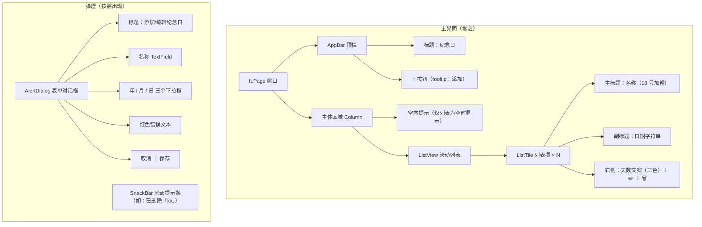
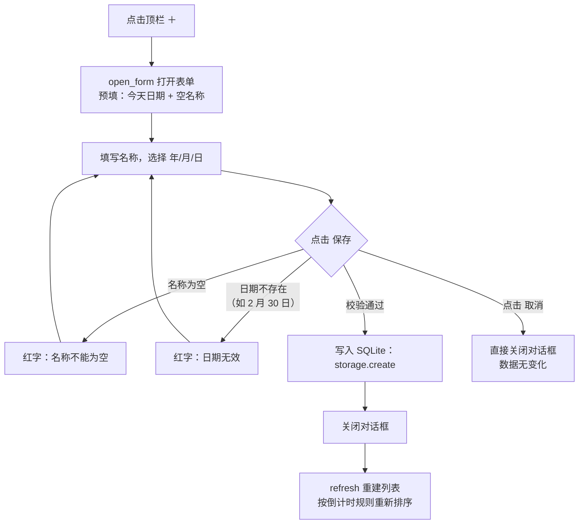

如果你已经按照 [快速开始：安装 uv 并运行纪念日 App](2-kuai-su-kai-shi-an-zhuang-uv-bing-yun-xing-ji-nian-ri-app) 启动了桌面窗口，此刻屏幕上大概率只有一行灰字："还没有纪念日，点右上角 + 添加"。这一页就来回答三个问题：**这个 App 能做什么、屏幕上每一块是什么、每一次点击之后发生了什么**。我们会从用户视角走完全部功能与交互，并在每一步顺手指出"这个行为写在哪个文件、哪个函数里"——只做定位，不深入实现细节（那是《深入解析》部分的任务）。读完本页，你对 App 的认知就能从"能跑"升级为"每一处界面都能对上代码"。
Sources: [main.py](main.py#L18-L39), [README.md](README.md#L3-L8)

## 这是什么 App：一句话定位与功能全景

一句话：**记录一个日期，展示"已过多少天"或"倒计时还剩多少天"**。它是一个本地单机小工具——没有账号、没有网络请求，所有数据存在设备上的一个 SQLite 文件里。典型的使用场景是生日、纪念日、重要截止日：添加一次，之后每次打开 App，天数自动按当天重新计算。下表把 README 中宣称的功能逐条对应到代码入口，这也是本页后续章节的"地图"：

| 功能 | 你看到的效果 | 代码入口 |
|---|---|---|
| 添加纪念日 | 顶栏 `+` → 弹出表单对话框 | `main.py` 的 `open_form()` |
| 编辑纪念日 | 每行铅笔图标 → 同一表单，预填原值 | `main.py` 的 `open_form(item)` |
| 删除纪念日 | 每行垃圾桶图标 → 立即删除 + 底部提示 | `main.py` 的 `remove()` |
| 天数自动计算 | 文案三态：`还有 N 天` / `就是今天` / `已 N 天` | `core.py` 的 `days_until()` 与 `label()` |
| 三色状态标识 | 蓝 = 未来、橙 = 当天、灰 = 已过 | `main.py` 的 `badge_color()` |
| 智能排序 | 倒计时近的在前；已过的按新→旧排在后面 | `core.py` 的 `sort_items()` |
| 空态引导 | 无数据时显示灰字提示 | `main.py` 的 `empty_hint` |
| 表单校验 | 名称为空 / 日期不存在时红字报错 | `main.py` 的 `save()` 内部校验 |

Sources: [README.md](README.md#L10-L14), [main.py](main.py#L59-L157), [core.py](core.py#L4-L23)

## 主界面解剖：你看到的每一块

整个界面由两个常驻部件构成：**顶部的 AppBar** 和**主体列表区域**。窗口标题与应用栏标题都叫"纪念日"，主题跟随系统深浅色（`page.theme_mode = SYSTEM`），页面四周留 12 像素内边距。AppBar 右侧只有一个动作按钮——带"添加"提示的加号图标，它是新增功能的唯一入口。主体是一个 `Column`，从上到下装两样东西：空态提示文本和 `ListView` 列表。空态提示初始不可见，只有列表为空时才显示（灰字"还没有纪念日，点右上角 + 添加"）。
Sources: [main.py](main.py#L18-L23), [main.py](main.py#L159-L172)

列表不为空时，每个纪念日渲染为一个 `ListTile` 行：**主标题**是名称（18 号、加粗），**副标题**是原始日期字符串（如 `2025-06-01`），**右侧区域**从左到右依次是彩色天数文案、编辑按钮（铅笔图标，悬停提示"编辑"）、删除按钮（垃圾桶图标，悬停提示"删除"）。下面的示意图把主界面和两个弹层（表单对话框、SnackBar 提示条）的组成一次性画全，可以先记住结构，后面交互流程会逐个用到：

这张图里的每个控件都能在代码里找到出生地：`ListView` 与空态提示在 `main.py` 第 33–39 行创建，`ListTile` 行由 `make_row()` 函数按数据逐条生成，对话框与 SnackBar 则由 `open_form()` 和 `snackbar()` 在需要时弹出。
Sources: [main.py](main.py#L33-L39), [main.py](main.py#L69-L95)

## 列表展示规则：文案、颜色与排序

列表不是简单罗列，而是自带三套用户可感知的规则。**第一套是文案**：天数大于 0 显示"还有 N 天"，等于 0 显示"就是今天"，小于 0 显示"已 N 天"。**第二套是颜色**：未来的纪念日用蓝色，当天到期用醒目的橙色，已经过去的降到灰色——扫一眼颜色就能分辨"快到了"和"翻篇了"。**第三套是排序**：所有未来事件按倒计时从近到远排在前面，"就是今天"永远位于最顶；所有已过事件排在后面，且越近过期的越靠前（新→旧）。三套规则汇总如下：

| `days_until` 结果 | 显示文案 | 颜色 | 列表位置 |
|---|---|---|---|
| `> 0`（未来） | `还有 N 天` | 蓝色 `BLUE_400` | 前段，N 越小越靠前 |
| `= 0`（当天） | `就是今天` | 橙色 `ORANGE_400` | 全列表最顶部 |
| `< 0`（已过） | `已 N 天` | 灰色 `GREY_500` | 后段，刚过去的在前 |

这三套规则分别由三个极小的函数支撑：文案来自 `core.py` 的 `label()`，颜色来自 `main.py` 的 `badge_color()`，排序来自 `core.py` 的 `sort_items()`。每次列表刷新时（包括启动时），都是先从数据库取出全部条目、经 `sort_items()` 排序、再逐条算出天数与颜色后渲染。至于跨年、2 月 29 日这类边界场景为什么也成立，留给 [天数计算与文案生成：days_until 与 label](12-tian-shu-ji-suan-yu-wen-an-sheng-cheng-days_until-yu-label) 和 [排序设计：倒计时优先的元组排序键](13-pai-xu-she-ji-dao-ji-shi-you-xian-de-yuan-zu-pai-xu-jian) 详解。
Sources: [core.py](core.py#L4-L23), [main.py](main.py#L13-L15), [main.py](main.py#L62-L101)

## 交互流程一：新增纪念日

点击顶栏 `+` 后弹出模态对话框，表单预填为**今天的日期 + 空名称**。表单由五个控件组成，年/月/日采用三个下拉框而非日历控件（这是刻意的工程取舍，原因见 [年月日下拉选日期：规避 DatePicker 对话框叠加的工程取舍](9-nian-yue-ri-xia-la-xuan-ri-qi-gui-bi-datepicker-dui-hua-kuang-die-jia-de-gong-cheng-qu-she)）：

| 控件 | 类型 | 取值范围 / 说明 |
|---|---|---|
| 名称 | `TextField` | 必填；保存时会去掉首尾空格，为空即报错 |
| 年 | `Dropdown` | 1900 ～ 当前年份 + 100，宽度占 3 份 |
| 月 | `Dropdown` | 01 ～ 12，宽度占 2 份 |
| 日 | `Dropdown` | 01 ～ 31（固定 31 个选项，非法组合由保存时校验拦截） |
| 错误提示 | `Text` | 红色 13 号小字，默认为空字符串 |

Sources: [main.py](main.py#L41-L57), [main.py](main.py#L108-L115)

点"保存"后进入校验分支，两道关卡都过才落库：名称去空格后非空；拼出的 ISO 日期能通过 `date.fromisoformat` 解析（拦截"2 月 30 日"这类不存在的日期）。任一关失败，红色错误文本出现在表单底部、对话框保持打开等用户修正；全部通过则写入数据库、关闭对话框、列表按规则重新排序刷新。点"取消"则直接关窗、不产生任何数据变化。完整决策路径如下：

需要点破一个新手容易忽略的细节：**错误提示是就地反馈而不是弹窗**——名称为空时不会弹第二个对话框，而是把红字写在表单里、保留用户已填内容。这种"校验失败 → 就地显示 → 等待修正"的循环，加上保存成功后的 SnackBar 反馈，构成了 App 的用户反馈体系，机制细节见 [表单校验与用户反馈：名称非空、非法日期与 SnackBar](10-biao-dan-xiao-yan-yu-yong-hu-fan-kui-ming-cheng-fei-kong-fei-fa-ri-qi-yu-snackbar)。
Sources: [main.py](main.py#L117-L157)

## 交互流程二：编辑纪念日

编辑与新增**共用同一个对话框、同一个 `open_form()` 函数**，区别只在于传不传参数：点 `+` 时无参调用（新增模式），点某行的铅笔图标时把该条数据传入（编辑模式）。两种模式的差异完全由预填逻辑体现——编辑模式下对话框标题变为"编辑纪念日"，名称和年/月/日都预填为该条目的当前值而非今天；保存时走 `storage.update()` 而不是 `storage.create()`。对用户来说体感是"点开就有原值，改哪存哪"，对代码来说则是"一套表单吃掉两种场景"。对话框如何弹出与关闭（`page.show_dialog` / `page.pop_dialog`）属于 Flet 0.86 的对话框生命周期话题，详见 [新增/编辑对话框：show_dialog 与 pop_dialog 的生命周期](8-xin-zeng-bian-ji-dui-hua-kuang-show_dialog-yu-pop_dialog-de-sheng-ming-zhou-qi)。
Sources: [main.py](main.py#L82-L86), [main.py](main.py#L108-L157)

## 交互流程三：删除纪念日

删除是最短的一条流程，但有一个值得注意的产品决策：**没有二次确认弹窗**。点垃圾桶图标后直接删库、立即从列表消失，随后底部弹出 SnackBar 提示条"已删除「某某」"作为操作确认。也就是说，这个 App 用"事后提示"替代了"事前确认"——适合删除低风险的小工具场景，但意味着误删无法撤销（数据不在回收站，直接从 SQLite 表中移除）：

`remove()` 函数只有三行：删数据、弹提示、刷新列表，是观察"一次交互 = 存储操作 + 反馈 + 刷新"这个固定三段式的最佳样本。而每次交互结束后都会调用的 `refresh()`——为什么整体重建列表就能让界面正确更新——是本项目状态管理的核心模式，留给 [闭包式状态管理：refresh 驱动的整体刷新模式](11-bi-bao-shi-zhuang-tai-guan-li-refresh-qu-dong-de-zheng-ti-shua-xin-mo-shi) 展开。
Sources: [main.py](main.py#L59-L60), [main.py](main.py#L103-L106)

## 数据去哪儿了（一分钟版）

关掉窗口再打开，列表还在——因为每次保存都写进了设备上的 SQLite 数据库文件（`anniversaries.db`），而 App 启动后的首次 `refresh()` 会从库里把全部条目读回来重新渲染。桌面运行时这个文件优先放在系统应用数据目录，取不到时回退到项目内 `data/` 文件夹；也可以用环境变量 `ANNIVERSARY_DB` 指定位置。读写动作全部封装在 `storage.py` 的四个函数里（`list_all` / `create` / `update` / `delete`），UI 层从不直接碰 SQL。路径策略与建表细节分别见 [数据库路径三级策略：系统目录、本地回退与 ANNIVERSARY_DB 环境变量](16-shu-ju-ku-lu-jing-san-ji-ce-lue-xi-tong-mu-lu-ben-di-hui-tui-yu-anniversary_db-huan-jing-bian-liang) 和 [SQLite 裸 SQL CRUD：参数化查询与连接管理](15-sqlite-luo-sql-crud-can-shu-hua-cha-xun-yu-lian-jie-guan-li)。
Sources: [main.py](main.py#L24-L31), [main.py](main.py#L97-L101), [storage.py](storage.py#L58-L116)

## 下一步阅读

到这里，你已经从用户视角完整走过这个 App：三种交互（增、改、删）、三套展示规则（文案、颜色、排序）、一套反馈体系（就地校验 + SnackBar），并且每个行为都能定位到代码。入门指南到此收官，接下来建议按"先看骨架、再挑感兴趣的深入"的顺序进入《深入解析》：

1. **先读骨架**：[四层分层架构：UI、纯逻辑、存储、日志的职责划分](5-si-ceng-fen-ceng-jia-gou-ui-chun-luo-ji-cun-chu-ri-zhi-de-zhi-ze-hua-fen)——理解本页反复出现的 `main.py` / `core.py` / `storage.py` / `log.py` 四个文件为什么这样切分；
2. **对 UI 感兴趣**：从 [列表渲染：ListView、ListTile 与条件空态提示](7-lie-biao-zhan-ran-listview-listtile-yu-tiao-jian-kong-tai-ti-shi) 开始，依次是 [新增/编辑对话框：show_dialog 与 pop_dialog 的生命周期](8-xin-zeng-bian-ji-dui-hua-kuang-show_dialog-yu-pop_dialog-de-sheng-ming-zhou-qi)、[年月日下拉选日期：规避 DatePicker 对话框叠加的工程取舍](9-nian-yue-ri-xia-la-xuan-ri-qi-gui-bi-datepicker-dui-hua-kuang-die-jia-de-gong-cheng-qu-she)、[表单校验与用户反馈：名称非空、非法日期与 SnackBar](10-biao-dan-xiao-yan-yu-yong-hu-fan-kui-ming-cheng-fei-kong-fei-fa-ri-qi-yu-snackbar)、[闭包式状态管理：refresh 驱动的整体刷新模式](11-bi-bao-shi-zhuang-tai-guan-li-refresh-qu-dong-de-zheng-ti-shua-xin-mo-shi)；
3. **对计算逻辑感兴趣**：[天数计算与文案生成：days_until 与 label](12-tian-shu-ji-suan-yu-wen-an-sheng-cheng-days_until-yu-label) → [排序设计：倒计时优先的元组排序键](13-pai-xu-she-ji-dao-ji-shi-you-xian-de-yuan-zu-pai-xu-jian) → [日期边界场景：当天、跨年与 2 月 29 日的处理](14-ri-qi-bian-jie-chang-jing-dang-tian-kua-nian-yu-2-yue-29-ri-de-chu-li)。

无论选哪条线，手里都已经有本页这张"功能 ↔ 代码"对照表作为索引。