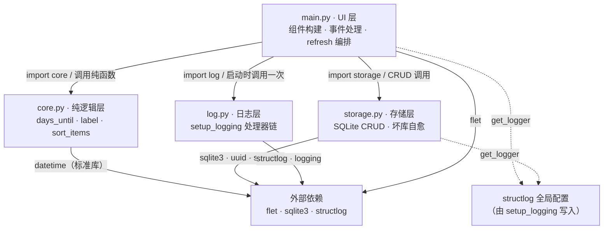
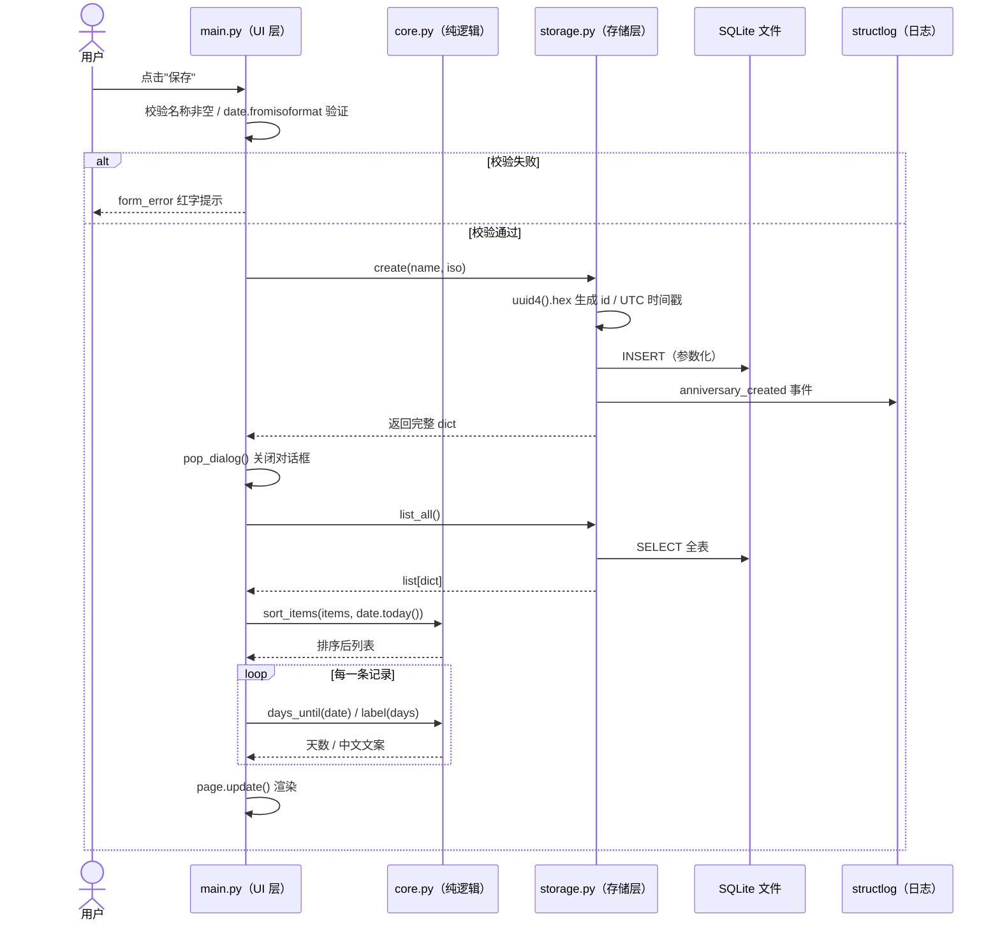

这个项目只有四个源文件，却完整呈现了一个分层架构的所有要素：`main.py` 负责界面与交互编排，`core.py` 承载无副作用的领域计算，`storage.py` 封装全部 SQLite 持久化知识，`log.py` 作为横切关注点的配置中心在启动时统一日志行为。本文不深入任何一层的实现细节——那些将在后续章节逐一展开——而是回答一个更根本的问题：**每个文件凭什么被划入某一层，层与层之间的依赖方向和数据契约是什么，以及这种切分在移动端场景下换取了什么、付出了什么**。理解了这张骨架图，后续所有页面都只是骨架上的一块肌肉。

## 架构全景：四个文件，四种职责

先看事实。项目根目录下的四个 Python 模块，行数与职责如下：

| 文件 | 架构角色 | 行数 | 核心内容 |
|---|---|---|---|
| `main.py` | UI 层（组合根） | 176 | `async main`、组件构建、事件处理、`refresh` 刷新 |
| `core.py` | 纯逻辑层 | 24 | `days_until`、`label`、`sort_items` 三个纯函数 |
| `storage.py` | 存储层 | 116 | SQLite CRUD、连接管理、坏库自愈 |
| `log.py` | 日志层（横切） | 25 | `setup_logging` 一次性配置 structlog |

下面的依赖图基于源码中的 import 语句绘制（阅读前提：图中箭头表示"依赖/调用"关系，虚线表示"共享全局配置而非显式导入"）。注意一个容易被忽略的事实——**`storage.py` 从未 import `log.py`**，它直接使用 `structlog.get_logger()`，其日志行为之所以正确，是因为 `main.py` 在启动早期调用了 `log.setup_logging()` 完成了全局配置。

这张图与经典的分层架构（甚至六边形架构的朴素形态）一一对应：`main.py` 是表现层与适配器，`core.py` 是不依赖任何框架的领域核心，`storage.py` 是基础设施层，`log.py` 则是贯穿所有层的横切关注点。对中级开发者而言，最有价值的学习点在于：**这套分层不是靠框架或依赖注入容器强制的，而是靠 import 纪律自觉维持的**。Sources: [main.py](main.py#L1-L11), [storage.py](storage.py#L1-L9), [core.py](core.py#L1-L7), [log.py](log.py#L1-L5)

## 依赖方向：单向箭头，无回边

将四个文件的 import 语句整理成依赖矩阵，单向性一目了然：

| 模块 | 项目内依赖 | 外部依赖 | 模块级全局状态 |
|---|---|---|---|
| `main.py` | `core` · `log` · `storage` | `flet` · `structlog` | 无（颜色常量与 logger） |
| `core.py` | **无** | `datetime`（仅标准库） | **无** |
| `storage.py` | **无** | `sqlite3` · `structlog` · `uuid` | `DB_PATH`（由 `init` 注入） |
| `log.py` | **无** | `structlog` · `logging` | structlog 进程级配置 |

三个结构性结论值得强调。第一，**`main.py` 是唯一同时知道所有层的模块**——它扮演"组合根"（composition root）角色，所有跨层装配都发生在 `main()` 函数内部，包括日志初始化、数据库路径解析与注入。第二，**`core.py` 的 import 区只有一行 `from datetime import date`**——零第三方依赖、零项目内依赖、零全局状态，这使它成为整个项目唯一可以脱离 Flet 运行环境做纯函数断言的模块，可测试性设计将在[纯函数可测试性](25-chun-han-shu-ke-ce-shi-xing-wu-io-she-ji-yu-bian-jie-duan-yan-ce-lue)中展开。第三，**箭头全部指向下方，没有任何回边**：`core` 不知道 `storage` 的存在，`storage` 也不知道是谁在调用它，层与层之间唯一的耦合媒介是函数签名和数据结构。Sources: [main.py](main.py#L1-L11), [core.py](core.py#L1-L7), [storage.py](storage.py#L1-L13), [log.py](log.py#L1-L7)

## UI 层：组合根与交互编排

`main.py` 的职责可以拆成五块：启动编排、组件构建、事件处理、刷新协调、表单校验与反馈。其中**启动编排**最能体现组合根的角色——`main()` 的前 13 行依次完成三件事：第 19 行调用 `log.setup_logging()` 统一日志行为，第 24–27 行通过 `page.storage_paths` 探测平台应用目录并在失败时回退到本地 `data/` 目录，第 30 行把解析出的路径注入存储层 `storage.init(db_file)`。这个顺序揭示了一个关键的职责分配原则：**"环境感知"只属于 UI 层**，因为只有它持有 Flet 的 `page` 对象、能区分 Android 真机与桌面调试环境；`storage.py` 本身对平台一无所知，路径三级策略的细节见[数据库路径三级策略](16-shu-ju-ku-lu-jing-san-ji-ce-lue-xi-tong-mu-lu-ben-di-hui-tui-yu-anniversary_db-huan-jing-bian-liang)。Sources: [main.py](main.py#L18-L31)

**刷新协调**是 UI 层的另一核心职责，`refresh()` 函数只有四行，却是全部四层协作的枢纽：它先调用 `storage.list_all()` 取回原始数据，交给 `core.sort_items()` 排序，再用 `make_row()` 把每个 dict 渲染成 `ListTile`，最后调用 `page.update()` 提交到屏幕。注意这里的分工——UI 层自己不做任何排序或日期计算，`make_row` 内部把天数计算和文案生成都委托给 `core.days_until()` 与 `core.label()`，自己只决定"用什么颜色、多大字号、放在哪个位置"。这种"编排归 UI、计算归 core"的切分让 176 行的 `main.py` 始终只处理一个问题：**用户看到了什么**。Sources: [main.py](main.py#L69-L101)

## 纯逻辑层：24 行的克制

`core.py` 是整个项目中最短、约束也最严格的模块。三个函数共享同一组特征：**无 IO**（不读写文件、不访问网络、不打印）、**无全局可变状态**、**确定性**（相同输入必然产生相同输出）。其中最值得注意的设计决策是 `days_until()` 的签名——`today` 是显式参数而非函数内部调用 `date.today()`。把"现在"作为参数注入，意味着这个函数可以在任何时刻被测试，测试时传入构造的日期即可复现任意时间边界场景，这正是[日期边界场景](14-ri-qi-bian-jie-chang-jing-dang-tian-kua-nian-yu-2-yue-29-ri-de-chu-li)所依赖的前提。

另一个体现层间适配意图的细节是 `days_until()` 接受 `str | date` 联合类型：UI 层从存储层拿到的是 ISO 格式字符串（SQLite TEXT 列），无需先转换即可直接传入，类型解析的责任被下放到纯逻辑层内部。`sort_items()` 同样以 `(d < 0, abs(d) if d < 0 else d)` 元组键实现"倒计时优先"策略，算法细节归[排序设计](13-pai-xu-she-ji-dao-ji-shi-you-xian-de-yuan-zu-pai-xu-jian)一页。从架构视角看，`core.py` 的价值不在它做了什么，而在它**坚决不做什么**——没有 dataclass、没有抽象基类、没有配置对象，数据以最朴素的 dict 流过，抽象被压缩到项目规模真正需要的程度。Sources: [core.py](core.py#L4-L23)

## 存储层：sqlite3 知识的唯一持有者

`storage.py` 的对外接口只有五个函数：`init`、`list_all`、`create`、`update`、`delete`。**模块内部的所有复杂度——建表 SQL、参数化查询、连接生命周期、甚至坏库自愈——对上层完全不可见**。这一点在 `_connect()` 中体现得最彻底：当建表语句抛出 `sqlite3.DatabaseError` 时，存储层自行完成"关闭连接 → 给损坏文件加时间戳改名 → 重建空库"的整套恢复流程，UI 层永远不会感知到数据库曾经损坏。故障被隔离在发生它的那一层，这是分层架构最直接的收益，自愈机制的完整剖析见[坏库自愈机制](18-pi-ku-zi-yu-ji-zhi-sun-huai-jian-ce-gai-ming-bei-fen-yu-zi-dong-zhong-jian)。

存储层还有两个与架构相关的自主决策。其一是**主键由应用层生成**：`create()` 用 `uuid4().hex` 生成 id 而非依赖 SQLite 自增，函数随即返回完整 dict——调用方无需回查数据库即可拿到新纪录。其二是**每次操作独立开关连接**，没有连接池、没有长连接，这是单用户移动应用场景下的合理简化。同时存储层是除 UI 层外唯一埋日志的模块，每个写操作都通过 `structlog` 记录结构化事件（`anniversary_created`、`anniversary_updated`、`anniversary_deleted`），使数据变更在日志流水中有完整审计线索。CRUD 与参数化查询的细节归[SQLite 裸 SQL CRUD](15-sqlite-luo-sql-crud-can-shu-hua-cha-xun-yu-lian-jie-guan-li)一页。Sources: [storage.py](storage.py#L25-L55), [storage.py](storage.py#L69-L115)

## 日志层：横切关注点的时序陷阱

`log.py` 与其他三层的"被依赖"方式根本不同——它不是被持续调用的服务，而是**启动期执行一次的配置中心**。`setup_logging()` 读取 `LOG_LEVEL` 与 `LOG_JSON` 环境变量，组装 structlog 处理器链并写入进程级全局配置；此后任何模块调用 `structlog.get_logger(__name__)` 拿到的 logger 都自动继承这套配置。正因如此，`main.py` 和 `storage.py` 都直接 `import structlog` 而非 `import log`——日志层的依赖是**时序性的**（配置必须先于首次使用），而非结构性的。处理器链与渲染格式的完整解析见[structlog 配置详解](19-structlog-pei-zhi-xiang-jie-chu-li-qi-lian-console-cai-se-yu-json-xuan-ran)。

时序约束有一个容易被忽视的细节：`main.py` 在模块顶层第 11 行就执行了 `logger = structlog.get_logger(__name__)`，而 `setup_logging()` 直到第 19 行才运行——两者之间隔了 import 与模块加载。这段顺序之所以安全，是因为 structlog 的代理对象是惰性的，真正的配置绑定发生在第一次日志调用时（`main.py` 的首次调用在第 28 行，此时配置早已就绪），且 `cache_logger_on_first_use=True` 缓存的正是绑定后的结果。这解释了一个实践规则：**`setup_logging()` 必须是 `main()` 的第一句业务代码**，任何在此之前发出的日志都会以未配置的默认格式输出。Sources: [main.py](main.py#L11-L31), [log.py](log.py#L8-L24)

## 层间契约：dict 与 ISO 字符串

分层架构的松耦合最终落在数据契约上。这个项目的选择极为朴素：**数据在所有层之间以 plain dict 流动**，键固定为四个，`date` 字段统一使用 ISO 格式字符串。下表梳理了每个键的生产者与消费者：

| 键 | 类型 | 生产者 | 消费者 | 归属层职责 |
|---|---|---|---|---|
| `id` | `str`（`uuid4().hex`） | `storage.create()` | 全链路（更新/删除定位） | 存储层生成 |
| `name` | `str` | UI 表单 → `storage` | UI 展示 | UI 层采集 |
| `date` | `str`（`"YYYY-MM-DD"`） | UI 表单校验后 → `storage` | `core` 解析计算 / UI 展示 | 三层共享 |
| `created_at` | `str`（UTC ISO 秒级） | `storage.create()` | 预留（排序/审计） | 存储层生成 |

ISO 字符串作为 `date` 的传输形态是三层共同遵守的约定：存储层负责以 TEXT 列持久化（字典序即时间序的优势见[表结构设计](17-biao-jie-gou-she-ji-iso-ri-qi-zi-fu-chuan-de-zi-dian-xu-pai-xu-you-shi)），纯逻辑层负责用 `date.fromisoformat()` 解析，UI 层直接展示原始字符串。契约的代价同样明确——dict 没有类型检查，键名拼写错误只会在运行时以 `KeyError` 暴露，这是用"零抽象成本"换来的风险，详见后文收益与代价分析。Sources: [storage.py](storage.py#L69-L86), [core.py](core.py#L4-L7), [main.py](main.py#L69-L95)

## 一次保存操作的跨层协奏

静态切分之外，动态视角更能展现分层的价值。下面用时序图追踪"用户在对话框中保存一条新纪念日"的完整链路（阅读前提：时序图自上而下表示时间推进，`alt/else` 分支表示校验的两种结果）：

时序图暴露了一个值得诚实讨论的**灰色地带**：名称非空与日期合法性校验出现在 UI 层而非 `core.py`。这并非疏漏——校验逻辑与 `form_error` 文本控件的即时反馈强耦合，拆出去反而要在层间搬运错误状态；但若未来规则膨胀（如名称去重、日期范围限制），按本文的判断准则应下沉到纯逻辑层。项目在当前规模下选择把"表单反馈闭环"整体留在 UI 层，是用架构纯度换交互内聚性的务实取舍，校验细节见[表单校验与用户反馈](10-biao-dan-xiao-yan-yu-yong-hu-fan-kui-ming-cheng-fei-kong-fei-fa-ri-qi-yu-snackbar)。Sources: [main.py](main.py#L108-L138)

## 收益与代价

| 维度 | 收益 | 代价 |
|---|---|---|
| 可测试性 | `core.py` 无 IO、`today` 参数化，可脱离 Flet 直接断言 | UI 层闭包函数难以单测，依赖手工验证 |
| 可替换性 | 换掉 `storage.py` 的实现（如 JSON 文件）不动 UI 一行 | dict 契约无类型保护，键名错误运行时才暴露 |
| 故障隔离 | 坏库自愈在存储层内部消化，UI 永不感知 `DatabaseError` | 每操作开关连接有固定开销（移动端单用户可接受） |
| 认知负荷 | 四个文件 176/24/116/25 行，单人可全量掌握 | 分层纪律无工具强制，靠 import 习惯维持 |
| 部署灵活性 | 存储路径由组合根注入，桌面与真机同一套代码 | `DB_PATH` 模块级全局使 `storage` 依赖初始化顺序 |

这张表的每一行都对应可验证的代码事实：可测试性源于 `core.py` 仅有的一个 import；故障隔离源于 `_connect()` 中的 try/except 边界；部署灵活性源于 `main()` 中 `page.storage_paths` 与本地回退的双路径探测。对于同规模的个人项目，这是一份"收益远大于代价"的账单；当项目规模增长到需要多人协作或引入类型检查时，dict 契约与无强制的分层纪律会率先成为改造对象。Sources: [core.py](core.py#L1-L23), [storage.py](storage.py#L37-L55), [main.py](main.py#L24-L31)

## 判断准则：新代码应该放在哪一层

四层架构日常使用中最高频的问题是"这段新代码放哪"。项目自身提供了几组对照样本，可以提炼出一条核心准则——**代码依赖什么，就属于哪一层**。最典型的对照是两个形似的纯映射函数：`core.label(days)` 返回 `str`，归纯逻辑层；`main.badge_color(days)` 返回 `ft.Colors` 常量，归 UI 层。两者都是 `days → 某个值` 的无副作用映射，唯一区别是返回值是否绑定 Flet 类型——绑定者无法脱离 UI 层存在。据此整理决策表：

| 新代码类型 | 归属层 | 判断依据 |
|---|---|---|
| 日期/天数计算、文案生成、排序规则 | 纯逻辑层 | 无 IO、需要边界单测、只依赖标准库 |
| SQL 语句、表结构、连接策略 | 存储层 | sqlite3 知识必须集中，禁止泄漏到上层 |
| 颜色、字号、布局、对话框结构 | UI 层 | 返回值或逻辑绑定 `ft.*` 类型 |
| 表单校验（简单规则） | UI 层（本项目取舍） | 与错误提示控件强耦合；规则复杂化后应下沉 core |
| 日志格式、级别、渲染器调整 | 日志层 | 进程级全局配置，启动期一次性生效 |
| 环境变量读取 | 就近原则 | `LOG_LEVEL` 归日志层，`ANNIVERSARY_DB` 归存储层 |

## 延伸阅读

骨架已立，接下来可以沿任意一条肌理深入：想理解 UI 层的运行机制，从[Flet 0.86 声明式 UI 模型：async main 与 ft.run 入口](6-flet-0-86-sheng-ming-shi-ui-mo-xing-async-main-yu-ft-run-ru-kou)与[闭包式状态管理：refresh 驱动的整体刷新模式](11-bi-bao-shi-zhuang-tai-guan-li-refresh-qu-dong-de-zheng-ti-shua-xin-mo-shi)进入；对纯逻辑层感兴趣，依次阅读[天数计算与文案生成：days_until 与 label](12-tian-shu-ji-suan-yu-wen-an-sheng-cheng-days_until-yu-label)、[排序设计：倒计时优先的元组排序键](13-pai-xu-she-ji-dao-ji-shi-you-xian-de-yuan-zu-pai-xu-jian)与[日期边界场景：当天、跨年与 2 月 29 日的处理](14-ri-qi-bian-jie-chang-jing-dang-tian-kua-nian-yu-2-yue-29-ri-de-chu-li)；存储层与日志层分别从[SQLite 裸 SQL CRUD：参数化查询与连接管理](15-sqlite-luo-sql-crud-can-shu-hua-cha-xun-yu-lian-jie-guan-li)和[structlog 配置详解：处理器链、Console 彩色与 JSON 渲染](19-structlog-pei-zhi-xiang-jie-chu-li-qi-lian-console-cai-se-yu-json-xuan-ran)开始；最后用[纯函数可测试性：无 IO 设计与边界断言策略](25-chun-han-shu-ke-ce-shi-xing-wu-io-she-ji-yu-bian-jie-duan-yan-ce-lue)验证本文关于 `core.py` 可测试性的论断。