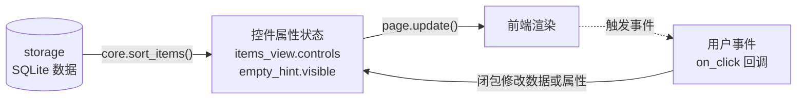
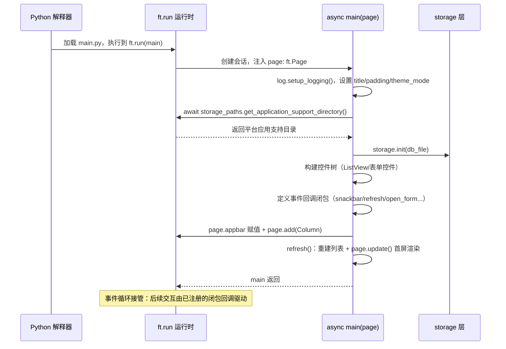

本页解析纪念日 App 的 UI 层入口契约：`main.py` 如何以一个 `async def main(page: ft.Page)` 函数对接 Flet 框架、`ft.run(main)` 这一行代码背后的控制反转机制，以及这套"控件树 + 属性 + `page.update()`"的声明式 UI 模型如何组织整个应用。本页属于架构与设计篇，聚焦入口契约本身；控件渲染细节、对话框生命周期与状态管理模式分别在后续专页展开。

## 一、入口契约：ft.run(main) 与框架注入的 Page

整个应用的可执行入口只有一行——`main.py` 末尾的 `ft.run(main)`。这行代码在**模块级**直接调用，没有 `if __name__ == "__main__":` 守卫：因为 Flet 的开发工具 `flet run` 会自行定位并加载 `main.py`，模块级调用即可被开发热重载与打包两种模式共同复用（两种运行方式的差异见 [热重载开发工作流：flet run 与直接运行的区别](3-re-zhong-zai-kai-fa-gong-zuo-liu-flet-run-yu-zhi-jie-yun-xing-de-qu-bie)）。

`ft.run` 的参数 `main` 是第 18 行定义的协程函数。这里体现了典型的**控制反转**：开发者从不自己构造 `page` 对象，而是声明"给我一个 `ft.Page`，我来配置它"——框架在合适的时机创建会话与页面实例，再反过来调用你的函数。这是"好莱坞原则"（Don't call us, we'll call you）在 UI 框架中的标准形态：你注册入口，框架驱动执行。

`main.py` 的模块级代码极其克制，只做三件事：导入依赖（`flet`、`structlog`、以及同仓库的 `core`/`log`/`storage` 三个本地模块）、获取 logger、定义三个颜色常量，然后调用 `ft.run`。**所有真正的应用逻辑都收纳在 `main` 函数体内部**，模块命名空间保持干净。

| 模块级代码 | 行号 | 职责 |
|---|---|---|
| 导入与 logger | `main.py#L1-L11` | 引入框架、日志、纯逻辑与存储层 |
| 颜色常量 | `main.py#L13-L15` | 未来/当天/过期三态的视觉语义 |
| `ft.run(main)` | `main.py#L175` | 唯一入口调用，启动 Flet 运行时 |

值得注意的是入口签名中 `page: ft.Page` 的类型标注——`Page` 对象是整个会话的根：后续的 `page.title`、`page.appbar`、`page.add()`、`page.update()`、`page.show_dialog()` 全部经由这个被注入的实例完成。**一个参数，撑起了 UI 层与框架的全部交互面**。在 UI、纯逻辑、存储、日志的四层分工中，`main` 就是 UI 层唯一的外壳（整体分层见 [四层分层架构：UI、纯逻辑、存储、日志的职责划分](5-si-ceng-fen-ceng-jia-gou-ui-chun-luo-ji-cun-chu-ri-zhi-de-zhi-ze-hua-fen)）。

Sources: [main.py](main.py#L1-L18), [main.py](main.py#L175)

## 二、为什么必须是 async：第 25 行的 await 证据链

`main` 的 `async` 前缀并非装饰性的现代化写法，而是被第 25 行直接"锁死"的语法前提：

```python
base = Path(await page.storage_paths.get_application_support_directory())
```

`page.storage_paths.get_application_support_directory()` 是一个**异步平台 API**——获取应用支持目录需要与宿主环境（桌面或 Android）通信，Flet 将其设计为协程。而 Python 语法规定 `await` 只能出现在 `async def` 函数体内，因此只要入口需要这一个调用，`main` 就必须声明为 `async`，`ft.run` 也原生支持异步入口函数。这不是可选项：把 `async` 去掉，第 25 行连解释都无法通过。

这个 `await` 拿到的路径随后流向存储初始化：`base / "anniversaries.db"` 交给 `storage.init()`，让 SQLite 在正式渲染界面前就绪。整段还包了 `try/except`，失败时回退到脚本同目录的 `data/` 文件夹——这一路径策略的完整设计意图在 [数据库路径三级策略：系统目录、本地回退与 ANNIVERSARY_DB 环境变量](16-shu-ju-ku-lu-jing-san-ji-ce-lue-xi-tong-mu-lu-ben-di-hui-tui-yu-anniversary_db-huan-jing-bian-liang) 专页展开，本页只强调其时序位置：**存储初始化发生在任何控件构建之前**。

| 对比维度 | `async def main`（本仓库） | 假想的同步 `def main` |
|---|---|---|
| `await` 平台 API（第 25 行） | ✅ 直接可用 | ❌ 语法错误 |
| 存储路径获取 | 走异步平台通道 | 需另寻同步替代方案 |
| `ft.run` 兼容性 | 支持 | 同样支持，但能力受限 |
| 入口内部可声明的回调 | 同步与 `async` 回调均可 | 同步与 `async` 回调均可 |

Sources: [main.py](main.py#L18-L31)

## 三、声明式 UI 模型：控件树 + 属性 + page.update()

Flet 的 UI 编程模型可以概括为三个动作的循环：**构造控件 → 挂载到页面 → 变更属性后调用 `page.update()`**。开发者操纵的是 Python 对象的属性，框架负责把属性变化同步到真实界面——你永远不会去操作原生控件或 DOM，这正是"声明式"的含义：界面是数据状态的函数，而非一串手动拼接的绘制指令。

在 `main` 函数体内，这个模型具体表现为三个阶段。**第一阶段是构造**（第 33-57 行）：`ft.ListView`、`ft.Text`、`ft.TextField`、三个 `ft.Dropdown` 都是纯 Python 对象，此刻尚未与任何界面产生关联。**第二阶段是挂载**（第 159-171 行）：设置 `page.appbar` 并调用 `page.add()` 把组装好的 `Column` 树交给页面，控件树自此进入框架管理。**第三阶段是同步**：此后任何属性变更，都要经 `page.update()` 才会反映到屏幕上。

最能体现声明式精髓的是 `refresh()` 闭包（第 97-101 行）：它从存储层拉取数据、经 `core.sort_items` 排序后，**整体重建** `items_view.controls` 列表并切换 `empty_hint.visible`，最后一次性 `page.update()`。列表视图不维护增量操作，而是每次都从数据重新推导——视图永远等于 `sort_items(list_all())` 的求值结果。这种"数据 → 控件属性 → `update()` 同步"的驱动方式与配套的闭包捕获机制，在 [闭包式状态管理：refresh 驱动的整体刷新模式](11-bi-bao-shi-zhuang-tai-guan-li-refresh-qu-dong-de-zheng-ti-shua-xin-mo-shi) 有完整推演；单个 `ListTile` 的视觉组装细节则在 [列表渲染：ListView、ListTile 与条件空态提示](7-lie-biao-xuan-ran-listview-listtile-yu-tiao-jian-kong-tai-ti-shi) 展开。

下面的概念图描绘了这一循环（阅读前提：图中的"控件属性"指 `main` 中构造的那些 Python 对象的字段，"前端渲染"指 Flet 运行时管理的实际界面）：



Sources: [main.py](main.py#L33-L57), [main.py](main.py#L97-L101), [main.py](main.py#L159-L171)

## 四、main 的完整启动时序：从 ft.run 到首屏渲染

把 `main` 函数体从头到尾读一遍，会发现它本质上是一个**一次性的装配函数**，按固定顺序完成六个阶段后返回。下方的时序图展示了从 Python 解释器加载模块到首屏渲染的完整链路（阅读前提：参与者从左到右依次是解释器、Flet 运行时、`main` 函数与存储层；实线箭头为调用，虚线为返回）：



| 阶段 | 行号 | 内容 | 产物 |
|---|---|---|---|
| 页面配置 | `main.py#L19-L22` | 日志初始化、标题、边距、主题跟随系统 | 可用且已配置的 `page` |
| 存储初始化 | `main.py#L24-L31` | `await` 平台目录 → `storage.init` | 就绪的 SQLite 连接 |
| 控件构造 | `main.py#L33-L57` | 列表、空态提示、表单全套控件 | 尚未挂载的控件对象 |
| 回调定义 | `main.py#L59-L157` | `snackbar`/`badge_color`/`make_row`/`refresh`/`remove`/`open_form` | 捕获控件引用的闭包集 |
| 树挂载 | `main.py#L159-L171` | `page.appbar` + `page.add(Column)` | 进入框架管理的控件树 |
| 首屏渲染 | `main.py#L172` | 调用 `refresh()` | 数据驱动的首屏 |

这里有一个容易被忽视的关键事实：**`main` 在第 172 行调用 `refresh()` 之后就返回了，但应用并未结束**。存活的原因在于闭包——`open_form`、`remove`、`save` 等回调全部通过嵌套函数定义捕获了 `page` 与各控件的引用，Flet 运行时的事件循环随后接管一切：用户每次点击 AppBar 的"+"按钮或列表行的编辑/删除图标，框架就把事件分发到对应闭包执行。`main` 是装配线，闭包是流水线上的工人，运行时是永不熄火的传送带。日志初始化被安排为 `main` 的第一句，保证存储初始化等后续动作即有日志可查，其配置细节见 [structlog 配置详解：处理器链、Console 彩色与 JSON 渲染](19-structlog-pei-zhi-xiang-jie-chu-li-qi-lian-console-cai-se-yu-json-xuan-ran)。

Sources: [main.py](main.py#L19-L31), [main.py](main.py#L59-L172)

## 五、版本事实核对：>=0.28.0 声明与 0.86.5 锁定

本页标题写明 "Flet 0.86"，这一数字的出处是锁文件而非项目声明——两个文件的表述存在刻意的信息分工，理解这层分工对排查"为什么我本地的 API 和教程不一样"至关重要：

| 文件 | 表述 | 角色 |
|---|---|---|
| `pyproject.toml#L10-L13` | `flet>=0.28.0` | 宽松的**兼容性下限声明**，允许解析到任何更高版本 |
| `uv.lock#L28-L39` | `flet 0.86.5`（锁定） | uv 解析后的**实际生效版本**，保证所有环境可复现 |

也就是说：声明说"至少 0.28"，锁定说"你用的是 0.86.5"。`main.py` 中的几处 API 正是这一现代版本的指纹——`ft.run` 作为入口函数名（早期 Flet 教程中该函数叫 `ft.app`）、`page.show_dialog()`/`page.pop_dialog()` 的对话框 API、以及异步的 `page.storage_paths` 系列。当你查阅第三方资料时，务必对照锁定的 0.86.5 版本，而不是声明文件里的 0.28。这套"声明宽、锁定死"的依赖管理哲学在 [uv 依赖管理与零第三方依赖哲学](24-uv-yi-lai-guan-li-yu-ling-di-san-fang-yi-lai-zhe-xue) 有完整论述。

Sources: [pyproject.toml](pyproject.toml#L9-L13), [uv.lock](uv.lock#L28-L39)

## 小结与延伸阅读

本页确立的入口模型可以浓缩为一句话：**`ft.run` 注入 `Page`，`async main` 装配一切，闭包接棒驱动余生**。`main.py` 全文 176 行中，入口契约只占两行（第 18 行签名与第 175 行调用），但整个 UI 层的组织方式——控件树、属性状态、事件闭包——全部由这个契约塑形。

理解了入口模型后，有三条自然的深入路径：想看控件树如何随数据整体重建，读 [闭包式状态管理：refresh 驱动的整体刷新模式](11-bi-bao-shi-zhuang-tai-guan-li-refresh-qu-dong-de-zheng-ti-shua-xin-mo-shi)；想看 `show_dialog`/`pop_dialog` 这对 0.86 版本 API 如何管理对话框生命周期，读 [新增/编辑对话框：show_dialog 与 pop_dialog 的生命周期](8-xin-zeng-bian-ji-dui-hua-kuang-show_dialog-yu-pop_dialog-de-sheng-ming-zhou-qi)；想看这套入口在真机上如何被 `flet build apk` 消费，读 [flet build apk 打包流程与 adb 真机安装](22-flet-build-apk-da-bao-liu-cheng-yu-adb-zhen-ji-an-zhuang)。