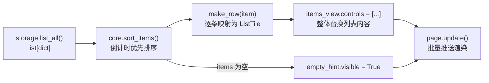
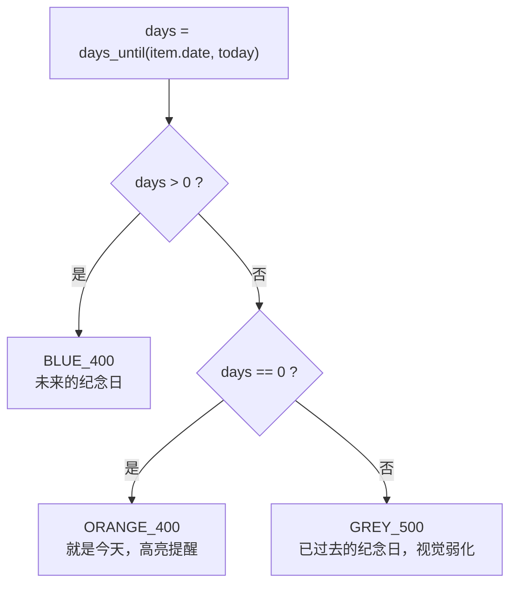

本页聚焦 UI 层中最核心的一条渲染管线：**存储层的原始数据如何经过排序，被逐条映射为 `ListTile` 行组件，最终装进 `ListView` 容器；以及当数据为空时，如何用 `visible` 开关切换到空态提示**。全文围绕 `main.py` 中不到 30 行的渲染代码展开——但它牵出的每个决策（容器选型、行工厂、闭包绑定、空态策略）都值得单独拆解。阅读前建议先了解 [四层分层架构：UI、纯逻辑、存储、日志的职责划分](5-si-ceng-fen-ceng-jia-gou-ui-chun-luo-ji-cun-chu-ri-zhi-de-zhi-ze-hua-fen)，以便定位本页内容在整体中的位置。

## 渲染管线总览：从数据库到屏幕

列表渲染的完整数据流可以概括为一句话：**每次状态变化都触发一次"全量重建"**。`refresh()` 函数是这个管线的唯一入口——它先从 `storage.list_all()` 取出全部记录（`list[dict]`），交给纯函数 `core.sort_items()` 按倒计时优先排序，然后用列表推导式把每条 dict 喂给行工厂 `make_row()`，产出的 `ListTile` 列表直接整体替换 `items_view.controls`。替换完成后，同步翻转空态提示的可见性，最后调用一次 `page.update()` 将所有变更批量推送到前端。整个过程没有任何增量 diff 计算，这是典型的"以简单换正确"的取舍，其架构动机详见 [闭包式状态管理：refresh 驱动的整体刷新模式](11-bi-bao-shi-zhuang-tai-guan-li-refresh-qu-dong-de-zheng-ti-shua-xin-mo-shi)。

Sources: [main.py](main.py#L97-L101)

用 Mermaid 描述这条管线（阅读下图前需要理解一个前提：Flet 的 `page.update()` 是一次批量同步调用，此前所有对控件属性的修改都只是内存中的暂存，尚未渲染到屏幕）：

值得注意的是排序发生在渲染之前、且在 UI 层之外——`sort_items` 是 `core.py` 中的纯函数，`refresh()` 只负责调用。这种"逻辑归 core、组装归 main"的分工保证了行工厂拿到的一定是排好序的数据，渲染代码无需关心排序键的设计细节（元组排序键的原理见 [排序设计：倒计时优先的元组排序键](13-pai-xu-she-ji-dao-ji-shi-you-xian-de-yuan-zu-pai-xu-jian)）。同理，`make_row` 内部调用的 `core.days_until()` 与 `core.label()` 也都是无副作用纯函数，本页只关注它们在渲染层的消费方式。

Sources: [main.py](main.py#L97-L101), [core.py](core.py#L17-L23)

## ListView 容器选型：为什么不是 Column

`items_view = ft.ListView(expand=True, spacing=6)` 这一行只设置了两个属性，但每个都有明确的工程含义。`expand=True` 让列表占据父容器（`ft.Column`）中除空态提示外的全部剩余空间，这是 Flet 弹性布局的核心机制——不指定 expand 的控件按内容收缩，指定了的按比例瓜分剩余空间；`spacing=6` 则在每个 `ListTile` 之间插入 6 像素的垂直间隙，避免行与行视觉粘连。

Sources: [main.py](main.py#L33-L33)

选择 `ListView` 而非 `Column` 是面向移动端场景的必然结果，两者的关键差异如下：

| 维度 | `ft.ListView` | `ft.Column` |
|---|---|---|
| 滚动能力 | 内建滚动，条目超出屏幕即可滑动 | 默认不滚动，需额外包 `ScrollView` |
| 条目构建 | 惰性构建，长列表按需渲染 | 一次性构建全部控件 |
| 适用规模 | 数十到数千条 | 数条到十几条 |
| 纪念日场景 | 纪念日数量不可预估，选它稳妥 | 数据量增长后会出现溢出不滚动 |

对这个 App 而言，用户可能录入几十上百个纪念日，且运行环境是屏幕有限的 Android 设备——`ListView` 的内建滚动和惰性构建正好对症。同时要注意代码并未使用 Flet 提供的 `first_item_index` / `last_item_index` 精细化虚拟滚动 API，而是直接整体赋值 `controls`：在纪念日这种数据量级下，简洁性优先于渲染性能优化，这是与"零第三方依赖哲学"一脉相承的实用主义选择。

Sources: [main.py](main.py#L33-L33), [main.py](main.py#L99-L99)

## ListTile 的三槽结构：一个标准 Material 行的解剖

`make_row(item)` 是行工厂，每个纪念日 dict 经它变成一个 `ft.ListTile`。`ListTile` 是 Material Design 的标准列表行控件，采用**三槽（slot）布局**：主标题、副标题、尾部操作区各自占据预定义位置，无需手写布局代码。本项目对三个槽的填充如下：

| 槽位 | 填充控件 | 渲染内容 | 视觉规格 |
|---|---|---|---|
| `title` | `ft.Text` | `item["name"]` 纪念日名称 | size=18, 字重 W_600 |
| `subtitle` | `ft.Text` | `item["date"]` ISO 日期字符串 | 默认样式 |
| `trailing` | `ft.Row(tight=True)` | 倒计时徽章 + 编辑/删除两个按钮 | 见下文分解 |

`trailing` 槽内部是一个紧凑 `ft.Row`，装着三样东西：倒计时文案（颜色随天数三态变化）、编辑按钮（`Icons.EDIT_OUTLINED`）、删除按钮（`Icons.DELETE_OUTLINE`）。这里的 `tight=True` 参数至关重要——不加它，`ft.Row` 默认会尝试在主轴方向上占满可用宽度，导致尾部按钮被推离右边缘；加上后 Row 只按内容收缩，徽章和按钮才能紧贴列表行右端。

Sources: [main.py](main.py#L69-L95)

徽章文本本身是 `core.label(days)` 的输出——"还有 N 天"、"就是今天"或"已 N 天"三种文案，其生成逻辑在 [天数计算与文案生成：days_until 与 label](12-tian-shu-ji-suan-yu-wen-an-sheng-cheng-days_until-yu-label) 中详解。渲染层关心的是文案的**颜色编码**：`badge_color()` 把整数天数映射为三种语义色，形成一眼可辨的视觉分层。

Sources: [main.py](main.py#L76-L81), [main.py](main.py#L62-L67)

## 颜色三态映射：badge_color 的决策逻辑

`badge_color(days)` 是一个纯粹的三分支函数，配合模块顶部的三个颜色常量工作。它的决策结构如下：

三态映射的完整语义对照：

| days 取值 | 文案（core.label） | 颜色 | 语义意图 |
|---|---|---|---|
| `days > 0` | "还有 N 天" | `_FUTURE_COLOR` = BLUE_400 | 倒计时中，蓝色表期待 |
| `days == 0` | "就是今天" | `_TODAY_COLOR` = ORANGE_400 | 当天到期，橙色强提醒 |
| `days < 0` | "已 N 天" | `_PAST_COLOR` = GREY_500 | 已过完，灰色退居次级 |

颜色常量在模块顶部以 `_FUTURE_COLOR` 等下划线命名集中定义，而非散落在 `make_row` 内联硬编码——这让主题调整只需改三行。值得一提的是灰色同时被空态提示复用（`empty_hint` 的 `color=_PAST_COLOR`），"过去"与"空"共享弱化语义，是一种克制的视觉语言复用。

Sources: [main.py](main.py#L13-L15), [main.py#L62-L67), [main.py#L34-L39)

## lambda 默认参数：行工厂里的闭包绑定技巧

`make_row` 的两个 `IconButton` 回调写法值得单独拆解：`on_click=lambda e, it=item: open_form(it)`。这里把循环变量 `item` 作为 lambda 的**默认参数**在定义时刻固化，而非直接闭包引用。这是 Python 经典的 late-binding（延迟绑定）防御写法——如果写成 `lambda e: open_form(item)`，所有 lambda 会共享同一个闭包单元，最终都引用循环最后一次的 `item`，导致每行按钮都打开同一条记录。

在本项目中，`make_row` 是被普通函数 `refresh()` 中的列表推导式调用的，作用域生存期很短，延迟绑定问题实际不会触发；但写成默认参数绑定是无害且防御性的——将来若有人把行工厂挪到真正的循环或异步上下文中，代码依然正确。与之呼应，`remove(it)` 与 `open_form(it)` 回调拿到的是完整 dict 引用而非仅 `id`，删除操作内部再调 `storage.delete(item["id"])`，删完立即 `refresh()` 重建列表。

Sources: [main.py](main.py#L82-L91), [main.py#L103-L106)

## 条件空态：visible 开关而非条件构造

空态提示的实现采用**常驻控件 + 可见性翻转**策略：`empty_hint` 是一个普通的 `ft.Text`，初始化时 `visible=False`，与 `items_view` 一起被 `page.add()` 装进同一个居中的 `ft.Column`。`refresh()` 每次执行时用 `empty_hint.visible = not items` 一行完成切换——有数据时隐藏提示、显示列表，无数据时反转。两个控件**永远同时存在于控件树中**，只是轮流可见。

Sources: [main.py](main.py#L33-L39), [main.py#L97-L101), [main.py#L165-L171)

这个策略与另一种常见写法——"条件构造"（在 `refresh` 里 `if items: page.add(list) else: page.add(hint)`）相比，有明确的权衡表：

| 维度 | visible 翻转（本项目采用） | 条件构造/销毁 |
|---|---|---|
| 控件树稳定性 | 两个控件引用恒定，`refresh` 永远只改属性 | 需处理 add/remove 时机，易残留旧控件 |
| 状态残留 | 无——隐藏不销毁，无需重置内部状态 | 销毁重建会丢失控件内部状态（如滚动位置） |
| 首次挂载 | `page.add` 一次性完成，无后续增删 | 需动态增删，逻辑分支更多 |
| 内存开销 | 空态提示常驻（一个轻量 Text，可忽略） | 无数据时更省（本项目场景下差异为零） |
| 与整体刷新模式的契合度 | 高——refresh 只需两行属性赋值 | 低——需引入 add/remove 分支逻辑 |

选择可见性翻转的深层原因是它**与整体重建模式天然自洽**：`refresh()` 的设计哲学是"每次都从零推导 UI 状态"（`controls` 整体替换），如果空态切换却采用增删 DOM 式操作，两种范式混用反而增加心智负担。此外 `empty_hint` 放在 Column 首位且 Column 设置了 `CrossAxisAlignment.CENTER`，空态时提示文本水平居中，视觉上不会尴尬地贴边。

Sources: [main.py](main.py#L97-L101), [main.py#L165-L171)

## 行按钮触发的闭环：渲染与交互的衔接

列表渲染并非静态展示——每个 `ListTile` 尾部的编辑按钮会带着当前行的完整 dict 进入 `open_form(it)`，弹出编辑对话框（其生命周期详见 [新增/编辑对话框：show_dialog 与 pop_dialog 的生命周期](8-xin-zeng-bian-ji-dui-hua-kuang-show_dialog-yu-pop_dialog-de-sheng-ming-zhou-qi)）；删除按钮则直接调 `storage.delete()` 并给出 SnackBar 反馈。两条路径殊途同归：**最终都汇入 `refresh()`**，由它重新拉取数据、重排、重建整个列表。这意味着列表渲染代码不需要为"编辑后局部更新某一行"写任何特殊逻辑——行工厂的幂等性（同一 dict 进、同一 ListTile 出）保证了全量重建的正确性。`list_all()` 从 SQLite 读取数据的具体实现见 [SQLite 裸 SQL CRUD：参数化查询与连接管理](15-sqlite-luo-sql-crud-can-shu-hua-cha-xun-yu-lian-jie-guan-li)。

Sources: [main.py](main.py#L82-L91), [main.py#L103-L106), [main.py#L97-L101)

## 小结与延伸阅读

本页拆解的渲染层可以浓缩为三个核心决策：**容器用 ListView 换取滚动与扩展性；行用 ListTile 三槽结构换取标准 Material 布局；空态用 visible 翻换取控件树稳定**。加上 `make_row` 里的 lambda 默认参数防御和三态颜色映射，整个列表功能只用了约 40 行代码——这正是"简单架构 + 纯函数支撑"组合的收益。若想继续深入，建议按以下顺序阅读：先看 [闭包式状态管理：refresh 驱动的整体刷新模式](11-bi-bao-shi-zhuang-tai-guan-li-refresh-qu-dong-de-zheng-ti-shua-xin-mo-shi) 理解 refresh 的全局角色，再看 [排序设计：倒计时优先的元组排序键](13-pai-xu-she-ji-dao-ji-shi-you-xian-de-yuan-zu-pai-xu-jian) 和 [天数计算与文案生成：days_until 与 label](12-tian-shu-ji-suan-yu-wen-an-sheng-cheng-days_until-yu-label) 了解渲染上游的两个纯函数，最后回到 [新增/编辑对话框：show_dialog 与 pop_dialog 的生命周期](8-xin-zeng-bian-ji-dui-hua-kuang-show_dialog-yu-pop_dialog-de-sheng-ming-zhou-qi) 补全行内交互的另一半。