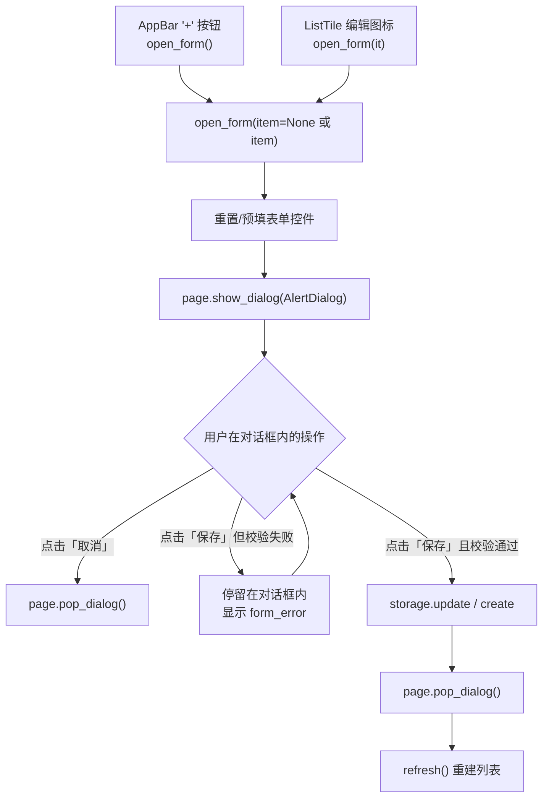
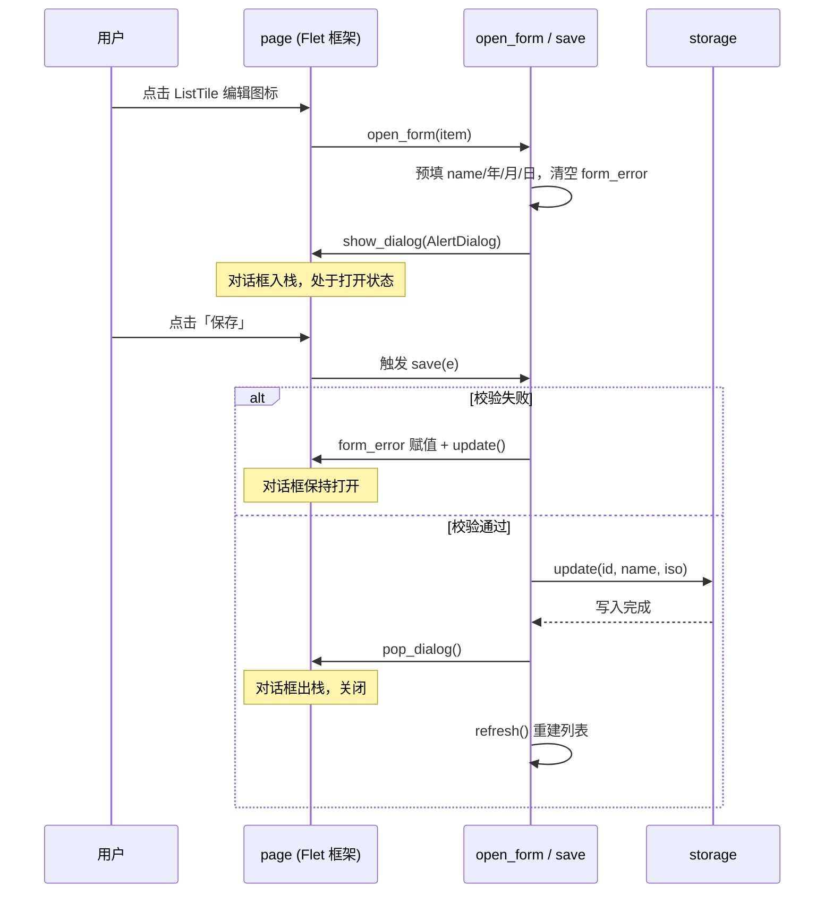

本页聚焦纪念日 App 中"新增/编辑"对话框从触发、打开到关闭的**完整生命周期**：`open_form` 如何用一个函数统一"新增"与"编辑"两种模式，`page.show_dialog` 与 `page.pop_dialog` 这对 Flet 0.86 API 如何管理对话框的入栈与弹出，以及 `save` 闭包中"校验失败停留、成功才关闭"的时序约定。表单内部的三组日期下拉框、具体校验规则、关闭后的列表刷新分别属于其他章节的主题，本页只在生命周期边界处衔接它们。

## 对话框的两个入口，一个统一实现

对话框有两个互不相干的触发点，却汇聚到同一个处理函数。AppBar 右上角的"+"按钮以无参形式调用 `open_form()`，进入**新增模式**；每条 `ListTile` 尾部的铅笔图标则把该行对应的 `item` 字典传入 `open_form(it)`，进入**编辑模式**。这种"一个函数、两种模式"的设计避免了为新增和编辑各写一份几乎相同的对话框代码——模式差异完全由 `item` 是否为 `None` 这个单一开关承载，后续的预填逻辑与保存分支都从它派生。

Sources: [main.py](main.py#L108-L115), [main.py](main.py#L159-L164), [main.py](main.py#L82-L86)

用流程图观察对话框的生命周期全貌：从两个入口进入 `open_form`，经 `show_dialog` 打开，最终有三条退出路径——取消直接弹出、校验失败原地停留、保存成功先弹出再刷新列表。三条路径中只有一条真正触碰数据库。

## show_dialog 与 pop_dialog：Flet 0.86 的页面级对话框 API

本仓库锁定的 Flet 版本为 **0.86.5**（`pyproject.toml` 中宽松声明 `flet>=0.28.0`，实际由 `uv.lock` 精确锁定），`page.show_dialog()` 与 `page.pop_dialog()` 正是这一代 API 中的对话框管理入口。`show_dialog` 接收一个控件并将其作为对话框压入页面的对话框栈顶部展示；`pop_dialog` 则**不接受任何参数**，直接关闭当前位于栈顶的对话框。这与 Flet 早期版本需要先 `page.dialog = dlg` 再手动翻转 `dlg.open = True` 并调用 `page.update()` 的命令式做法、以及 0.2x 引入的 `page.open()/page.close()` 形成了清晰的代际更替——声明式模型下，打开与关闭成为页面级的对称操作，无需持有对话框引用即可关闭它。

Sources: [uv.lock](uv.lock#L27-L29), [pyproject.toml](pyproject.toml#L9-L12)

在整个 `main.py` 中，这对 API 一共出现四个调用点，分布高度集中：

| 调用点 | API | 触发场景 | 所在函数 |
|---|---|---|---|
| 打开表单对话框 | `page.show_dialog(AlertDialog)` | 用户点击"+"或编辑图标 | `open_form` |
| 保存成功后关闭 | `page.pop_dialog()` | 校验通过、数据已落库 | `save`（闭包） |
| 取消按钮关闭 | `page.pop_dialog()` | 用户点击「取消」 | 匿名 lambda |
| 弹出消息条 | `page.show_dialog(SnackBar)` | 删除成功后的用户反馈 | `snackbar` |

值得注意的是第四行：SnackBar 并非 AlertDialog，却也通过 `show_dialog` 展示——在 0.86 的统一模型下，页面级的弹出层（对话框、消息条）共享同一个入口 API，由框架负责区分呈现形态。本文的姊妹页 [表单校验与用户反馈：名称非空、非法日期与 SnackBar](10-biao-dan-xiao-yan-yu-yong-hu-fan-kui-ming-cheng-fei-kong-fei-fa-ri-qi-yu-snackbar) 会展开 SnackBar 的反馈语义。

Sources: [main.py](main.py#L59-L60), [main.py](main.py#L137), [main.py](main.py#L140-L157), [main.py](main.py#L152-L155)

## open_form 的前半程：打开之前先重置状态

`open_form` 的前七行是生命周期的"预检阶段"，它解决一个由控件复用模式带来的必然问题（下一节详述）：表单控件是 `main` 作用域内的**单例**，上一次会话残留的值会原样出现在本次对话框里，因此每次打开前必须显式覆写。新增模式与编辑模式在这里分道扬镳，差异完全体现在预填的取值来源上：

| 表单字段 | 新增模式（item=None） | 编辑模式（item 为 dict） |
|---|---|---|
| `name_field.value` | `""`（清空） | `item["name"]`（回填原名） |
| 年/月/日下拉框 | `date.today()` 拆解为三段 | `date.fromisoformat(item["date"])` 拆解为三段 |
| `form_error.value` | `""`（清空上次错误） | `""`（同左） |

编辑模式的日期先经 `date.fromisoformat` 解析再拆为 `str(d.year)`、`f"{d.month:02d}"`、`f"{d.day:02d}"` 三段，与下拉框选项的字符串格式严格对齐——下拉框的选项值是零填充字符串（如 `"03"`、`"07"`），预填值必须同构，否则下拉框显示为空白。若不做这段重置，第二次打开新增对话框时会看到上一次编辑的条目名称与日期，这是复用单例控件最典型的坑。重置完成后，`open_form` 构造一个新的 `ft.AlertDialog`（`modal=True` 阻断背景交互）并交给 `page.show_dialog`，对话框正式进入"打开"状态。

Sources: [main.py](main.py#L108-L157), [main.py](main.py#L41-L57)

## save 闭包：校验、关闭与刷新的严格顺序

`save` 是定义在 `open_form` 内部的嵌套函数，作为对话框「保存」按钮的 `on_click` 处理器。它的执行顺序构成了一条不可颠倒的链：**校验 → 落库 → 关闭 → 刷新**。名称为空或日期非法（如 2 月 30 日）时，只把错误文案写入 `form_error.value` 并调用 `page.update()`，函数随即 `return`——**不落库、不关闭**，对话框保持打开，用户可以原地修正后重试。只有校验通过，才会依据 `editing` 是否为真分流到 `storage.update` 或 `storage.create`，随后先 `page.pop_dialog()` 关闭对话框，最后 `refresh()` 重建整个列表。

这个"先关后刷"的顺序并非随意：如果先 `refresh` 再 `pop_dialog`，用户会在对话框尚未消失的瞬间看到背景列表已经变化，视觉上产生撕裂感；先关闭再刷新，则形成干净的"提交 → 消失 → 结果呈现"因果序列。校验细节（名称非空判断、`date.fromisoformat` 对非法日期的捕获）由 [表单校验与用户反馈](10-biao-dan-xiao-yan-yu-yong-hu-fan-kui-ming-cheng-fei-kong-fei-fa-ri-qi-yu-snackbar) 一页专门解析；`refresh` 的整体刷新机制则见 [闭包式状态管理](11-bi-bao-shi-zhuang-tai-guan-li-refresh-qu-dong-de-zheng-ti-shua-xin-mo-shi)。

Sources: [main.py](main.py#L117-L138), [main.py](main.py#L97-L106)

把一次完整的"编辑已有纪念日"交互放进时序图，各方参与者的职责与先后关系一目了然：

## 单例控件与每次新建的 AlertDialog：复用的边界在哪里

`open_form` 的生命周期设计里藏着一组容易被忽视的不对称：**内容控件复用，对话框容器新建**。五个表单控件（`name_field`、三组下拉框、`form_error`）在 `main` 顶部创建一次，之后所有对话框会话共享同一批实例；而 `ft.AlertDialog` 本体每次调用 `open_form` 都重新构造，连同它 `actions` 里引用的 `save` 函数与取消按钮的 lambda。这个不对称带来两个直接后果。

第一个后果是前文提到的重置义务——共享实例意味着脏状态会跨会话泄漏，`open_form` 开头的预填代码就是为此存在。第二个后果则更为精妙：`save` 闭包捕获的 `editing` 局部变量随每次 `open_form` 调用产生**新鲜绑定**。即便用户快速连续打开两个不同条目的编辑对话框，前一个 `save` 闭包引用的仍是前一个 `item`，但由于前一个 AlertDialog 已随 `pop_dialog` 关闭、其按钮不再可达，旧闭包永远不会被误触发——闭包作用域天然把"每次打开"隔离成独立会话，无需任何显式的状态清理代码。这是 Python 闭包语义与 Flet 声明式模型配合的一个典型收益，与 [闭包式状态管理](11-bi-bao-shi-zhuang-tai-guan-li-refresh-qu-dong-de-zheng-ti-shua-xin-mo-shi) 一页的整体架构一脉相承。

Sources: [main.py](main.py#L108-L157), [main.py](main.py#L41-L57)

用一张利弊表收束这个复用模式的取舍：

| 维度 | 控件单例复用 + 容器每次新建 | 每次全量新建（对照组） |
|---|---|---|
| 内存与 GC 压力 | 低，五个控件常驻 | 每次会话产生全新控件树 |
| 状态一致性 | 需手动重置，漏写即脏数据泄漏 | 天然干净，无残留 |
| 代码位置 | 表单控件集中在 `main` 顶部，`open_form` 只管逻辑 | 构造代码与业务逻辑混在一起 |
| 闭包隔离 | `save` 每次重建，`editing` 绑定隔离 | 同样安全 |
| 适用边界 | 表单字段固定、结构简单 | 字段动态增减时更稳妥 |

## 小结与延伸阅读

对话框的生命周期可以压缩为一条主线：**入口收敛于 `open_form`（双模式由 `item` 开关），打开靠 `show_dialog` 入栈，退出有三路（取消即弹、失败停留、成功后 pop→refresh）**。`pop_dialog` 的无参调用意味着代码从不持有对话框引用——关闭操作完全交给页面级 API，这是 0.86 声明式模型赋予的简洁性。理解了这条主线之后，三个相邻主题值得按序深入：对话框内部那三组用下拉框替代 DatePicker 的年月日选择器，其工程动机在 [年月日下拉选日期：规避 DatePicker 对话框叠加的工程取舍](9-nian-yue-ri-xia-la-xuan-ri-qi-gui-bi-datepicker-dui-hua-kuang-die-jia-de-gong-cheng-qu-she)；`save` 中拦截关闭的两道校验关卡，细节见 [表单校验与用户反馈：名称非空、非法日期与 SnackBar](10-biao-dan-xiao-yan-yu-yong-hu-fan-kui-ming-cheng-fei-kong-fei-fa-ri-qi-yu-snackbar)；而对话框关闭后让新数据出现在列表上的 `refresh` 整体刷新机制，则由 [闭包式状态管理：refresh 驱动的整体刷新模式](11-bi-bao-shi-zhuang-tai-guan-li-refresh-qu-dong-de-zheng-ti-shua-xin-mo-shi) 展开。