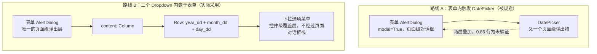
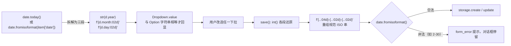

本页解析纪念日 App 表单中"年 / 月 / 日"三个 `ft.Dropdown` 的设计动机与实现细节：为什么不使用 Flet 自带的 `DatePicker`，而是把日期拆成三个内嵌于表单对话框的下拉框；这一取舍付出了什么代价（用户可能拼出"2 月 30 日"这类不存在的日期），代码又用什么手段对冲。它属于 UI 层实现详解的一环，聚焦**取舍本身**——对话框的完整生命周期见姊妹篇，校验的完整链路见后续篇，本页不重复展开。

## 决策起点：一句"未验证"换来的稳妥方案

这个设计决策在 README 中有一句直白的自述：*"日期选择采用年/月/日下拉：Flet 0.86 的 DatePicker 与表单 AlertDialog 的对话框叠加行为未验证，先取稳妥方案"*。理解这句话需要看到两层背景：其一，本项目锁定的 Flet 版本是 **0.86.5**（`pyproject.toml` 宽松声明 `flet>=0.28.0`，实际由 `uv.lock` 精确锁定），这一代框架的对话框统一走 `page.show_dialog / pop_dialog` 页面级 API；其二，表单本身已经是一个 `modal=True` 的 `AlertDialog`——若在其中触发 `DatePicker`，按 README 的表述就构成了"对话框叠加"：第二个弹出层压在第一个之上。项目没有验证这种叠加在 0.86 上的实际行为，于是选择了行为完全由自己代码定义的路线。

Sources: [README.md](README.md#L46), [README.md](README.md#L8), [uv.lock](uv.lock#L28-L29), [pyproject.toml](pyproject.toml#L9-L12)

值得强调的是这次取舍的本质：**规避的对象是"不确定性"，而不是一个已知的缺陷**。README 用词是"未验证"而非"不可用"——如果某天在真机上实证了叠加行为正常，切换回 `DatePicker` 并不冲突。这是一种典型的风险预算思维：在对话框生命周期、存储、日志等主线问题尚未站稳之前，不为一个分支交互引入未经实证的框架行为。它把"验证成本"显式地记在了文档里，而不是隐式地埋进代码。

Sources: [README.md](README.md#L46)

## 两条路线的结构对比

先把两条路线的结构画出来。阅读下图前需要知道一个前提：`Dropdown` 的选项菜单是**控件级覆盖层**（锚定在控件内部展开），而 `AlertDialog` 与 `DatePicker` 这类弹出物是**页面级对话框**（经由 `page.show_dialog` 进入页面对话框栈）——两者的层级机制不同，这正是取舍的分水岭。



两条路线的差异可以放进一张多维权衡表。可以看出路线 B 并非全面占优——它用"可能拼出非法日期"换取了"弹出层行为的确定性"，这是一笔等价交换而非免费午餐：

| 维度 | 路线 A：DatePicker | 路线 B：三个 Dropdown（实际采用） |
|---|---|---|
| 弹出层级 | 页面级对话框叠加在表单 AlertDialog 之上 | 控件级选项菜单，不触碰页面对话框栈 |
| 非法日期 | 日历网格结构上无法选出 2 月 30 日 | 允许 2 月 31 日等组合，需保存时校验兜底 |
| 交互步数 | 打开日历后点选，通常 1~2 次点击 | 年、月、日三次独立选择 |
| 触屏键盘 | 无需虚拟键盘 | 同样无需虚拟键盘 |
| 版本行为确定性 | 0.86 下与 AlertDialog 叠加未验证 | 完全由本仓库代码定义，行为确定 |
| 代码责任 | 框架负责产出合法日期 | 自行拼装三段字符串并自行校验 |

Sources: [README.md](README.md#L46), [main.py](main.py#L42-L56), [main.py](main.py#L140-L157)

## 三个 Dropdown 的构造：选项生成与宽度分配

实际方案的代码非常紧凑——三个控件在 `main` 顶部一次性创建（与 `name_field`、`form_error` 同批，构成跨会话复用的控件单例），选项列表在应用启动时即刻生成，此后所有对话框会话共享同一批实例：

```python
year_dd = ft.Dropdown(
    label="年", expand=3,
    options=[ft.dropdown.Option(str(y)) for y in range(1900, date.today().year + 101)],
)
month_dd = ft.Dropdown(
    label="月", expand=2,
    options=[ft.dropdown.Option(f"{m:02d}") for m in range(1, 13)],
)
day_dd = ft.Dropdown(
    label="日", expand=2,
    options=[ft.dropdown.Option(f"{d:02d}") for d in range(1, 32)],
)
```

三者的参数差异各有含义，汇总如下表。**年份选项不补零**（`str(y)` 生成 `"1900"`、`"2025"`），**月与日选项零填充**（`"03"`、`"07"`）——这不是随手为之，而是与预填逻辑构成隐式契约（下一节详述）。`expand` 的 3:2:2 比例则分配对话框内一行的横向空间：四位数年份需要更宽，两位数的月与日平分剩余宽度。

| 控件 | label | expand | 选项生成 | 格式 | 选项数（2025 年启动） |
|---|---|---|---|---|---|
| `year_dd` | 年 | 3 | `range(1900, date.today().year + 101)` | `str(y)` 不补零 | 226（1900–2125） |
| `month_dd` | 月 | 2 | `range(1, 13)` | `f"{m:02d}"` 零填充 | 12 |
| `day_dd` | 日 | 2 | `range(1, 32)` | `f"{d:02d}"` 零填充 | 31 |

Sources: [main.py](main.py#L42-L56), [main.py](main.py#L41-L57)

年份区间值得单独看一眼：下界固定为 **1900**，上界是**启动当年 + 100**（`range` 的排他上界写作 `+101`）。这个区间同时覆盖了约两个世纪前的历史日期（生日、历史事件纪念日）与未来一个世纪的规划日期（如整百年的倒计时），且上界在控件创建时求值一次——单例模式下它不随对话框每次打开而重算，跨年长期运行时上界会停驻在启动那一年。

Sources: [main.py](main.py#L42-L46)

还有一处容易被忽略的关键事实：**三个下拉框都没有注册 `on_change` 回调**。日选项静态固定为 1–31，不随年、月的选择联动收缩。这意味着用户完全可以选出 `2025-02-30`——这正是路线 B 在权衡表中付出的那笔代价，它的对冲手段见后文"代价与对冲"一节。

Sources: [main.py](main.py#L42-L56)

## 字符串格式纪律：预填值必须与选项同构

`Dropdown` 的回显依赖**字符串相等匹配**：`value` 必须与某个 `Option` 的字符串完全一致，控件才会显示选中项。这就把三段日期的格式变成了一条必须三处保持一致的纪律。先看数据在三个代码位点的流转——阅读下图前注意一个要点：**保存路径经由 `int()` 归一化，对格式宽容；预填路径依赖字符串相等，对格式严格**。真正敏感的是预填。



三个位点的格式对照如下表。预填代码（`open_form` 开头）逐字段镜像了选项生成格式：年份 `str(d.year)` 对 `str(y)`，月日 `f"{d.month:02d}"`、`f"{d.day:02d}"` 对应的零填充选项。假如有人把月预填写成 `str(d.month)`，`"3"` 匹配不到选项 `"03"`，下拉框会回显为空白——这是一条**没有编译器或框架替你检查的隐式契约**，只能靠命名与注释纪律维持：

| 代码位点 | 年 | 月 | 日 | 格式敏感度 |
|---|---|---|---|---|
| 选项生成（控件创建时） | `str(y)` | `f"{m:02d}"` | `f"{d:02d}"` | 基准 |
| 预填（`open_form`） | `str(d.year)` | `f"{d.month:02d}"` | `f"{d.day:02d}"` | **严格**：字符串相等才回显 |
| 拼装（`save`） | `f"{int(...):04d}"` | `f"{int(...):02d}"` | `f"{int(...):02d}"` | 宽容：经 `int()` 归一化 |

Sources: [main.py](main.py#L42-L56), [main.py](main.py#L108-L115), [main.py](main.py#L124-L128)

保存路径的宽容性来自两处设计：`int(year_dd.value)` 把选项字符串还原为整数，`"03"` 与 `"3"` 殊途同归；随后的格式化模板 `f"{int(...):04d}-..."` 重新生成规范 ISO 串，最终落库的形态由模板统一决定，与选项字符串的长相脱钩。其中年份段的 `:04d` 对 1900 以上的年份是天然满足的防御性格式化——不产生实际效果，但保证了模板的自洽。这条产出的 `YYYY-MM-DD` 串正是存储层约定的日期形态，其字典序可排序的优势由数据持久化篇展开。

Sources: [main.py](main.py#L124-L128)

## 代价与对冲：静态 31 天与保存时校验

现在正面审视路线 B 的核心代价。`day_dd` 恒为 1–31 且无任何联动，意味着 `1900-02-31`、`2025-04-31`、非闰年的 `2025-02-29` 都可以被拼出来——`DatePicker` 的日历网格在结构上杜绝这类输入，而三个下拉框把这份责任整体转移给了应用代码。对冲手段落在 `save` 闭包内：三段拼出 `iso` 后立即调用 `date.fromisoformat(iso)`，不存在的日期抛 `ValueError`；若某个下拉框值为 `None`（未选择），`int(None)` 抛 `TypeError`——`except (TypeError, ValueError)` 将两类失败一并捕获，写入 `form_error` 的"日期无效（如 2 月 30 日）"，对话框原地停留等待修正。

Sources: [main.py](main.py#L52-L56), [main.py](main.py#L117-L138)

另一种理论上可行的对冲是**级联收缩**：月变化时按当月天数重算日选项。但本仓库没有走这条路——三个下拉框之间不存在任何回调与状态耦合，合法性判断被整体推迟到保存时刻，以"一次可恢复的表单内报错"换取了控件间的零耦合。这与整个应用"控件单例 + `refresh` 整体重建"的极简风格一致：宁可让用户在提交时收到一条明确的错误，也不引入跨控件的联动状态。至于错误文案如何呈现、与名称非空校验、SnackBar 反馈如何组成完整的校验链路，属于表单校验篇的范畴。

Sources: [main.py](main.py#L42-L56), [main.py](main.py#L129-L132)

## 触屏视角的隐性收益

下拉方案还有一个结构上的副产品：表单四个字段中，只有名称是 `TextField`（需要唤起虚拟键盘），三个日期字段全部是纯点选交互。README 在"本机调试 vs 真机"一节把**虚拟键盘遮挡**明确列为真机才需要验证的风险项之一——下拉方案使日期录入天然绕开了键盘，把这条风险的影响面压缩到仅剩名称一个字段。对一款以 Android 为目标平台的应用而言，"点选代替键入"也更贴近移动端的日期录入习惯。

Sources: [main.py](main.py#L41-L57), [main.py](main.py#L140-L157), [README.md](README.md#L79-L82)

## 小结与延伸阅读

本页的取舍可以压缩成一条主线：**规避的对象是 Flet 0.86 下"未验证"的对话框叠加行为，而非 DatePicker 本身；付出的代价是三段静态选项可能拼出非法日期，对冲是保存时 `date.fromisoformat` 的一次性校验；维持方案运转的纪律是预填字符串与选项格式的严格同构**。它展示了小型项目里一种可复用的决策模式——把框架行为的不确定性显式记录在 README 中，选择行为完全自控的实现，并让代价由应用层兜底。

沿着本页向外延伸，推荐继续阅读：

- [新增/编辑对话框：show_dialog 与 pop_dialog 的生命周期](8-xin-zeng-bian-ji-dui-hua-kuang-show_dialog-yu-pop_dialog-de-sheng-ming-zhou-qi)——三个下拉框栖身的 `AlertDialog` 如何入栈、弹出，控件单例为何需要每次预填；
- [表单校验与用户反馈：名称非空、非法日期与 SnackBar](10-biao-dan-xiao-yan-yu-yong-hu-fan-kui-ming-cheng-fei-kong-fei-fa-ri-qi-yu-snackbar)——本页"代价"的完整对冲链路；
- [表结构设计：ISO 日期字符串的字典序排序优势](17-biao-jie-gou-she-ji-iso-ri-qi-zi-fu-chuan-de-zi-dian-xu-pai-xu-you-shi)——三个下拉拼出的 `YYYY-MM-DD` 为何恰好是理想的存储形态；
- [桌面调试与真机验证的能力边界划分](23-zhuo-mian-diao-shi-yu-zhen-ji-yan-zheng-de-neng-li-bian-jie-hua-fen)——"对话框叠加行为未验证"这类问题，最终应归属哪一端的验证职责。